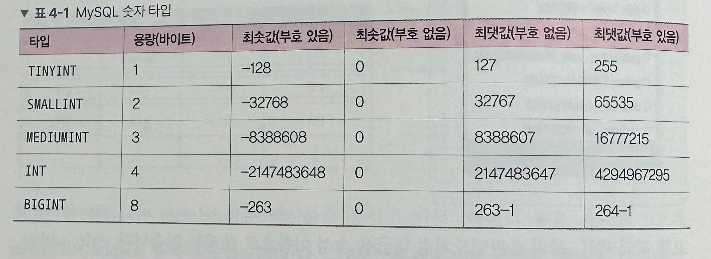
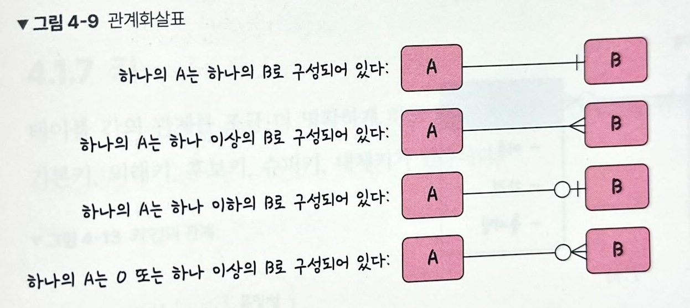
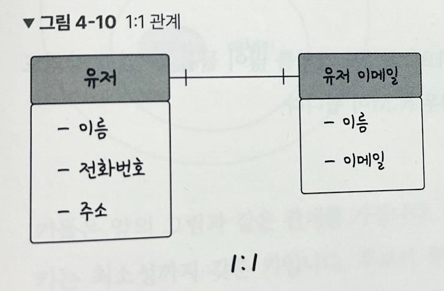
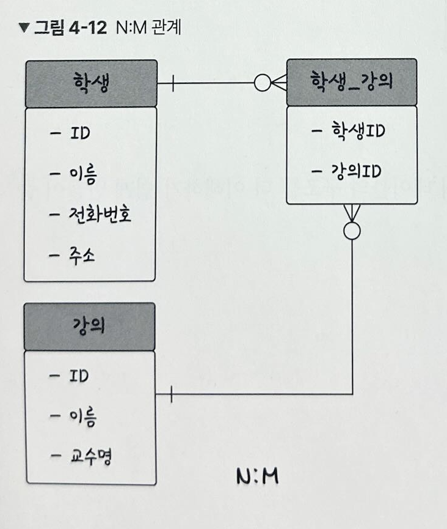
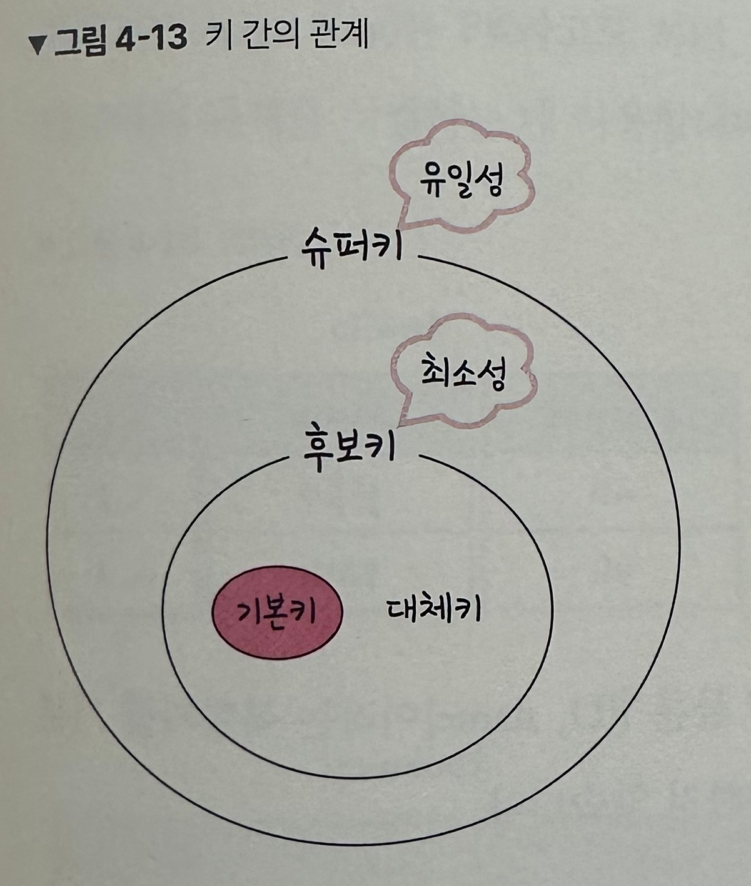

# 4.1 데이터베이스의 기본
- ☑️`데이터베이스` : 일정한 규칙, 혹은 규약을 통해 구조화되어 저장되는 데이터의 모음
  - 실시간 접근과 동시 공유가 가능
- ☑️`DBMS` : 데이터베이스를 제어, 관리하는 통합 시스템
  - 데이터베이스의 데이터들은 특정 DBMS마다 정의된 쿼리 언어를 통해 삽입, 삭제, 수정, 조회를 수행할 수 있음.
- 아래 사진에서 예를 들면 응용 프로그램은 Node.js나 php 이고, DBMS는 MySQL이다.

## 4.1.1 엔터티
- ☑️`엔티티` : 사람, 장소, 물건, 사건, 개념 등 여러 개의 속성을 지닌 명사를 의미
- 회원은 이름, 아이디, 주소, 전화번호의 `속성`을 가진다.
- `약한 엔티티` vs `강한 엔티티`
  - 강한 엔티티는 혼자서 존재할 수 있는 엔티티(ex. 건물)
  - 약한 엔티티는 다른 엔티티의 존재 여부에 따라 종속적인 엔티티(ex. 방)

## 4.1.2 릴레이션
- ☑️`릴레이션` : 데이터베이스에서 정보를 구분하여 저장하는 기본 단위
- 아래 그림은 회원이라는 엔터티가 데이터베이스에서 관리될 때 릴레이션으로 변화된 것

- 릴레이션은 관계형 데이터베이스에서는 `테이블`이라고 하며, NoSQL 데이터베이스에서는 `컬렉션`이라고 함.
    - 관계형 데이터베이스의 구조 : 레코드 - 테이블 - 데이터베이스
    - NoSQL 데이터베이스의 구조 : 도큐먼트 - 컬렉션 - 데이터베이스
- 레코드가 쌓여서 테이블이 되고, 테이블이 쌓여서 데이터베이스가 됨.

## 4.1.3 속성
- ☑️`속성` : 릴레이션에서 관리하는 구체적이며 고유한 이름을 갖는 정보
- 서비스의 요구 사항을 기반으로 관리해야 할 필요가 있는 속성듦나 엔터티의 속성이 됨.

## 4.1.4 도메인
- ☑️`도메인` : 릴레이션에 포함된 각각의 속성들이 가질 수 있는 집합
  - 성별이라는 속성의 도메인 ➡️ {남, 여} 

## 4.1.5 필드와 레코드
- 테이블은 필드와 레코드로 구성됨.
- 회원이란 엔터티는 member라는 테이블로 속성인 이름, 아이디 등을 가지고 있으며 `name, ID, address` 등의 **필드**를 가짐.
    
- ☑️`레코드` : 테이블에 쌓이는 행(row) 단위의 데이터 ➡️ 튜플이라고도 함.

### 필드 타입
- 🔢 **숫자 타입**
    
- 📅 **날짜 타입**
  - DATE : 날짜만 사용 (3 bytes)
  - DATETIME : 날짜 및 시간 모두 사용 (8 bytes) ➡️ 9999-12-31 23:59:59 까지 지원.
  - TIMESTAMP : 날짜 및 시간 모두 사용 (4 bytes) ➡️ 2038-01-19 03:14:07 까지 지원.
- 🔤 **문자 타입**
  - CHAR : 고정 길이 문자열
  - VARCHAR : 가변 길이 문자열
    - 입력된 문자열에 해당하는 바이트 + 길이기록용 1 바이트로 저장하게 됨
  - TEXT : 큰 문자열 저장에 쓰며 주로 게시판 본문을 저장할 때 사용
  - BLOB : 이미지, 동영상 등 큰 데이터 저장에 사용
  - ENUM : ENUM(XS, S, M, L, XL) 형태로 쓰이며 이 중에서 단일 선택만 가능
    - 잘못된 값을 삽입하면 빈 문자열이 대신 삽입
    - 메모리를 적게 사용하고, 65535 개의 요소를 넣을 수 있음
  - SET : ENUM과 비슷하지만 여러 개의 데이터 선택 가능
    - 비트 연산 가능, 최대 64개의 요소를 넣을 수 있음.

## 4.1.6 관계
- 여러 개의 테이블은 서로의 `관계`가 정의되어 있고, 이를 **관계화살표**로 나타낸다.

### 1:1 관계
- ex) 유저당 유저 이메일이 하나씩 있음.

- 테이블을 두 개의 테이블로 나눠 테이블의 구조를 더 이해하기 쉽게 만들어줌.

### 1:N 관계
- 한 개체가 다른 많은 개체를 포함하는 관계
- ex) 유저당 0개 이상의 상품을 장바구니에 넣음.

### N:M 관계
- 테이블 두 개를 직접적으로 연결해서 구축하지 않고, 1:N, 1:M 이라는 관계를 갖는 테이블 두개로 나눠서 설정.
- ex) 학생은 여러 개의 강의를 들을 수 있고, 강의도 여러 명의 학생을 포함할 수 있음.

## 4.1.7 키
- 테이블 간의 관계를 더 명확하게 하고 테이블 자체의 인덱스를 위해 설정된 장치
- `기본키, 외래키, 후보키, 슈퍼키, 대체키`가 있음.

  
- `유일성` : 중복되는 값이 없음
- `최소성` : 필드를 조합하지 않고 최소 필드만 써서 키를 형성할 수 있음

### 기본키
- `기본키`(Primary Key, PK)는 유일성과 최소성을 만족하는 키
- 고유하게 존재하는 속성(중복❌)
- 자연키와 인조키 중에 골라 설정
  - `자연키` : 중복된 값들을 제외하며 중복되지 않는 것을 **자연스레** 뽑다가 나오는 키
    - 언젠가는 변하는 속성을 가짐
  - `인조키` : 인위적으로 생성한 키
    - 변하지 않음 ➡️ 따라서 **기본키는 보통 인조키로 설정**

### 외래키
- `외래키`(Foreign Key, FK)는 다른 테이블의 기본키를 그대로 참조하는 값
- 개체와의 관계를 식별하는데 사용
- 외래키는 중복되어도 됨.

### 후보키
- 기본키가 될 수 있는 **후보들**
- **유일성과 최소성을 동시에 만족**하는 키

### 대체키
- 후보키가 두 개 이상일 경우 어느 하나를 기본키로 지정하고 남은 후보키들

### 슈퍼키
- 각 레코들을 유일하게 식별할 수 있는 **유일성을 갖춘 키**

## 예상질문
- 외래키와 기본키에 대해 설명해주세요.
- 테이블의 1:N 관계 예시를 들어주세요