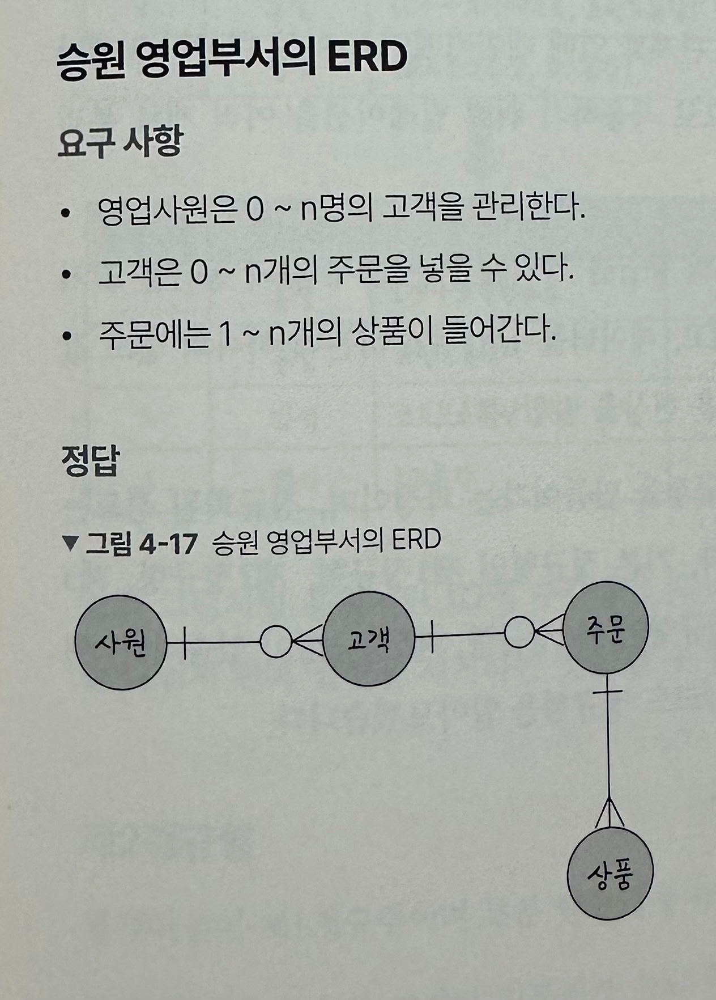
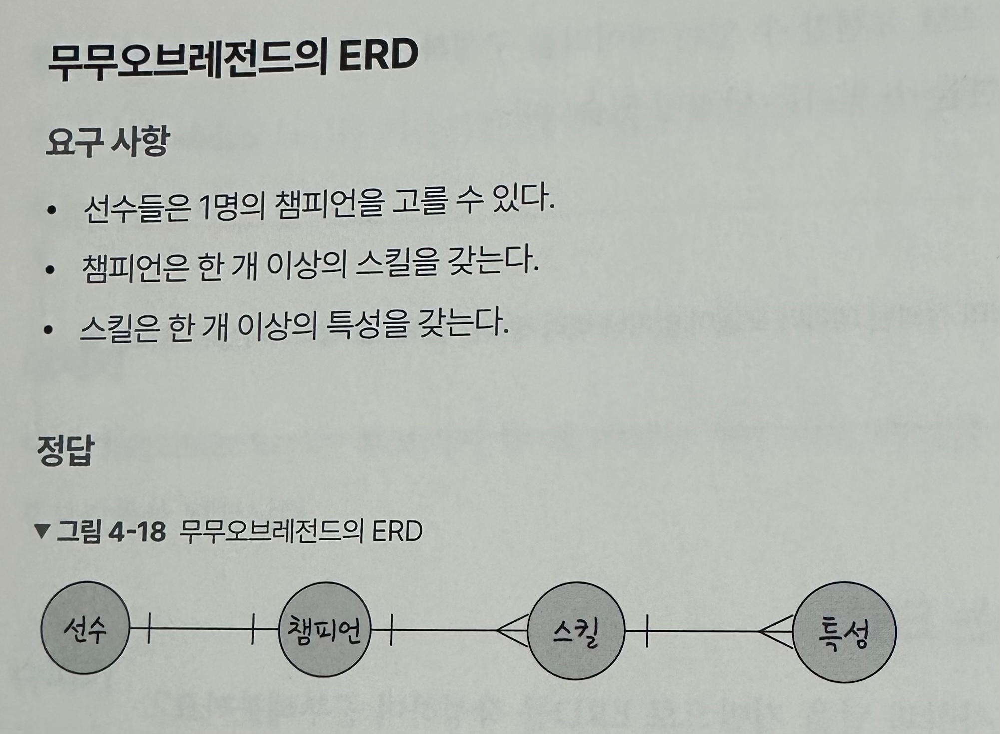
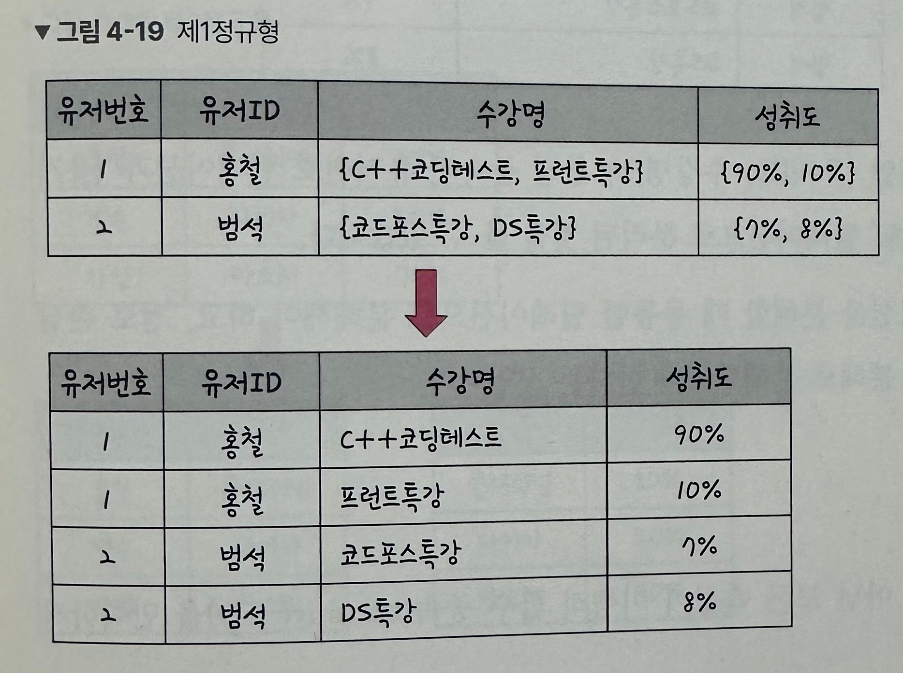
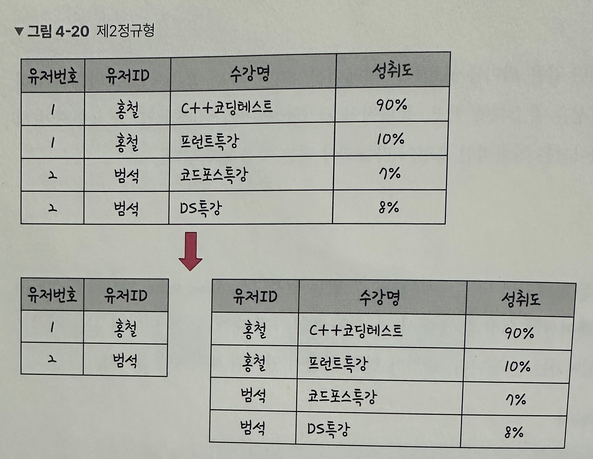
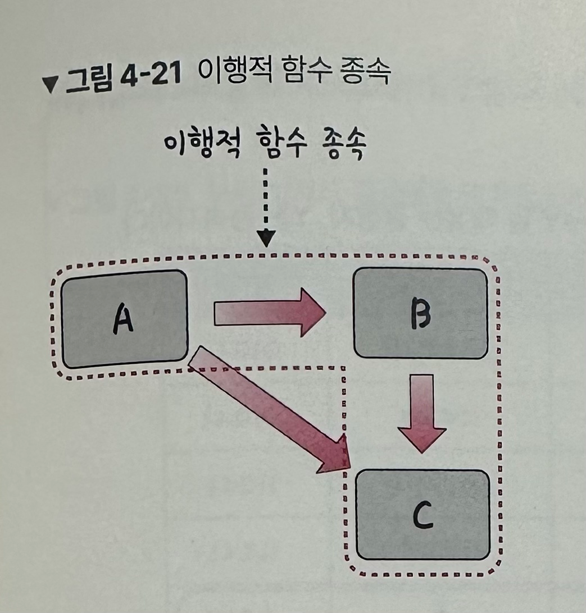
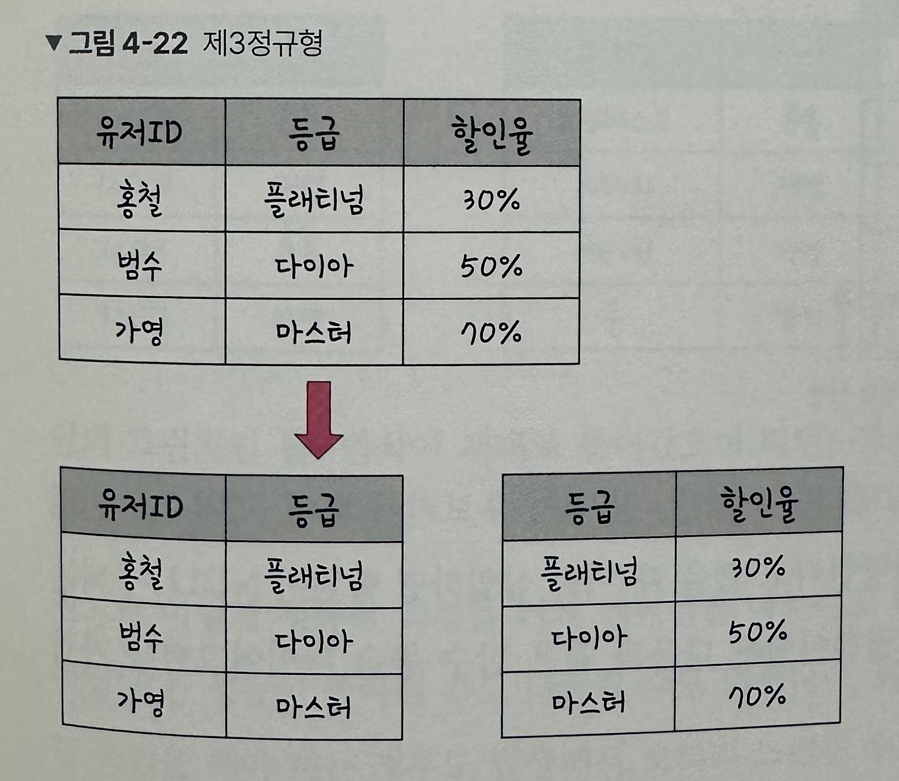
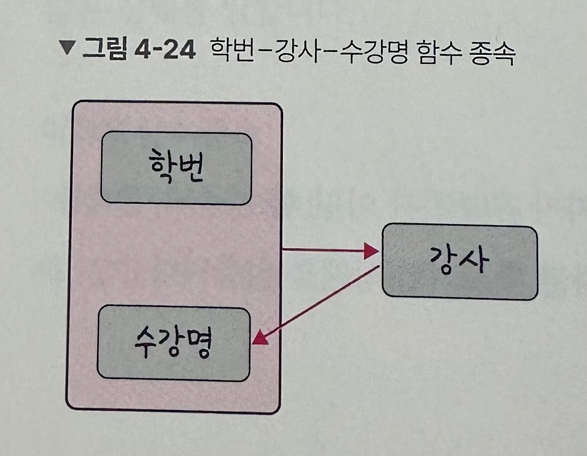
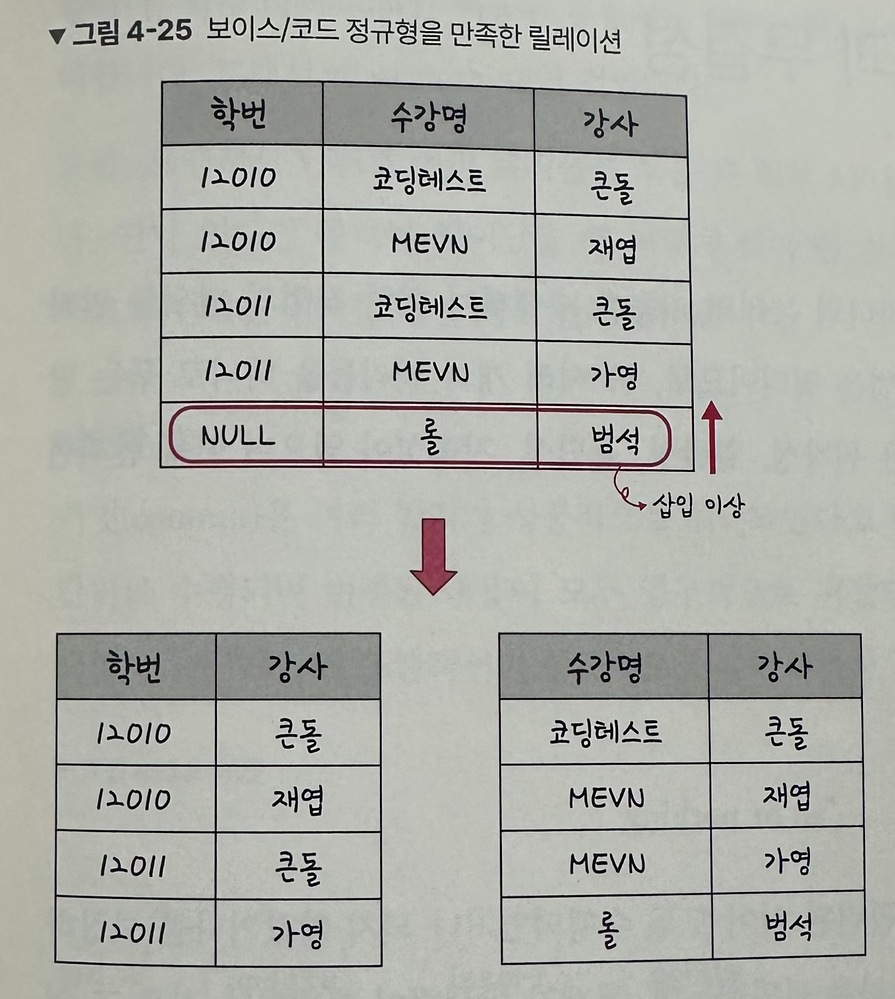

# 4.2 ERD와 정규화 과정
- ☑️`ERD` : 데이터베이스를 구축할 때 가장 기초적인 뼈대 역할을 하며, 릴레이션 간의 관계들을 정의한 것

## 4.2.1 ERD의 중요성
- 시스템의 요구 사항을 기반으로 작성됨
- 디버깅 또는 재설계가 필요한 경우에도 설계도 역할 담당
- 장점👍 : 관계형 구조로 표현할 수 있는 데이터를 구성하는 데 유용
- 단점👎 : **비정형 데이터**를 충분히 표현할 수 없음
  - `비정형 데이터` : 비구조화 데이터로, 미리 정의된 데이터 모델이나 정의된 방식이 없는 정보

## 4.2.2 예제로 배우는 ERD



## 4.2.3 정규화 과정
- `⭐️도부이결다조⭐️` 로 외우면 편함!
- `정규화 과정` : 릴레이션 간의 잘못된 종속 관계로 인해 **데이터베이스 이상 현상이 일어나서 이를 해결**하거나,
저장 공간을 효율적으로 사용하기 위해 **릴레이션을 여러 개로 분리**하는 과정
  - 정규형 원칙을 기반으로 정규형을 만들어가는 과정
  - 정규화된 정도는 정규형(NF)으로 표현함
  - 기본 정규형 : 제1 정규형, 제2 정규형, 제3 정규형, 보이스/코드 정규형
  - 고급 정규형 : 제4 정규형, 제5 정규형
- `데이터베이스 이상 현상` : 회원이 한 개의 등급을 가져야 하는데 세 개의 등급을 갖거나,
삭제할 때 필요한 데이터가 같이 삭제되고 데이터를 삽입해야 하는데 하나의 필드 값이 NULL이 되면 안돼서 삽입하기 어려운 현상
- 정규화 과정을 거쳐 테이블을 나눈다고 해서 성능이 무조건 좋아지는 것은 아님. ➡️ 비정규화 과정을 진행해야 할 수도 있음.

### 정규형 원칙
```
같은 의미를 표현하는 릴레이션이지만
  - 좀 더 좋은 구조로 만들어야 함
  - 자료의 중복성이 감소해야 함
  - 독립적인 관계는 별개의 릴레이션으로 표현
  - 각각의 릴레이션은 독립적인 표현이 가능해야 함
```

### 제1정규형
- 릴레이션의 모든 도메인이 더 이상 분해될 수 없는 `원자 값`으로만 구성 되어야 함
- 한 개의 기본키에 대해 두 개 이상의 값을 가지는 반복 집합이 있어서는 안됨 ➡️ 반복 집합 제거


### 제2정규형
- 릴레이션이 제1정규형이며 **부분 함수의 종속성을 제거**한 형태
- `부분 함수의 종속성 제거` : 기본키가 아닌 모든 속성이 기본키에 완전 함수 종속적인 것

- 릴레이션을 분해할 때 동등한 릴레이션으로 분해해야 하고, 정보 손실이 발생하지 않는 무손실 분해로 분해되어야 함.

### 제3정규형
- 릴레이션이 제2정규형이고 기본키가 아닌 모든 속성이 **이행적 함수 종속을 만족하지 않는 상태**
- `이행적 함수 종속` : A->B와 B->C가 존재하면 논리적으로 A->C가 성립하는데, 이때 집합C가 집합A에 이행적으로 함수 종속 되었다고 함.

  


### 보이스/코드 정규형(BCNF)
- 릴레이션이 제3정규형이고, **결정자가 후보키가 아닌 함수 종속 관계를 제거**하여
릴레이션의 함수 종속 관계에서 모든 `결정자`가 후보키인 상태
- `결정자` : 함수 종속 관계에서 특정 종속자를 결정짓는 요소, **X**->Y 일 때 'X'는 결정자, 'Y'는 종속자
```
예시 요구 사항
- 각 수강명에 대해 한 학생은 오직 한 강사의 강의만 수강
- 각 강사는 한 수강명만 담당
- 한 수강명은 여러 강사가 담당 가능
```
  



### 제4정규형
- 다치 종속을 제거

### 제5정규형
- 조인 종속을 제거