# 5.3 비선형 자료 구조
- 💡`비선형 자료 구조`란?
  - 일렬로 나열하지 않고 자료 순서나 관계가 **복잡한 구조**
  - 일반적으로 `트리`나 `그래프`를 말함.

## 5.3.1 그래프
- 💡`그래프`란?
  - **정점**과 **간선**으로 이루어진 자료 구조
  
### 정점과 간선
- 정점 🏝️ : 위치(V 또는 U로 표현)
- 간선 ↔️ : 위치 간의 관계 🟰 정점을 연결하는 선

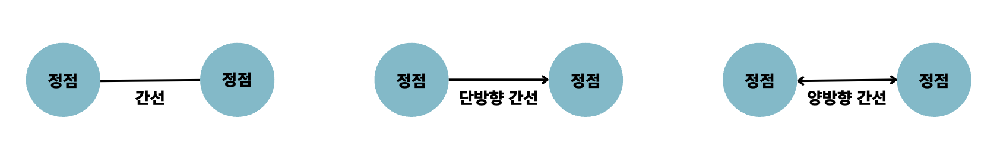

- outdegree ➡️ : 정점으로 나가는 간선
- indegree ⬅️ : 들어오는 간선
- 아래 그림의 정점 V는 outdegree는 3개, indegree는 2개임.
  
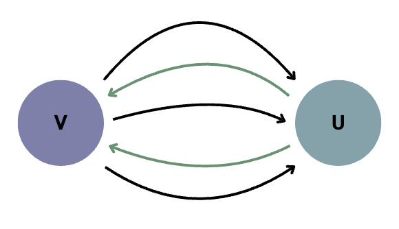

### 가중치
- 가중치 💸 : 간선과 정점 사이에 드는 비용
- 1번 노드에서 2번 노드까지 가는 비용이 한 칸이라면
  - 두 노드 사이의 가중치 🟰 한 칸

  
## 5.3.2 트리
- 💡`트리`란?
  - **그래프** 중 하나로 정점과 간선으로 이루어짐.
  - 트리🌲 구조로 배열된 일종의 **계층적인 데이터의 집합**
  - **루트 노드, 내부 노드, 리프 노드** 등으로 구성
    ```
    루트 노드 : 가장 위에 있는 노드
    내부 노드 : 루트 노드와 내부 노드 사이에 있는 노드
    리프 노드 : 자식 노드가 없는 노드
    ```
  - 트리로 이루어진 집합을 숲이라고 함.

### 트리의 특징
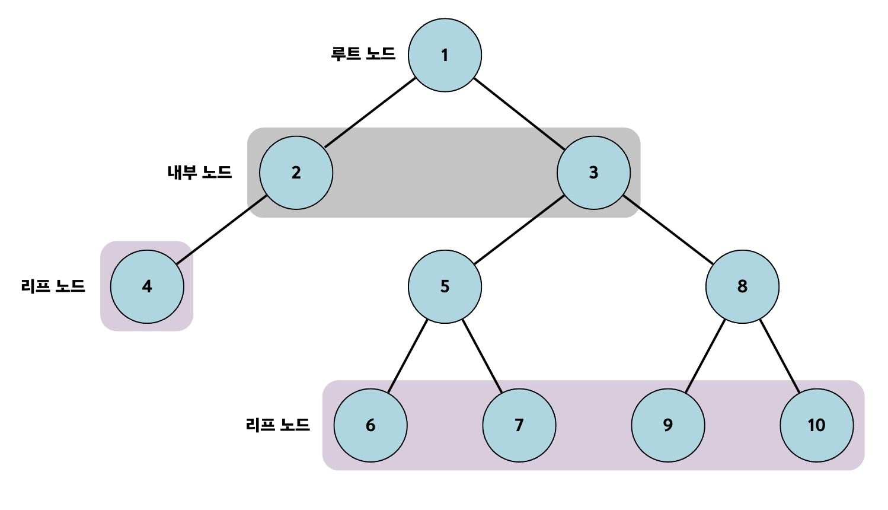
- `부모, 자식 계층 구조 🧑‍🧑‍🧒`를 가짐.
  - 5번 노드는 6번 노드와 7번 노드의 **부모** 노드
  - 6번 노드와 7번 노드는 5번 노드의 **자식** 노드
- `V - 1 = E`
  - 간선의 수 🟰 노드의 수 - 1
- 임의의 두 노드 사이의 경로는 **유일무이하게 존재**
  - 트리 내의 어떤 노드와 어떤 노드까지의 경로는 반드시 있음.

### 트리의 높이와 레벨


- `깊이` : 로트 노드부터 특정 노드까지 최단 거리로 갔을 때의 거리
  - ex. 4번 노드의 깊이는 2임.
- `높이` : 루트 노드부터 리프 노드까지 거리 중 가장 긴 거리
  - ex. 위 트리의 높이는 3임.
- `레벨` : 깊이와 같은 의미를 지님.
  - ex. 1번 노드가 0 레벨이면, 2번 노드와 3번 노드는 1레벨
- `서브트리` : 트리 내의 하위 집합(트리 내에 있는 부분집합)
### 이진 트리
- 자식 노드의 수가 두 개 이하인 트리

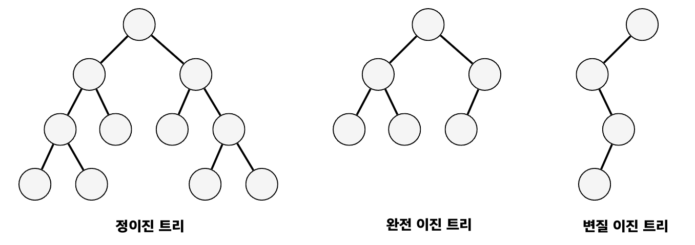

- 정이진 트리(Full Binary Tree) : 모든 노드의 자식 노드가 0 또는 2개인 이진 트리
- 완전 이진 트리(Complete Binary Tree) : 왼쪽에서부터 채워져 있는 이진 트리
  - 마지막 레벨을 제외하곤 모든 레벨이 완전히 채워져 있고, 마지막 레벨은 왼쪽부터 채워짐.
- 변질 이진 트리(Degenerate Binary Tree) : 모든 노드의 자식 노드가 1개인 이진 트리

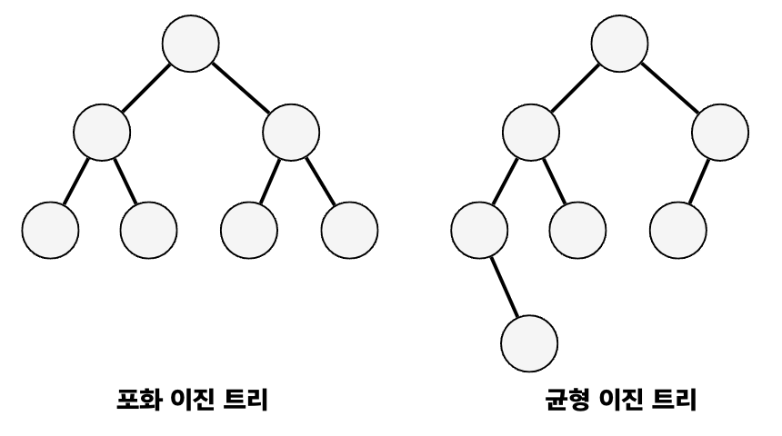

- 포화 이진 트리(Perfect Binary Tree) : 모든 노드가 꽉 차 있는 이진 트리
- 균형 이진 트리(Balanced Binary Tree) : 왼쪽과 오른쪽 노드의 높이 차이가 1 이하인 이진 트리
  - map, set을 구성하는 레드 블랙 트리는 균형 이진 트리 중 하나임.

### 이진 탐색 트리
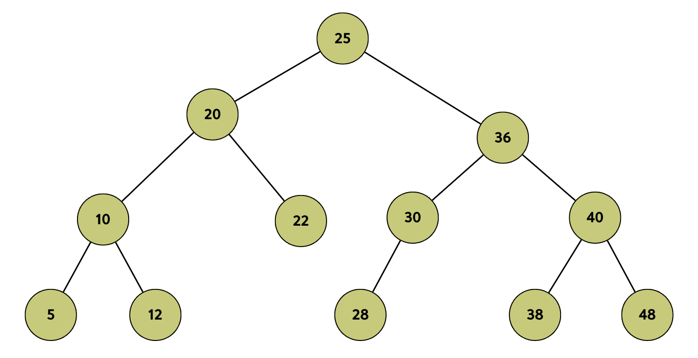

- 노드의 오른쪽 하위 트리에는 노드 값보다 큰 값이 있는 노드만 포함되고,
왼쪽 하위 트리에는 노드 값보다 작은 값이 들어 있는 트리
- 검색을 하기에 용이


- 보통 요소를 찾을 때 시간복잡도가 `O(logn)`이지만, 최약의 경우 `O(n)`이 걸림.
  - 이진 탐색 트리는 삽입 순서에 따라 **선형적**일 수 있기 떄문.


### AVL 트리
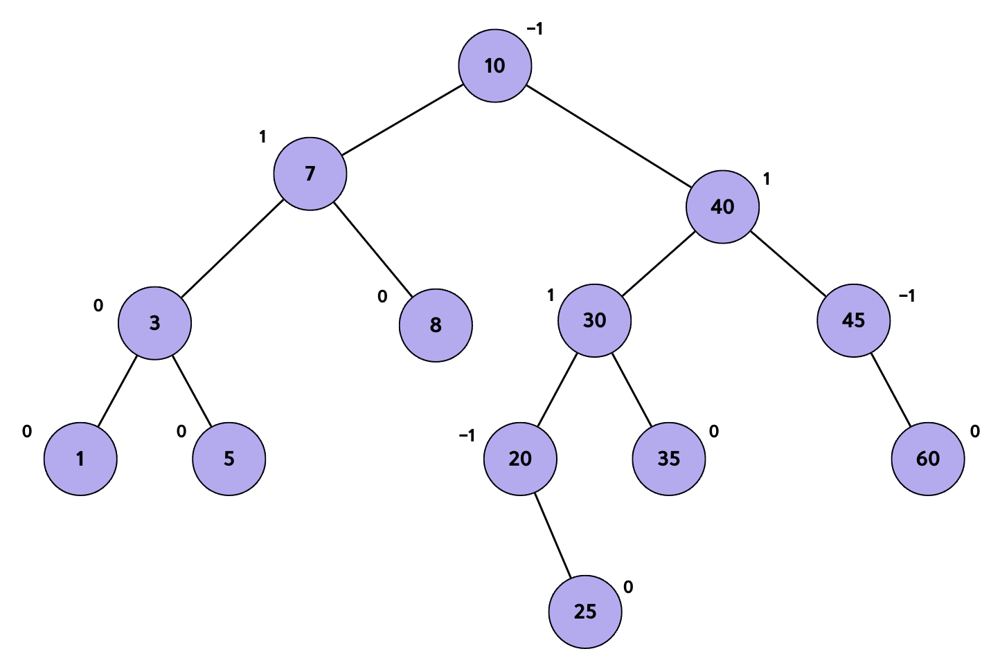

- 스스로 균형을 잡는 `이진 탐색 트리`
- 이진 탐색 트리의 최악의 경우인 `선형적인 트리⚠️`가 되는 것을 방지🛡️
- 두 자식 서브트리의 높이는 항상 최대 1만큼 차이남.
  - `균형 인수 🟰 (왼쪽 서브 트리의 높이) - (오른쪽 서브 트리의 높이)`
  - 모든 노드의 균형 인수가 -1이상이고 1이하면 AVL 트리임.
- 탐색, 삽입, 삭제 모두 시간 복잡도가 `O(logn)`임.
- 삽입, 삭제를 할 때마다 균형이 안 맞는 것을 맞추기 위해
트리 일부를 왼쪽 혹은 오른쪽으로 회전시키며 균형을 잡음.

### 레드 블랙 트리
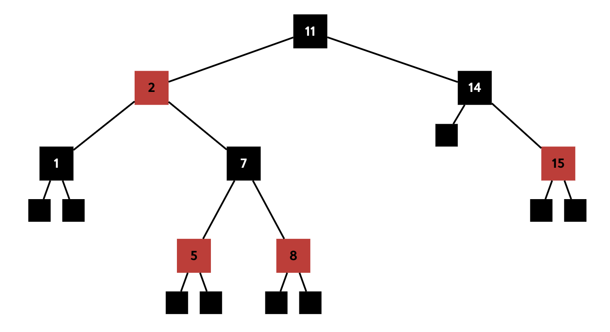

- `균형️ 이진 탐색 트리⚖️`로 탐색, 삽입, 삭제 모두 시간 복잡도가 `O(logn)`임.
- 각 노드는 빨간색🔴 또는 검은색⚫️의 색상을 나타내는 추가 비트를 저장하며,
삽입 및 삭제 중에 트리가 균형을 유지하도록 하는 데 사용됨.
- 레드 블랙 트리의 규칙을 기반으로 규현을 잡음.
  ```
  📌 레드 블랙 트리의 규칙
  
  모든 리프 노드와 루트 노드는 블랙이고 어떤 노드가 레드이면 그 노드의 자식은 반드시 블랙이다.
  ```

## 5.3.3 힙
- 💡`힙`이란?
  - 완전 이진 트리 기반의 자료 구조
  - 최대힙과 최소힙 두 가지가 있음.
    ```
    최대힙🔽
    - 루트 노드에 있는 키는 모든 자식에 있는 키 중에서 가장 커야 함.
    - 각 노드의 자식 노드와의 관계도 이처럼 재귀적🔄으로 이루어져야 함.
    
    최소힙🔼
    - 루트 노드에 있는 키는 모든 자식에 있는 키 중에서 가장 작아야 함.
    - 각 노드의 자식 노드와의 관계도 이처럼 재귀적🔄으로 이루어져야 함.
    ```
  - 힙에는 어떤 값이 들어와도 특정 힙의 규칙을 지키게 만들어져 있음.
    - 아래 최대힙의 삽입, 최대힙의 삭제를 참고

### 최대힙의 삽입
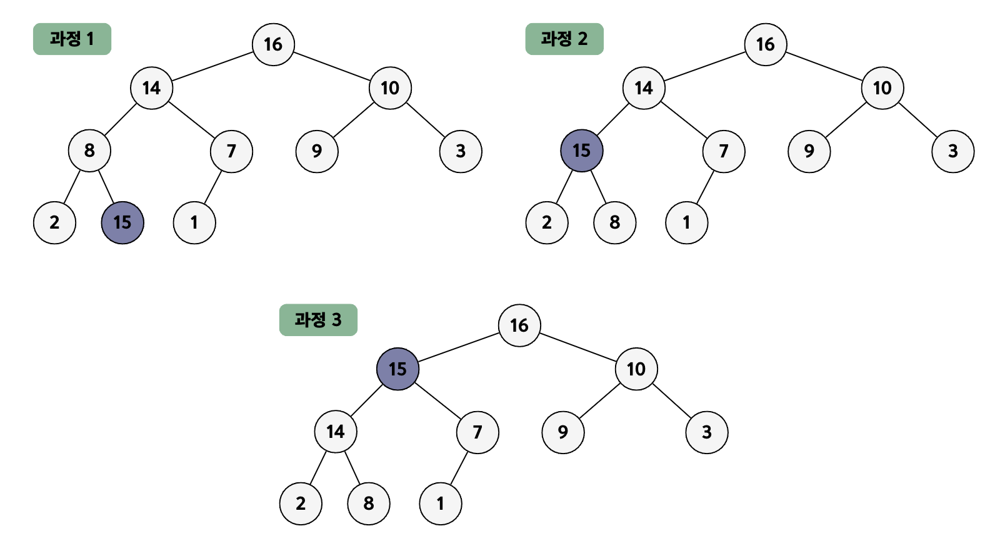

- 힙에 새로운 요소가 들어오면, 일단 새로운 노드를 힙의 마지막 노드에 이어서 삽입.
- 새로운 노드를 부모 노드들과의 크기 비교를 비교해서 힙의 성질을 만족시킴.

### 최대힙의 삭제
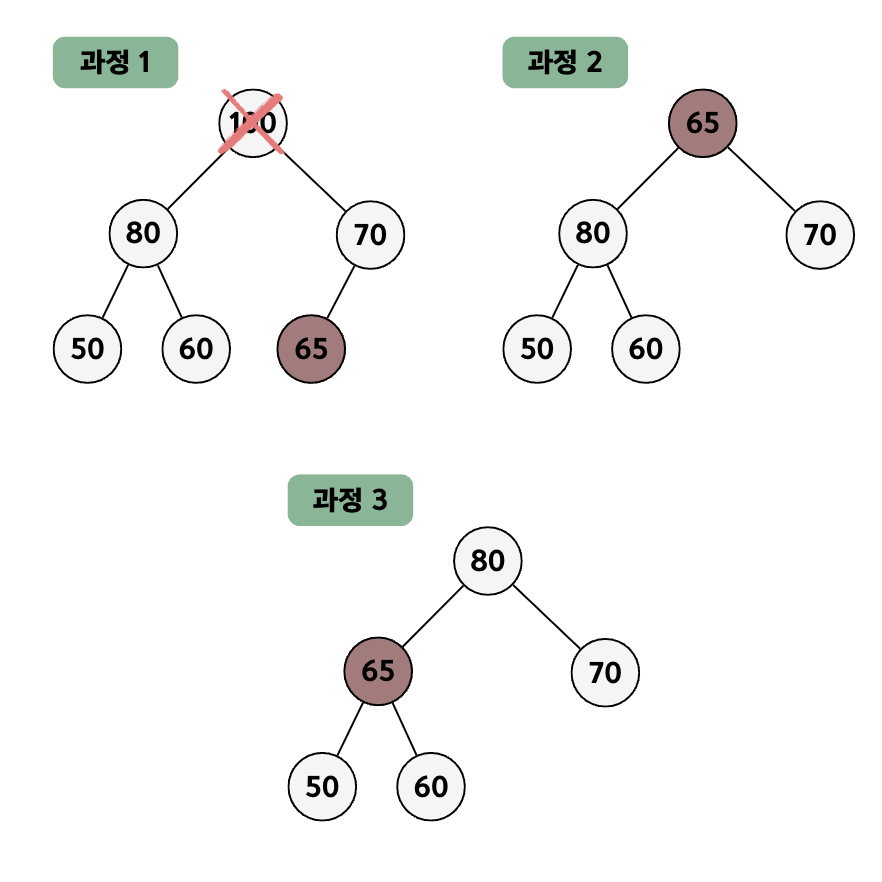

- 최대힙에서 삭제 연산은 `최대값을 가진 요소를 삭제`하는 것.
- 최대힙에서 최대값은 루트 노드이므로 루트 노드가 삭제됨.
- 그 이후 마지막 노드와 루트 노드를 스왑하여 또 다시 스왑 등의 과정을 거쳐 재구성됨.

## 5.3.4 우선순위 큐
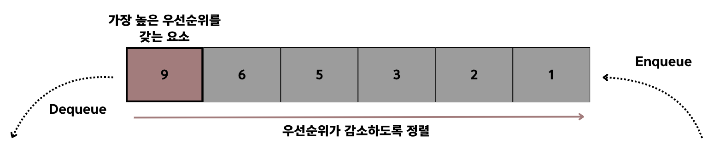
- 💡`우선순위 큐(우선순위 대기열)`란?
  - 대기열에서 우선순위가 높은 요소가 우선순위가 낮은 요소보다 먼저 제공되는 자료 구조
  - 힙을 기반으로 구현됨.

## 5.3.5 맵
- 💡`맵`이란?
  - 순서에 따라 `키`와 매핑된 `값`의 조합으로 형성된 자료 구조 
    - ex. `{"홍길동" : 1, "지우개" : 2}`
  - 키를 통해 값을 얻고, 키는 고유한 값(중복❌)을 가져야 함.
  - `레드 블랙 트리 자료 구조`를 기반으로 형성되고, 삽입하면 자동으로 정렬됨.
  - 맵은 **해시 테이블을 구현**할 때 쓰임.

## 5.3.6 셋
- 💡`셋`이란?
  - 특정 순서에 따라 **고유한 요소를 저장**하는 컨테이너
  - **중복되는 요소가 없고**, 오로지 **희소한(unique) 값만 저장**하는 자료 구조

## 5.3.7 해시 테이블
- 💡`해쉬 테이블`이란?
  - 무한♾️에 가까운 테이블들을 유한한 개수의 해시 값으로 매핑한 테이블
  - 삽입, 삭제, 탐색 시 평균적으로 O(1)의 시간 복잡도를 가짐.
  - 이를 통해 작은 크기의 캐시 메모리로도 프로세스를 관리하도록 할 수 있음.

