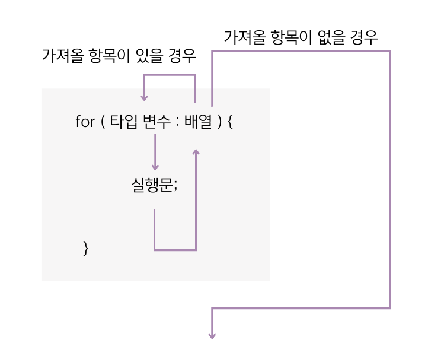

# 5.10 배열 항목 반복을 위한 향상된 for 문
- 자바는 배열 및 컬렉션을 좀더 쉽게 처리할 목적으로 `for-each loop를` 제공한다.
- 카운터 변수와 증감식을 사용하지 않고, 항목의 개수만큼 반복하는 for 문이다.

``` java
// 사용 예시
int[] scores = { 95, 71, 84, 32};
int sum = 0;

for (int score : scores) {
    sum += score;
}
```