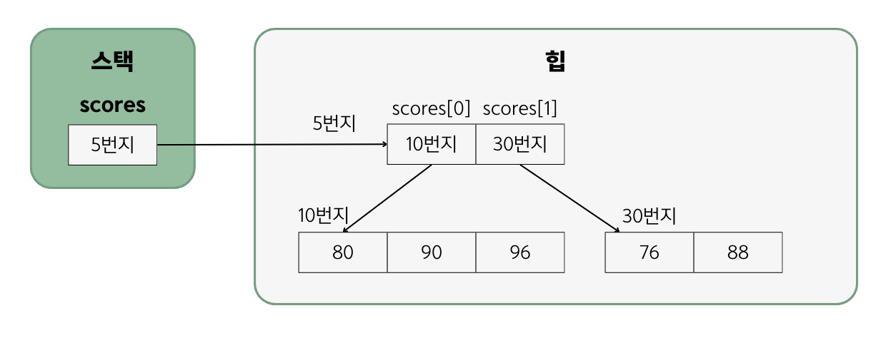
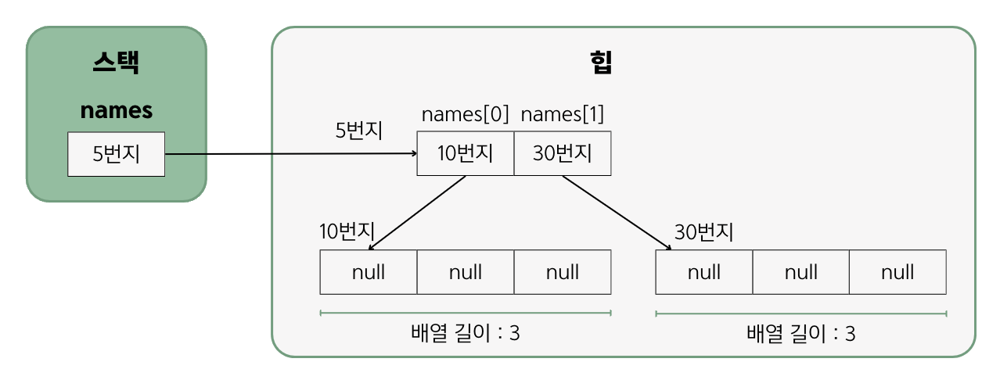

# 5.7 다차원 배열

- 배열 항목에는 또 다른 배열이 대입될 수 있음.
- 다차원 배열은 1차원 배열을 서로 연결한 것이다.
```
📌 다차원 배열에서 각 차원의 항목에 접근하는 방법

-> 변수[1차원인덱스][2차원인덱스][3차원인덱스]
```
## 값 목록으로 다차원 배열 생성
두 반의 학생 점수를 저장하는 배열을 생성하기(각 반은 1차원 배열, 해당 반의 학생 점수는 2차원 배열)
``` java
int[][] scores = {
    {80, 90, 96},           ---> 1차원 배열의 0 인덱스 : 첫 번째 반 성적
    {76, 88}                ---> 1차원 배열의 1 인덱스 : 두 번째 반 성적
 };
```

각 반의 학생 점수를 읽기
``` java
int score = scores[0][2];   // 96
int score = scores[1][1];   // 88
```
반의 개수는 1차원 배열의 길이와 동일, 각 반의 학생 수는 2차우너 배열의 길이와 동일
``` java
scores.length               // 반의 수 : 2
scores[0].length            // 첫 번째 반의 학생 수 : 3
scores[1].length            // 두 번째 반의 학생 수 : 2
```
## new 연산자로 다차원 배열 생성
```
📌 2차원 배열을 생성하고 변수에 대입하는 방법

-> 타입[][] 변수 = new 타입[1차원수][2차원수];
```
항목의 값은 다음과 같이 **초기값**을 가짐.
- 정수 타입 - 0 / 실수 타입 - 0.0 / 논리 타입 - false / 참조 타입 - null
``` java
// 2차원 배열의 길이는 모두 3이면서 항목은 0으로 초기화
int[][] scores = new int[2][3];

// 2차원 배열의 길이는 모두 3이면서 항목은 null로 초기화
String[][] names = new String[2][3];
```

``` java
// 두 반의 학생 수가 다를 경우 - 2차원 배열의 길이를 다르게 줄 수 있음.
int[][] scores = new int[2][];
scores[0] = new int[3];     // 첫 번째 반의 학생 수가 3명
scores[1] = new int[2];     // 두 번째 반의 학생 수가 2명
```