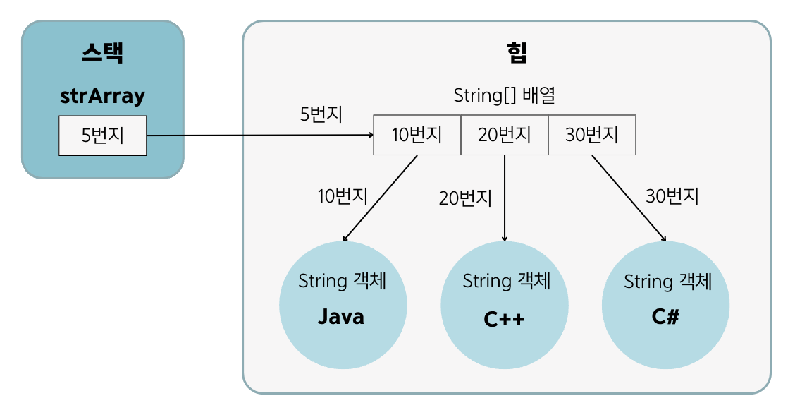
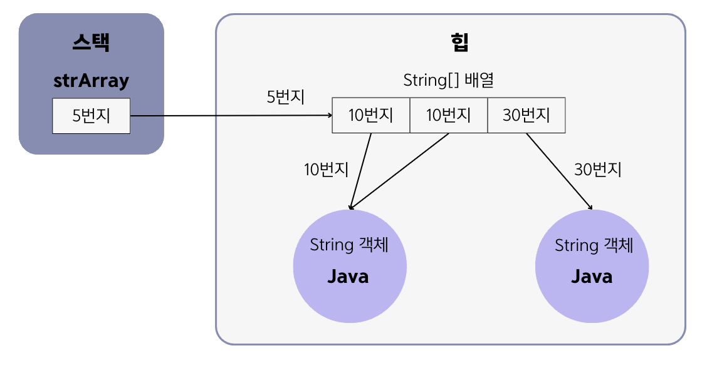

# 5.8 객체를 참조하는 배열
- 기본 타입(byte, char, short, int, long, float, double, boolean) 배열은 각 항목에 값을 직접 저장함.
- 참조 타입(클래스, 인터페이스) 배열은 각 항목에 **객체의 번지를 저장**함.
```
String[] strArray = new String[3];
strArray[0] = "Java";
strArray[1] = "C++";
strArray[2] = "C#";
```

- ==, != 연산자를 사용하면 배열 항목이 참조하는 객체가 같은 객체인지 다른 객체인지를 확인할 수 있음.
  - 같은 번지의 객체면 같은 객체, 번지가 다르면 다른 객체
- 문자열만 비교할 때는 `equals()` 메소드를 사용함.

```
String[] strArray = new String[3];
strArray[0] = "Java";
strArray[1] = "Java";
strArray[2] = new String("Java");
```

```
위의 그림을 바탕으로
strArray[0] == strArray[1] 은 같은 객체를 참조해서 true이다.
strArray[0] == strArray[2] 는 다른 객체를 참조하므로 false이다.
strArray[0].equsls(strArray[2])는 문자열이 동일하므로 true이다.
```

### 면접 예상 질문
- 문자열만 비교하고 싶을 때는 어떤 메소드를 사용해야 하는지 설명해주세요.