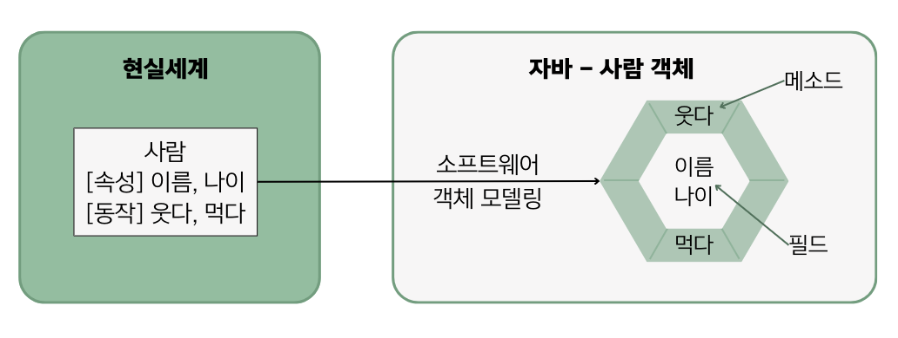
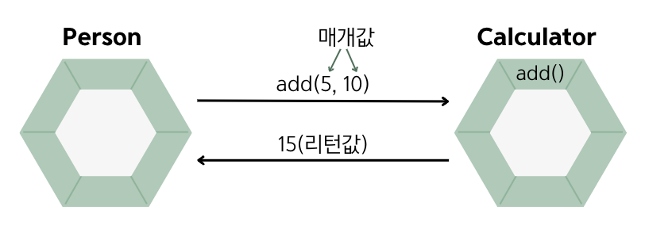
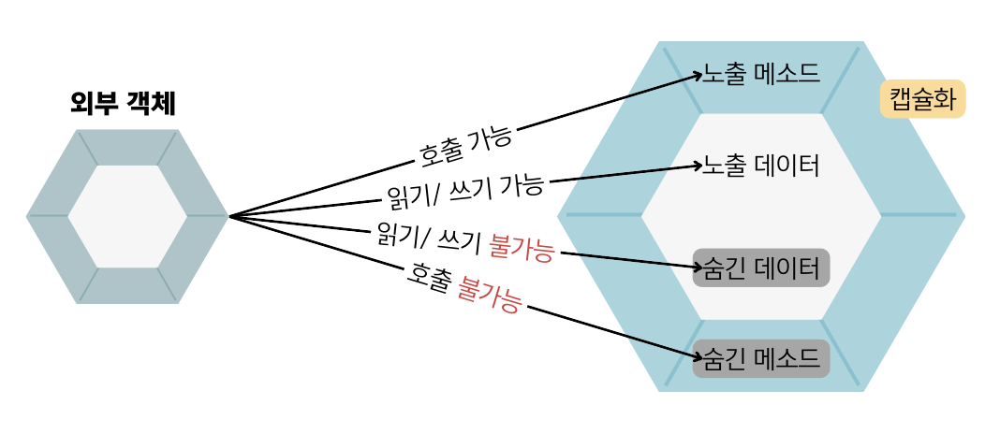
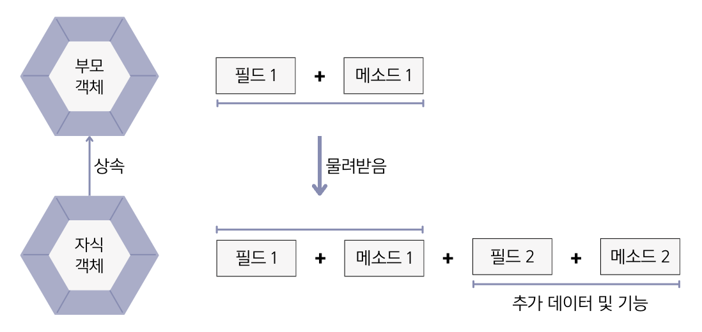

## 6.1 객체지향 프로그래밍
- 💠 객체지향 프로그래밍 : 부품에 해당하는 객체들을 먼저 만들고, 이 객체들을 하나씩 조립해서 완성된 프로그램을 만드는 기법

### 객체란?
- 💠 객체 : 물리적으로 존재하거나 개념적인 것 중에서 다른 것과 식별 가능한 것
  - `ex) 자동차, 자전거, 책, 학과, 강의, 주문`
- 객체는 속성과 동작으로 구성됨. ➡️ 자바는 속성을 **필드**, 동작을 **메소드**라고 부른다.
  - ex) 사람의 속성 : 나이, 이름 / 사람의 동작 : 웃다, 걷다
- 💠 객체 모델링 : 현실 세계의 객체를 소프트웨어 객체로 설계하는 것
  - 현실 세계 객체의 대표 속성과 동작을 추려 내어 소프트웨어 객체의 필드와 메소드로 정의하는 과정임.



### 객체의 상호작용
- 현실 세계에서 일어나는 모든 현상은 객체와 객체 간의 상호작용으로 이루어져 있다.
  - ex) 사람은 전자계산기의 기능을 이용 <-> 전자계산기는 계산 결과를 사람에게 리턴
- 객체지향 프로그램에서도 객체들은 다른 객체와 `메소드`를 통해 서로 상호작용함. 
- 객체가 다른 객체의 기능을 이용할 떄 아래와 같은 형태로 메소드를 호출함.
    ``` java
    메소드(매개값1, 매개값2, ...);
    ```
- 메소드 호출을 통해 객체들은 데이터를 서로 주고받음.
- 메소드 이름과 함께 전달하고자 하는 데이터를 괄호 () 안에 기술하는데, 이러한 데이터를 `매개값`이라고 함.
- 💠 매개값 : 메소드가 실행할 때 필요한 값
- 💠 리턴값 : 메소드의 실행의 결과, 호출한 곳으로 돌려주는 값 ➡️ 호출한 곳에서 변수로 대입받아 사용.
  ``` java
  // 리턴값을 int 변수에 저장
  int result = add(5, 10);
  ```


### 객체 간의 관계
- 집합 관계, 사용 관계, 상속 관계가 있음.

#### 집합 관계
- 완성품과 부품의 관계
  - ex) 자동차는 엔진, 타이어, 핸들 등으로 구성되므로 자동차와 부품들은 집합 관계임.

#### 사용 관계
- 다른 객체의 필드를 읽고 변경하거나 메소드를 호출하는 관계
  - ex) 사람이 자동차에게 달린다, 멈춘다 등의 메소드를 호출하면 사람과 자동차는 사용 관계임.

#### 상속 관계
- 부모와 자식 관계
  - ex) 자동차가 기계의 특징(필드, 메소드)을 물려받는다면 기계(부모)와 자동차(자식)는 상속 관계임.

### 객체지향 프로그래밍의 특징
- 객체지향 프로그램의 특징은 `캡슐화, 상속, 다형성`임.

#### 캡슐화

- 💠 캡슐화 : 객체의 데이터(필드), 동작(메소드)을 하나로 묶고 실제 구현 내용을 외부에 감추는 것
- 외부 객체는 객체 내부의 구조를 알지 못하며 객체가 노출해서 제공하는 필드와 메소드만 이용할 수 있음.
- 필드와 메소드를 캡슐화하여 보호하는 이유
  - 외부의 잘못된 사용으로 인해 객체가 손상되지 않도록 함.
- 자바 언어는 캡슐화된 멤버를 노출시킬지 숨길 것인지 결정하기 위해 **접근 제어자**를 사용함.

#### 상속

- 💠 상속 : 부모 객체가 자기가 가지고 있는 필드와 메소드를 자식 객체에게 물려주어 자식 객체가 사용할 수 있도록 하는 것
- 객체지향 프로그래밍에서는 부모 역할의 상위 객체와 자식 역할의 하위 객체가 있음.
- 상속을 하는 이유
  - 코드의 재사용성을 높여줌.
  - 유지 보수 시간을 최소화 시켜줌.
    - 부모 객체의 필드와 메소드를 수정하면 모든 자식 객체들은 수정된 필드와 메소드를 사용할 수 있음.

#### 다형성
- 💠 다형성 : 사용 방법은 돌일하지만 실행 결과가 다양하게 나오는 성질
- 프로그램을 구성하는 객체(부품)를 바꾸면 프로그램의 실행 성능이 다르게 나올 수 있음.
  - ex) 자동차에 어떤 타이어를 장착하느냐에 따라서 주행 성능이 달라짐.
- 다형성을 구현하기 위해서는 자동 타입 변환과 재정의 기술이 필요함. ➡️ `상속과 인터페이스 구현`을 통해 얻어짐.

### 면접 예상 질문
- 객체지향 프로그래밍의 4가지 주요 특성에 대해 설명해주세요.