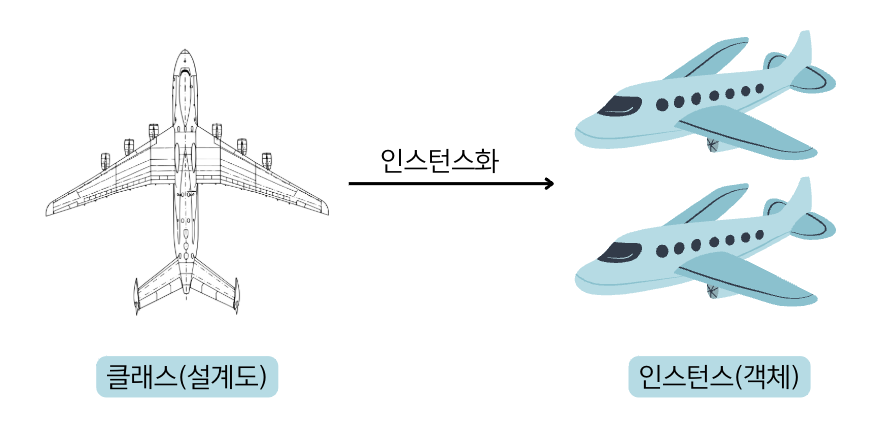

## 6.2 객체와 클래스
- 💠 클래스 : 객체지향 프로그래밍에서 객체를 생성하기 위한 설계도
- 💠 인스턴스 : 클래스로부터 생성된 객체
- 💠 인스턴스화 : 클래스로부터 객체를 만드는 과정
- 동일한 클래스로부터 여러 개의 인스턴스를 만들 수 있는데, 이것은 동일한 설계도로 여러 대의 자동차를 만드는 것과 동일함.

### 면접 예상 질문
- 객체와 클래스의 차이점은 무엇인지 설명해주세요.