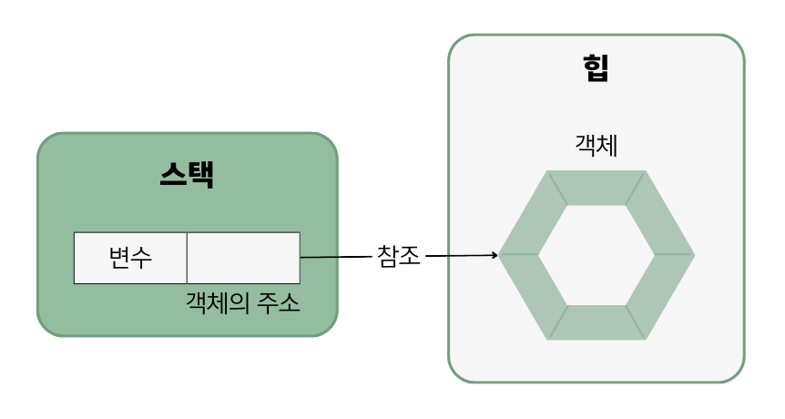

## 6.4 객체 생성과 클래스 변수
- 클래스로부터 객체를 생성하려면 객체 생성 연산자인 `new`가 필요함.
    ```java
    new 클래스()
    ```
- new 연산자 뒤에는 생성자 호출 코드가 오는데, `클래스()` 형태를 가짐.
- new 연산자는 **객체를 생성시킨 후 객체의 주소를 리턴**하기 때문에 클래스 변수에 다음과 같이 대입할 수 있음.
  ```java
  클래스 변수 = new 클래스();
  ```


### 클래스의 두 가지 용도
- 라이브러리 클래스 : 실행할 수 없으며 다른 클래스에서 이용하는 클래스
- 실행 클래스 : 메소드를 가지고 있는 실행 가능한 클래스
- 일반적으로 자바 프로그램은 하나의 실행 클래스와 여러 개의 라이브러리 클래스들로 구성됨.

### 면접 예상 질문
- 객체 생성 시 메모리에서 일어나는 일을 설명해주세요.