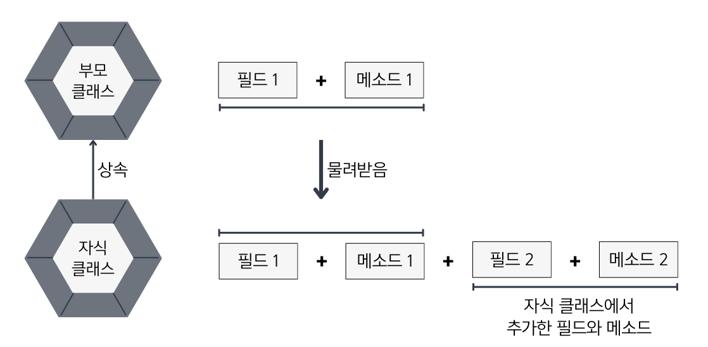

## 7.1 상속 개념
- 💠 상속 : 부모가 자식에게 물려주는 행위 ➡️ 부모 클래스의 필드와 메소드를 자식 클래스에게 물려줄 수 있음.


- 
```java
// 부모 클래스
public class A {
    int field1;
    void method1() {...}
}
```
```java
// 자식 클래스
public class B extends A {
    int field2;
    void method2() {...}
}
```
#### 상속의 이점👍
- 중복되는 코드를 줄여 개발 시간을 단축시킴.(이미 잘 개발된 클래스를 재사용해서 새로운 클래스를 만들기 때문)
- 클래스의 수정을 최소화할 수 있음.(부모 클래스를 수정하면 모든 자식 클래스에 수정 효과를 가져옴.)


### 면접 예상 질문
- 자바의 상속은 무엇이고, 왜 사용하는지 설명해주세요.