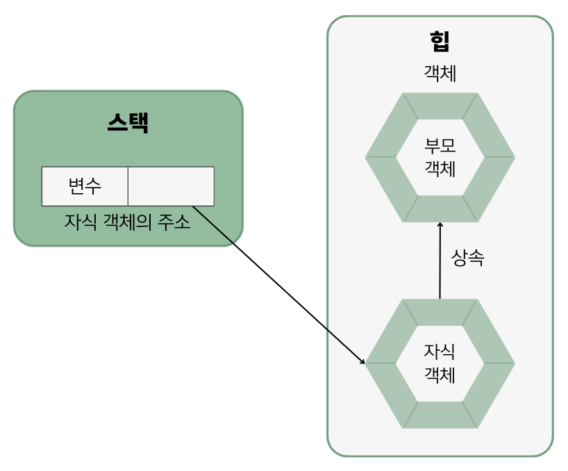

## 7.3 부모 생성자 호출
- 자식 객체를 생성하면 부모 객체가 먼저 생성된 다음에 자식 객체가 생성됨.
- `자식클래스 변수 = new 자식클래스();` 를 메모리로 표현하면 다음과 같음.
    
- 모든 객체는 생성자를 호출해야만 생성됨. 부모 객체도 마찬가지임. ➡️ 자식 생성자의 맨 첫 줄에 숨겨져 있는 `super()`에 의해 호출됨.
  ``` java
  // 자식 생성자 선언
  public 자식 클래스(...) {
    super();
    ...
  }
  ```
- `super()`는 컴파일 과정에서 **자동 추가**되고, 이것은 **부모의 기본 생성자를 호출**함.
- 만약 **부모 클래스에 기본 생성자가 없다면** 자식 생성자 선언에서 **⚠️컴파일 에러⚠️**가 발생함.
- 부모 클래스에 기본 생성자가 없고 매개변수를 갖는 생성자만 있다면 super(매개값, ...) 코드를 직접 넣어야 함.
  - ex) `super(model, color);`


### 면접 예상 질문
- super() 키워드의 역할에 대해 설명해주세요.
- 자식 클래스에서 부모 클래스의 생성자를 어떻게 호출하는지 설명해주세요.