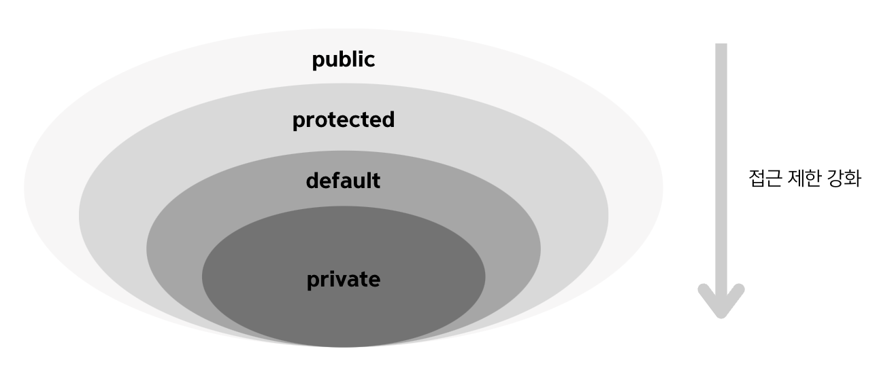
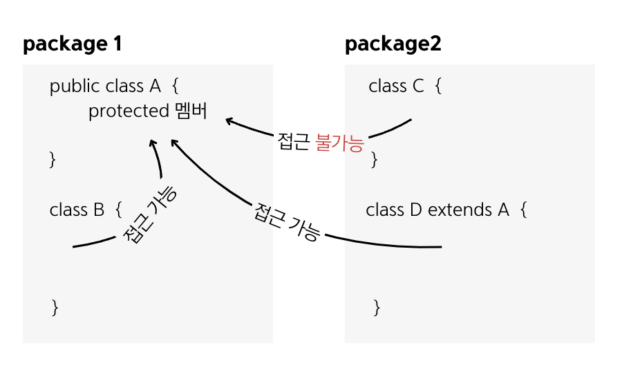

## 7.6 protected 접근 제한자
- `protected`는 상속과 관련이 있고, public과 default의 중간쯤에 해당하는 접근 제한을 함.

- `protected`는 같은 패키지에서는 default처럼 접근이 가능하고, 다른 패키지에서는 자식 클래스만 접근을 허용함.
- `protected`는 필드, 생성자, 메소드 선언에 사용될 수 있음.

- A 클래스에는 protected로 선언된 필드, 생성자, 메소드가 있음.
- B 클래스는 A 클래스와 동일한 패키지에 있기 때문에 A의 protected 필드, 생성자, 메소드에 접근이 가능함.
- C 클래스는 A 클래스와 다른 패키지에 있기 때문에 A의 protected 필드, 생성자, 메소드에 접근할 수 없음.
- D 클래스는 A 클래스와 다른 패키지에 있지만 자식 클래스이므로 A의 protected 필드, 생성자, 메소드에 접근이 가능함.
단, new 연산자를 사용해서 생성자를 직접 호출할 수는 없고, 자식 생성자에서 super()로 A 생성자를 호출할 수 있음.

### 면접 예상 질문
- protected 접근 제한자의 특징에 대해 설명해주세요.
- 다른 패키지에 있는 자식 클래스가 부모 클래스의 protected 멤버에 접근할 때는 어떻게 해야 하는지 설명해주세요.