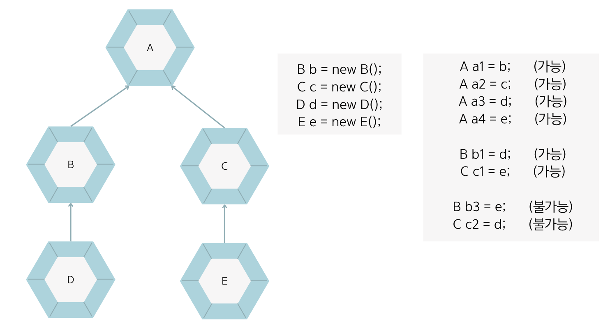

## 7.7 타입 변환
- 💠 타입 변환 : 타입을 다른 타입으로 변환하는 것
- 클래스의 타입 변환은 상속 관계에 있는 클래스 사이에서 발생함.

### 자동 타입 변환
- 💠 자동 타입 변환 : 자동적으로 타입 변환이 일어나는 것
    - `부모 타입 변수 = 자식타입객체;` 와 같은 조건에서 일어남.
- 자식은 부모의 특징과 기능을 상속받기 때문에 부모와 동일하게 취급될 수 있음.
    ```java
    class Animal {
    
    }

    class Cat extends Animal {
        
    }
    ```
    ```java
    Cat cat = new Cat();
    Animal animal = cat;
    ```
    - Cat 객체를 생성하고 이것을 Animal 변수에 대입하면 자동 타입 변환이 일어남.
    - cat과 animal 변수는 타입만 다를 뿐, 동일한 Cat 객체를 참조함. (== 연산 결과가 true)
- 바로 위의 부모가 아니더라도 상속 계층에서 상위 타입이라면 자동 타입 변환이 일어날 수 있음.

- **부모 타입으로 자동 타입 변환된 이후에는 ❗️부모 클래스에 선언된 필드와 메소드만 접근이 가능❗️함.**
- 비록 변수는 자식 객체를 참조하지만 변수로 접근 가능한 멤버는 부모 클래스 멤버로 한정됨.
- 자식 클래스에서 오버라이딩된 메소드가 있다면 부모 메소드 대신 오버라이딩된 메소드가 호출됨. ➡️ 다형성과 연관 있음.

### 강제 타입 변환
- 자식 타입은 부모 타입으로 자동 변환되지만, 반대로 부모 타입은 자식 타입으로 자동 변환되지 않음.
  - `자식타입 변수 = (자식타입) 부모타입객체;` 처럼 사용함.
  - `(자식타입)` 캐스팅 연산자로 강제 타입 변환을 할 수 있음.
- 부모 타입 객체가 자식 타입으로 **무조건 강제 변환할 수 있는 것은 아님⚠️**.
  - 자식 객체가 부모 타입으로 자동 변환된 후 다시 자식 타입으로 변환할 때 강제 타입 변환을 사용할 수 있음.
  ```java
  Parent parent = new Child();
  Child child = (Child) parent;
  ```
  - 자식 타입에 선언된 필드와 메소드를 꼭 사용해야 한다면 강제 타입 변환을 해서 다시 자식 타입으로 변환해야 함.
  

### 면접 예상 질문
- 자동 타입 변환과 강제 타입 변환에 대해 설명해주세요.
- 강제 타입 변환은 언제 사용하는지 설명해주세요.