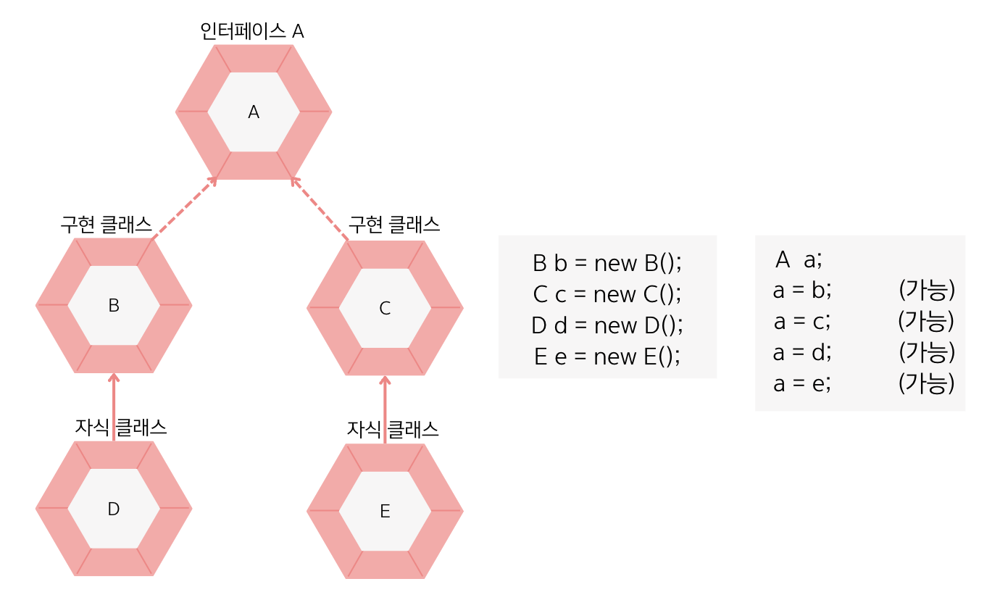

## 8.10 타입 변환
- 인터페이스의 타입 변환은 인터페이스와 구현 클래스 간에 발생함.
- 인터페이스 변수에 구현 객체를 대입하면 구현 객체는 인터페이스 타입으로 `자동 타입 변환`됨.
- 인터페이스 타입을 구현 클래스 타입으로 변환시킬 때는 `강제 타입 변환`이 필요함.

### 자동 타입 변환
- 💠 자동 타입 변환 : 자동으로 타입 변환이 일어나는 것을 말함.
- `인터페이스 변수 = 구현 객체;` 와 같은 조건에서 일어남.
- 부모 클래스가 인터페이스를 구현하고 있다면 자식 클래스도 인터페이스 타입으로 자동 타입 변환될 수 있음.

- 위의 사진에서 B, C, D, E로부터 생성된 객체는 모두 인터페이스 A로 자동 타입 변환될 수 있음.

### 강제 타입 변환
- 💠 강제 타입 변환 : 캐스팅 기호를 사용해서 인터페이스 타입을 구현 클래스 타입으로 변환시키는 것을 말함.
- `구현 클래스 변수 = (구현클래스) 인터페이스 변수` 와 같은 조건에서 일어남.
- 구현 객체가 인터페이스 타입으로 자동 변환되면, 인터페이스에 선언된 메소드만 사용 가능.
- 자동 타입 변환 후에 구현 객체에 있는 메소드를 호출하고 싶다면 캐스팅 기호를 사용해 강제 타입 변환해야 함.

### 면접 예상 질문
- 인터페이스와 구현 클래스 간의 자동 타입 변환과 강제 타입 변환에 대해 설명해주세요.