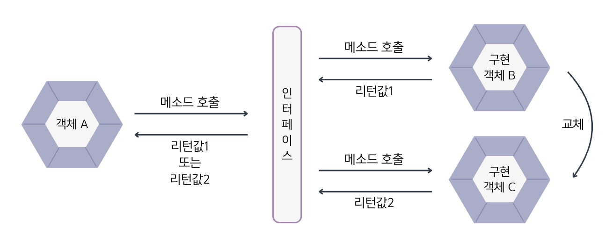
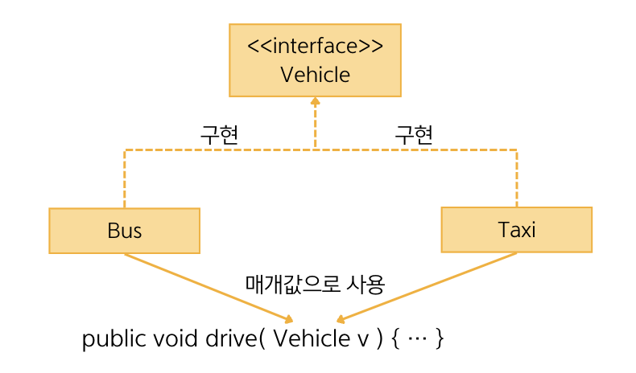

## 8.11 다형성
- 💠 다형성 : 사용 방법은 동일하지만 다양한 결과가 나오는 성질을 말함.
- 인터페이스는 다형성을 구현하는 주된 기술로 사용됨.
- 현업에서는 상속보다는 인터페이스를 통해 다형성을 구현하는 경우가 더 많음.


- 위의 그림에서 구현 객체 B와 구현 객체 C 둘 중 어느 객체가 인터페이스에 대입되었느냐에 따라서 객체 A의 메소드 호출 결과는 달라질 수 있음.


- 인터페이스 다형성을 구현하기 위해 `재정의` ➕ `자동 타입 변환` 기능을 이용함.
- 인터페이스의 추상 메소드는 구현 클래스에서 재정의를 해야 하며, 재정의되는 내용은 구현 클래스마다 다름.
- 구현 객체는 인터페이스 타입으로 자동 타입 변환이 되고, 
인터페이스 메소드 호출 시 **구현 객체의 재정의된 메소드가 호출되어 다양한 실행 결과**를 얻을 수 있음.

### 필드의 다형성
- 필드 타입으로 인터페이스를 선언하면 자동 타입 변환 때문에 해당 인터페이스를 어떤 클래스의 객체든 대입할 수 있음.
- 어떠한 클래스 구현 객체가 대입되어도 인터페이스에 선언된 메소드만 사용하므로 문제가 되지 않음.
  <details><summary>&nbsp;🚗 필드의 다형성 예시</summary>

  ``` java
  public interface Tire {
    // 추상 메소드
    void roll();
  }
  ```
  ``` java
  public class HankookTire implements Tire {
    // 추상 메소드 재정의
    @Override
    public void roll() {
      System.out.println("한국 타이어가 굴러갑니다.");
    }
  }
  ```
  ``` java
  public class KumhoTire implements Tire {
    // 추상 메소드 재정의
    @Override
    public void roll() {
      System.out.println("금호 타이어가 굴러갑니다.");
    }
  }
  ```
  ``` java
  public class Car {
    // 필드
    Tire tire1 = new HankookTire();
    Tire tire2 = new HankookTire();
  
    // 메소드
    void run() {
      tire1.roll();
      tire2.roll();
    }
  }
  ```
  ``` java
  public class CarExample {
    public static void main(String[] args) {
      // 자동차 객체 생성
      Car myCar = new Car();
      
      // run() 메소드 실행
      myCar.run();
  
      // 타이어 객체 교체
      myCar.tire1 = new KumhoTire();
      myCar.tire2 = new KumhoTire();
  
      // run() 메소드 실행(다형성: 실행 결과가 다름)
      myCar.run();
    }
  }
  ```
  실행결과
  ``` java
  한국 타이어가 굴러갑니다.
  한국 타이어가 굴러갑니다.
  금호 타이어가 굴러갑니다.
  금호 타이어가 굴러갑니다.
  ```
  </details>

### 매개변수의 다형성
- 매개변수 타입을 인터베이스로 선언하면 메소드 호출 시 다양한 구현 객체를 대입할 수 있음.


```java
public interface Vehicle {
    void run();
}
```
```java
public class Driver {
    void drive(Vehicle vehicle) {
        vehicle.run();
    }
}
```
- 운전자 클래스인 Driver는 다양한 Vehicle 구현 객체를 운전하기 위해 Vehicle 인터페이스를 매개변수로 가지는
drive() 메소드를 선언함. drive() 메소드를 호출할 때 인터페이스 Vehicle을 구현하는 어떠한 객체라도 매개값으로 줄 수 있음.
- ⭐️매개변수의 다형성⭐
  - 어떤 객체를 주느냐에 따라 run() 메소드의 실행 결과는 다르게 나옴. 구현 객체에서 정의된 run() 메소드의
    실행 내용이 다르기 때문인데 이것이 매개변수의 다형성임.
  <details><summary>&nbsp;🚴‍♀️ 매개변수의 다형성 예시</summary>

  ``` java
  public interface Vehicle {
    // 추상 메소드
    void run();
  }
  ```
  ``` java
  public class Driver {
    void drive( Vehicle vehicle ) {
      vehicle.run();
    }
  }
  ```
  ``` java
  public class Bus implements Vehicle {
    // 추상 메소드 재정의
    @Override
    public void run() {
      System.out.println("버스가 달립니다.");
    }
  }
  ```
  ``` java
  public class Taxi implements Vehicle {
    // 추상 메소드 재정의
    @Override
    public void run() {
      System.out.println("택시가 달립니다.");
    }
  }
  ```
  ``` java
  public class DriverExample {
    public static void main(String[] args) {
      // Driver 객체 생성
      Driver driver = new Driver();
      
      // Vehicle 구현 객체 생성
      Bus bus = new Bus();
      Taxi taxi = new Taxi();
     
      // 매개값으로 구현 객체 대입(다형성: 실행 결과가 다름)
      driver.drive(bus);  // 자동 타입 변환 -> 오버라이딩 메소드 호출 -> 다형성
      driver.dirve(taxi);

    }
  }
  ```
  실행 결과
  ``` java
  버스가 달립니다.
  택시가 달립니다.
  ```
  </details>
### 면접 예상 질문
- 인터페이스 다형성에 대해 설명해주세요.