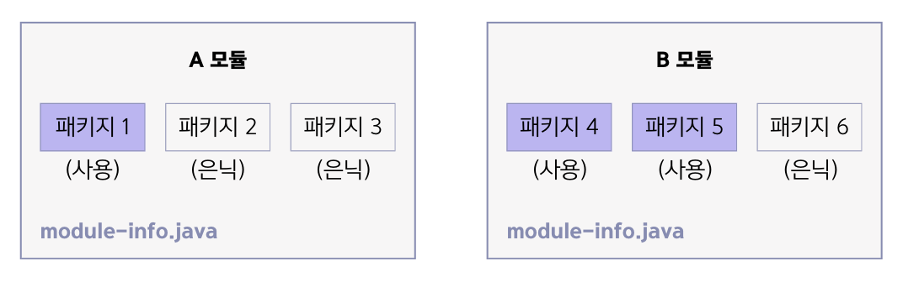
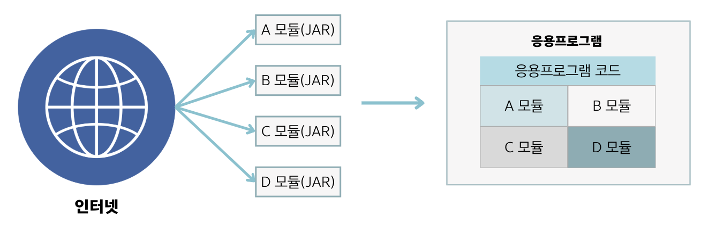

## 10.2 모듈
- 💠 `모듈` : 패키지 관리 기능까지 포함된 라이브러리(Java 9부터 지원)
- 일반 라이브러리는 내부에 포함된 모든 패키지에 외부 프로그램에서의 접근이 가능하지만,
모듈은 **일부 패키지를 은닉하여 접근할 수 없게끔 할 수 있음**.

- 모듈은 자신이 실행할 때 필요로 하는 의존 모듈을 **모듈 기술자(module-info.java)** 에 기술할 수 있기
때문에 **모듈 간의 의존 관계를 쉽게 파악**할 수 있음.
- 모듈도 라이브러리이기 때문에 `JAR 파일 형태`로 배포할 수 있음.
- 응용프로그램을 개발할 때 원하는 기능의 모듈(JAR) 파일을 다운로드해서 이용하면 됨.

- 대규모 응용프로그램은 기능별로 `모듈화⚙️`해서 개발할 수 있음.
- `모듈화`의 장점 👍 : 모듈별로 개발하고 조립하는 방식을 사용하면 재사용성 및 유지보수에 유리함.