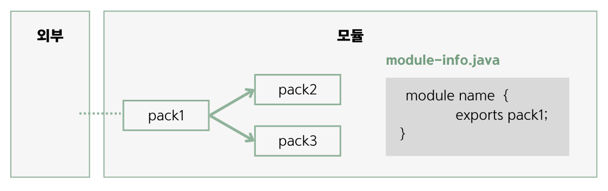

## 10.5 패키지 은닉
- 모듈은 모듈 기술자(module_info.java)에서 exports 키워드를 사용해 내부 패키지 중 외부에서 사용할 패키지를 지정함.
- exports되지 않은 패키지는 자동적으로 은닉됨.

- 위의 그림을 보면 exports된 pack1만 외부에서 사용될 수 있고, pack2와 pack3은 은닉됨.

### 모듈이 일부 패키지를 은닉하는 이유
- 모듈 사용 방법 통일 : 모듈 외부에서 패키지2와 3을 사용하지 못하도록 막고, 패키지1로 사용 방법을 통일함.
- 쉬운 수정 : 모듈 성능 향상을 위해 패키지2와 3을 수정하더라도 모듈 사용 방법(패키지1)이 달라지지 않기 때문에 외부에 영향을 주지 않음.

### 🙋 면접 예상 질문
- 모듈이 일부 패키지를 은닉하는 이유를 설명해주세요.
