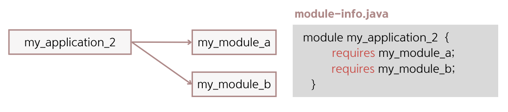
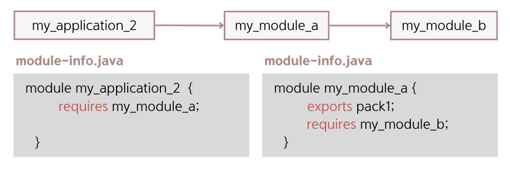
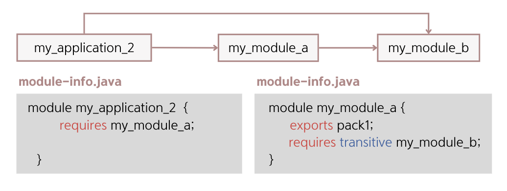

## 10.6 전이 의존

- my_application_2 프로젝트와 my_module_a, my_module_b 모듈의 관계는 위의 사진처럼 표현할 수 있음.
- my_application_2가 직접적으로 두 모듈을 `requires` 하고 있기 때문임.

- 위와 같이 의존 관계를 변경하면, my_application_2는 my_module_a에 의존하고, my_module_a는
my_module_b에 의존함.
- 위와 같이 모듈 기술자를 작성하면, my_application_2의 Main 클래스는 my_module_b 모듈을 사용하려면 `컴파일 오류⚠️`가 발생함.

- 이를 해결하기 위해 my_module_a의 모듈 기술자에 `transitive` 키워드와 함께 my_module_b를 의존 설정하면 됨.
- `transitive` 키워드를 사용하면 `⭐️의존 설정이 전이⭐️`되기 때문에 my_application_2에서 my_module_b를 사용할 수 있게 됨.

### 🙋 면접 예상 질문
- transitive 키워드에 대해 설명해주세요.