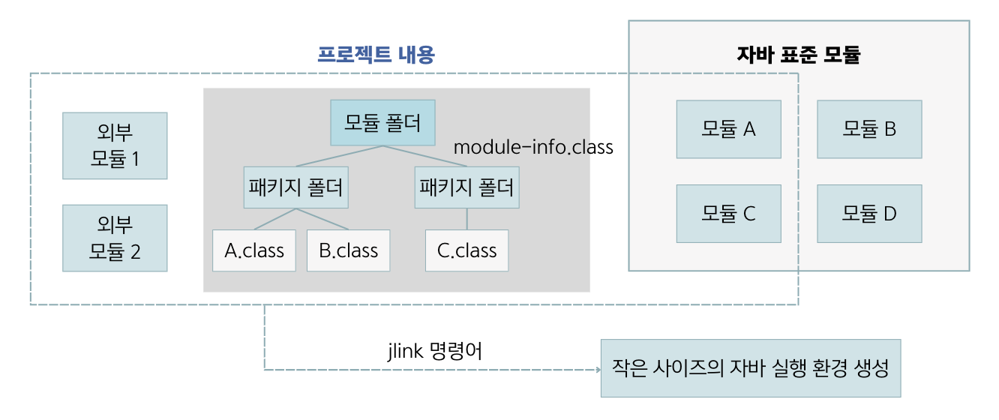

## 10.9 자바 표준 모듈
- 자바 프로그램이라면 JDK가 제공하는 표준 라이브러리를 활용함.
- 표준 라이브러리는 Java 9부터 모듈화가 되어 Java 21 표준 모듈이 완성되었음. [Java 21 전체 모듈](https://docs.oracle.com/en/java/javase/21/docs/api/java.se/module-summary.html)
- 표준 라이브러리를 모듈화한 이유 : 응용프로그램을 실행하는데 필요한 모듈만으로 구성된 작은 사이즈의 자바 실행 환경(JRE)을 만들기 위함.
- Java 8 이전 버전까지는 응용프로그램이 표준 라이브러리의 5%만 사용하는데도 불구하고 응용프로그램을 실행하려면 전체 표준 라이브러리가 갖추어진 자바 실행 환경(JRE)이 필요했음.
- **작은 사이즈의 자바 실행 환경이 필요한 경우**
  - 독립 실행형(응용프로그램 + 표준 라이브러리)으로 배포할 경우 표준 라이브러리의 크기가 작을수록 배포 사이즈가 줄어듬.
  - 제한된 자원만 가지고 있는 소형(임베디드) 기기에는 사이즈가 작은 자바 실행 환경이 필요함.

- 자바 표준 모듈은 모듈 A에서 모듈 D까지 제공하지만, 프로젝트를 실행하는 데는 모듈 A와 모듈 B만 있으면 됨.
- 모듈 C와 모듈 D를 제외하고 프로젝트만 실행할 수 있는 작은 실행 환경을 `jlink` 명령어로 생성할 수 있음.

### 🙋 면접 예상 질문
- 작은 사이즈의 자바 실행 환경(JRE)가 필요한 경우에 대해 설명해주세요.