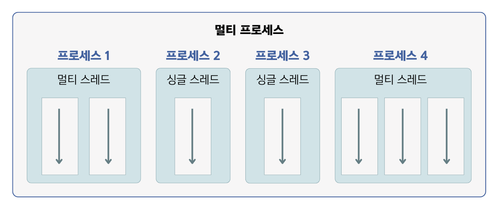

## 14.1 멀티 스레드 개념
- 운영체제는 실행 중인 프로그램을 `프로세스`로 관리함.
- 💠 **멀티 태스킹(multi tasking)** : 두 가지 이상의 작업을 동시에 처리하는 것
- 💠 **스레드(thread)** : 코드의 실행 흐름 ➡️ 프로세스 내에 스레드가 두 개라면 두 개의 코드 실행 흐름이 생김.
- 하나의 프로세스가 두 가지 이상의 작업을 처리할 수 있는 이유는 `멀티 스레드`가 있기 때문임.

### 멀티 프로세스 🆚 멀티 스레드

- **멀티 프로세스**
  - `프로그램 단위`의 멀티 태스킹
  - 서로 독립적 ➡️ 하나의 프로세스에서 오류가 발생해도 다른 프로세스에게 영향을 미치지 않음.
    - ex. 워드와 엑셀을 사용하는 도중에 워드에 오류가 생기더라도 엑셀은 여전히 사용 가능함.
- **멀티 스레드**
  - `프로그램 내부`에서의 멀티 태스킹
  - 다른 스레드에 영향을 미침. ➡️ 프로세스 내부에서 생성되기 때문에 하나의 스레드가 예외를 발생시키면 프로세스가 종료됨.
    - ex. 멀티 스레드로 동작하는 메신저의 경우, 파일을 전송하는 스레드에서 예외가 발생하면 메신저 프로세스 자체가 종료돼서
    채팅 스레드도 같이 종료됨.

      
### 멀티 스레드의 사용 🛠️
  - 데이터를 분할해서 병렬로 처리할 때
  - 안드로이드 앱에서 네트워크 통신을 할 때
  - 다수의 클라이언트 요청을 처리하는 서버를 개발할 때

### 🙋 면접 예상 질문
- 멀티 프로세스와 멀티 스레드의 차이점에 대해 설명해주세요.