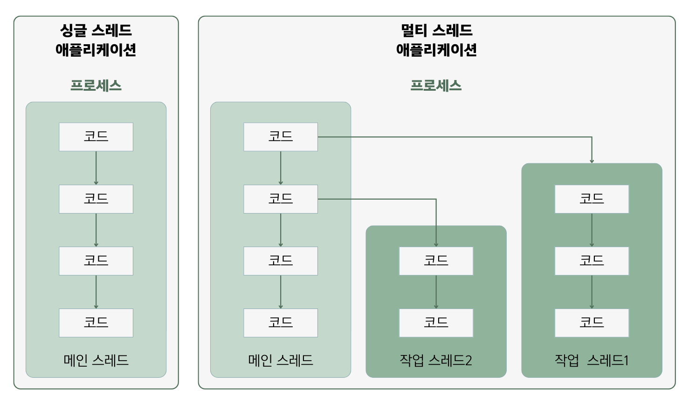

## 14.2 메인 스레드
- 모든 자바 프로그램은 `메인 스레드(main thread)`가 main() 메소드를 실행하면서 시작됨.
- 메인 스레드는 main() 메소드의 첫 코드부터 순차적으로 실행하고, main() 메소드의 마지막 코드를 실행해거나
return 문을 만나면 실행을 종료함.
- 메인 스레드는 필요에 따라 추가 작업 스레드들을 만들어서 실행시킬 수 있음.
  
  - 위의 그림에서 메인 스레드가 작업 스레드1을 생성하고 실행시킨 다음, 작업 스레드2를 생성하고 실행시키는 것을 볼 수 있음.
  - 싱글 스레드에서는 메인 스레드가 종료되면 프로세스도 종료됨.
  - 멀티 스레드에서는 실행 중인 스레드가 하나라도 있다면 프로세스는 종료되지 않음. 메인 스레드가 작업 스레드보다 먼저
  종료되더라도 작업 스레드가 계속 실행 중이라면 프로세스는 종료되지 않음.

### 🙋 면접 예상 질문
- 메인 스레드에 대해 설명해주세요.