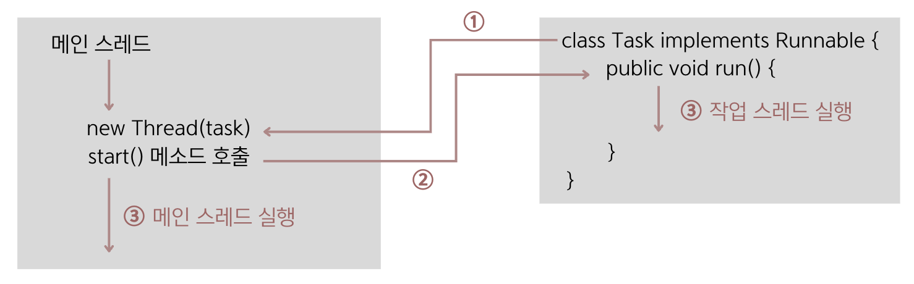
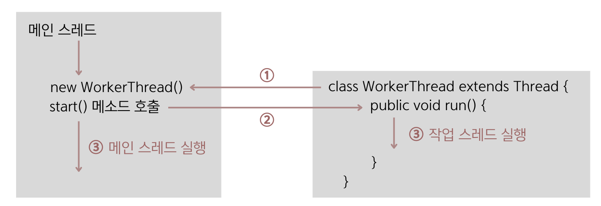

## 14.3 작업 스레드 생성과 실행
- 멀티 스레드로 실행하는 프로그램을 개발하려면 먼저 몇 개의 작업을 병렬로 실행할지 결정하고 각 작업별로 스레드를 생성해야 함.
- 자바 프로그램은 메인 스레드가 반드시 존재하기 때문에 메인 작업 이외에 **추가적인 작업 수만큼 스레드를 생성**하면 됨.
- 자바는 **작업 스레드도 객체로 관리하므로 클래스가 필요**함. ➡️ `Thread` 클래스로 직접 객체를 생성해도 되지만, 하위 클래스를 만들어 생성할 수도 있음.

### Thread 클래스로 직접 생성
- java.lang 패키지에 있는 Thread 클래스로부터 작업 스레드 객체를 생성하려면 ➡️ `Runnable` 구현 객체를 매개값으로 갖는 생성자를 호출하면 됨.
- 💠 **Runnable** : 스레드가 작업을 실행할 때 사용하는 인터페이스
  ```java
  Thread thread = new Thread(Runnable target);
  ```

- **1️⃣ Runnable 구현 클래스를 작성하는 방법**
  - Runnable에는 run() 메소드가 정의되어 있는데, 구현 클래스는 run() 메소드를 재정의해서 스레드가 실행할 코드를 가지고 있어야 함.
    ```java
    // Runnable 구현 클래스를 작성하는 방법
    class Task implements Runnable {
        @Override
        public void run() {
            // 스레드가 실행할 코드
        }
    }
    ```
  - Runnable 구현 클래스는 작업 내용을 정의한 것이므로 스레드에 전달해야 하고, Runnable 구현 객체를 생성한 후 Thread 생성자 매개값으로 Runnable
  객체를 다음과 같이 전달하면 됨.
    ```java
    Runnable task = new Task();
    Thread thread = new Thread(task);
    ```
    
- **2️⃣ Runnable 구현 클래스를 작성하지 않는 방법(익명 객체)**
  - 명시적인 Runnable 클래스를 작성하지 않고 Thread 생성자를 호출할 때 `⭐️Runnable 익명 구현 객체를 매개값⭐️`으로 사용할 수 있고, 이 방법이 더 많이 사용됨.
    ```java
    Thread thread = new Thread( new Runnable() {
        @Override
        public void run() {
            // 스레드가 실행할 코드
        }
    } );
    ```
    
- **작업 스레드 실행**
  - 작업 스레드 객체가 생성되었다고 해서 바로 작업 스레드가 실행되지는 않음.
  - 작업 스레드를 실행하려면 작업 스레드 객체의 `start()` 메소드를 호출해야 함.
  ```java
  thread.start();
  ```
  - start() 메소드가 호출되면, 작업 스레드는 매개값으로 받은 Runnable의 run() 메소드를 실행하면서 작업을 처리함.
  
  

### Thread 자식 클래스로 생성
- **1️⃣ 자식 클래스를 정의하는 방법**
  - Thread 클래스를 상속한 다음 run() 메소드를 재정의해서 스래드가 실행할 코드를 작성하고 객체를 생성하면 됨.
  ```java
  public class WorkerThread extends Thread {
      @Override
      public void run() {
          // 스레드가 실행할 코드
      }
  }

  // 스레드 객체 생성
  Thread thread = new WorkerThread();
  ```
  
- **2️⃣ 자식 클래스를 정의하지 않는 방법(익명 객체)**
  - `⭐️Thread 익명 자식 객체⭐️`를 사용하는 방법도 있음. 이 방법이 더 많이 사용됨.
  - 참고로 익명 클래스 문법은 `new 상위클래스명() { ... }` 또는 `new 인터페이스명() { ... }` 형태로 작성함.
  ```java
  Thread thread = new Thread() {
      @Override
      public void run() {
          // 스레드가 실행할 코드
      }
  };
  thread.start();
  ```

- **작업 스레드 실행**
  - 똑같이 작업 스레드 객체의 `start()` 메소드를 호출하면 됨.
  ```java
  thread.start();
  ```
  
  
  