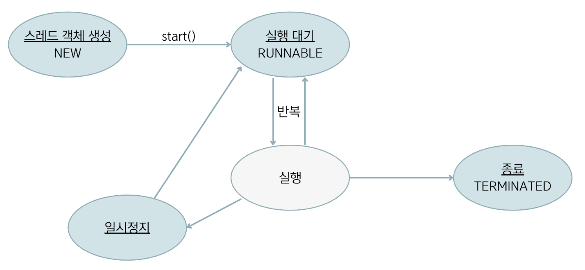
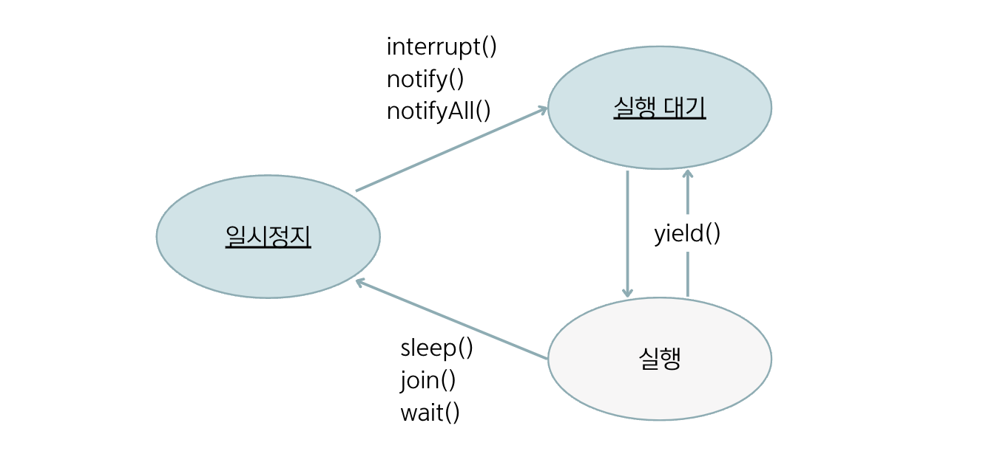
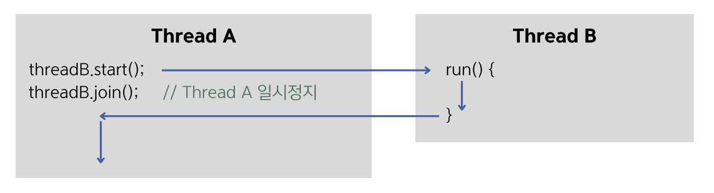
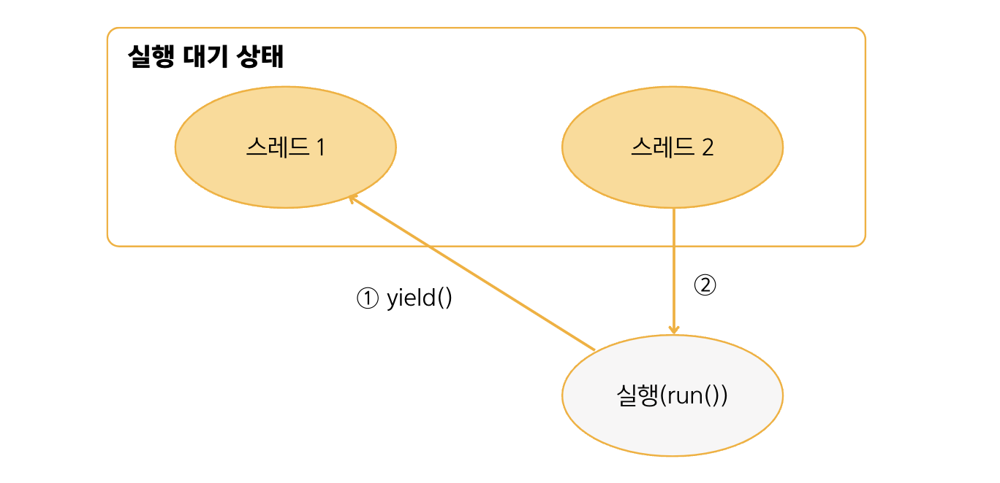

## 14.5 스레드 상태

- **실행 대기 상태**
  - 💠 `실행 대기 상태(RUNNABLE)` : 실행을 기다리고 있는 상태 
  - 스레드 객체를 생성(NEW)하고, start() 메소드를 호출하면 곧바로 스레드가 실행되는 것이 아니라 실행 대기 상태(RUNNABLE)가 됨.
- **실행 상태**
  - 💠 `실행 상태` : 스레드가 CPU 스케줄링에 따라 CPU를 점유하고 run() 메소드를 실행하는 상태
  - 실행 대기하는 스레드는 실행될 수 있고, 실행 스레드는 run() 메소드를 모두 실행하기 전에 스케줄링에 의해서 다시 실행 대기 상태로 돌아갈 수 있음.
  그리고 다른 스레드가 실행 상태가 됨.
  - 스레드는 실행 대기 상태와 실행 상태를 번갈아 가면서 자신의 run() 메소드를 조금씩 실행함.
- **종료 상태**
  - 💠 `종료 상태(TERMINATED)` : 실행 상태에서 run() 메소드가 종료되면 더 이상 실행할 코드가 없기 때문에 스레드의 실행이 멈추게 된 상태
- **일시 정지 상태**
  - 💠 `일시 정지 상태` : 스레드가 실행할 수 없는 상태
  - 스레드가 다시 실행 상태로 가기 위해서는 일시 정지 상태에서 실행 대기 상태로 가야만 함.

### 일시 정지로 가기 위한 메소드와 벗어나기 위한 메소드

 

<table border="1">
  <tr>
    <td rowspan="3">일시 정지로 보냄</td>
    <td><code>sleep(long millis)</code></td>
    <td>주어진 시간 동안 스레드를 일시 정지 상태로 만듦. 주어진 시간이 지나면 자동적으로 실행 대기 상태가 됨.</td>
  </tr>
  <tr>
    <td><code>join()</code></td>
    <td>join() 메소드를 호출한 스레드는 일시 정지 상태가 됨. 실행 대기 상태가 되려면, join() 메소드를 가진 스레드가 종료되어야 함.</td>
  </tr>
  <tr>
    <td><code>wait()</code></td>
    <td>동기화 블록 내에서 스레드를 일시 정지 상태로 만듦.</td>
  </tr>
  <tr>
    <td rowspan="2">일시 정지에서 벗어남</td>
    <td><code>interrupt()</code></td>
    <td>일시 정지 상태일 경우, InterruptedException을 발생시켜 실행 대기 상태 또는 종료 상태로 만듦.</td>
  </tr>
  <tr>
    <td><code>notify()</code><br><code>notifyAll()</code></td>
    <td>wait()메소드로 인해 일시 정지 상태인 스레드를 실행 대기 상태로 만듦.</td>
  </tr>
  <tr>
    <td>실행 대기로 보냄</td>
    <td><code>yield()</code></td>
    <td>실행 상태에서 다른 스레드에게 실행을 양보하고 실행 대기 상태가 됨.</td>
  </tr>
</table>

- 위의 표에서 wait()과 notify(), notifyAll()은 Object 클래스의 메소드이고, 그 외는 Thread 클래스의 메소드임.

### 주어진 시간 동안 일시 정지 - `sleep(long millis)`
- 실행 중인 스레드를 일정 시간 멈추게 하고 싶다면 ➡️ Thread 클래스의 정적 메소드인 `sleep()😴`을 이용하면 됨.
- 매개값에는 얼마 동안 일시 정지 상태로 있을 것인지 밀리세컨드(1/1000) 단위로 시간을 주면 됨.
```java
try {
    Thread.sleep(1000);
} catch(InterruptedException e) {
    // interrupt() 메소드가 호출되면 실행
}
```
- 위의 코드는 스레드를 1초 동안 일시 정지 상태로 만듦.
- 일시 정지 상태에서는 InterruptedException이 발생할 수 있기 때문에 sleep()은 예외 처리가 필요한 메소드임.

### 다른 메소드의 종료를 기다림 - `join()`
- 스레드는 다른 스레드와 독립적으로 실행하지만 다른 스레드가 종료될 때까지 기다렸다가 실행을 해야 하는 경우도 있음. ➡️ `join()🤝`을 이용하면 됨.
  - ex. 계산 스레드의 작업이 종료된 후 그 결과값을 받아 처리하는 경우


- ThreadA가 ThreadB의 join() 메소드를 호출하면 ThreadA는 ThreadB가 종료될 때까지 일시 정지 상태가 됨.
- ThreadB의 run() 메소드가 종료되어야 ThreadA는 일시 정지에서 풀려 다음 코드를 실행함.

### 다른 스레드에게 양보 - `yield()`
- 스레드가 무의미한 반복을 한다면 다른 스레드에게 실행을 양보하고 자신은 실행 대기 상태로 가는 것이 프로그램 성능에 도움이 됨. ➡️ `yield()`를 사용함.
- yield()를 호출한 스레드는 실행 대기 상태로 돌아가고, 다른 스레드가 실행 상태가 됨.


```java
// work 값이 false라면 무의미한 반복을 하는 코드.
public void run() {
    while(true) {
        if(work) {
            System.out.println("ThreadA 작업 내용");
        }
    }
}
```
```java
// 무의미한 반복을 하지 않고 다른 스레드에게 실행을 양보하도록 수정한 코드.
public void run() {
    while(true) {
        if(work) {
            System.out.println("ThreadA 작업 내용");
        } else {
            Thread.yield();
        }
    }
}
```


### 🙋 면접 예상 질문
- 스레드 상태엔 어떤 것이 있고, 각 상태에 대해 설명해주세요.
- 일시 정지 상태의 스레드가 실행이 되려면 어떤 상태를 거쳐야 하는지 설명해주세요.
- 일시 정지에서 벗어가기 위한 메소드로는 어떤 것이 있는지 설명해주세요.
- `sleep()`, `join()`, `yield()` 메소드에 대해 설명해주세요.