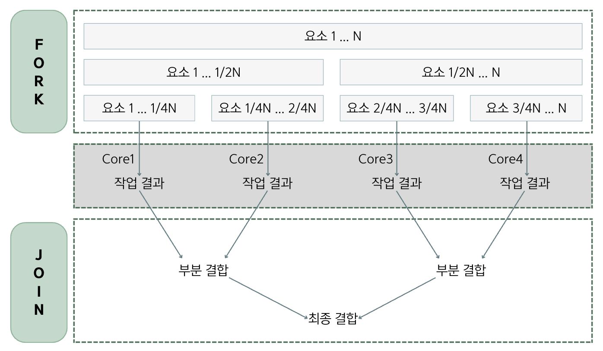
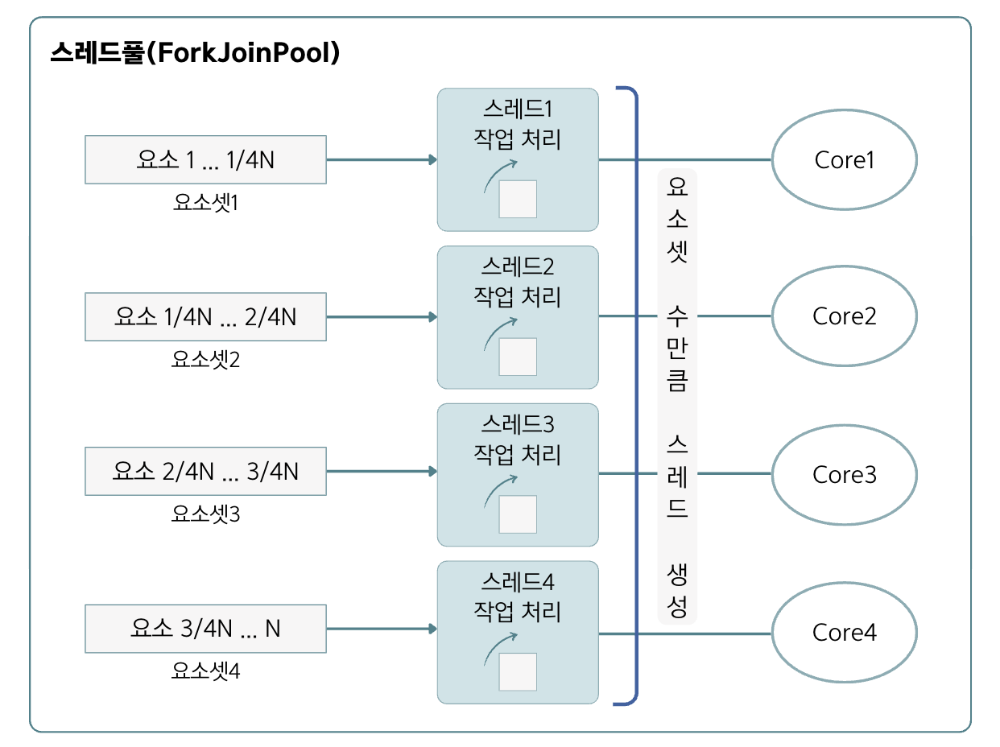

## 17.13 요소 병렬 처리
- 💠 요소 병렬 처리 : 멀티 코어 CPU 환경에서 전체 요소를 분할해서 각각의 코어가 병렬적으로 처리하는 것
- 요소 병렬 처리의 목적은 **작업 처리 시간을 줄이는 것**임.
- 자바는 요소 병렬 처리를 위해 `병렬 스트림`을 제공함.

### 동시성과 병렬성
- 💠 동시성 : 멀티 작업을 위해 멀티 스레드가 하나의 코어에서 번갈아 가며 실행하는 것
  - **한 시점에 하나의 작업만 실행**(동시에 처리되는 것처럼 보일 뿐)
- 💠 병렬성 : 멀티 작업을 위해 멀티 코어를 각각 이용해서 병렬로 실행하는 것
  - **한 시점에 여러 개의 작업을 병렬로 실행**하기 대문에 동시성보다는 좋은 성능을 냄.
  - `데이터 병렬성`과 `작업 병렬성`이 있음.
  - **데이터 병렬성**
    - 전체 테이터를 분할해서 서브 데이터셋으로 만들고 이 서브 데이터셋들을 병렬 처리해서 작업을 빨리 끝내는 것
    - `⭐️자바 스트림은 데이터 병렬성⭐️`을 구현한 것
  - **작업 병렬성**
    - 서로 다른 작업을 병렬 처리하는 것
    - 대표적인 예는 서버 프로그램. ➡️ 각각의 클라이언트에서 요청한 내용을 개별 스레드로에서 병렬로 처리함.

### 포크조인 프레임워크

- 자바 병렬 스트림은 요소들을 병렬 처리하기 위해 포크조인 프레임워크를 사용함.
- 포크조인 프레임워크는 포크 단계에서 전체 요소들을 서브 요소셋으로 분할하고, 각각의 서브 요소셋을 멀티 코어에서 병렬로 처리함.
- 조인 단계에서는 서브 결과를 결합해서 최종 결과를 만들어냄.


- 병렬 처리 스트림은 포크 단계에서 요소를 순서대로 분할하지 않음.(내부적으로 요소들을 나누는 알고리즘이 있어서 개발자는 신경 쓸 필요❌)
- 포크조인 프레임워크는 병렬 처리를 위해 스레드풀을 사용함. ➡️ `ExecutorService의 구현 객체인 ForkJoinPool`을 사용해서 작업 스레드를 관리함.
- 각각의 코어에서 서브 요소셋을 처리하는 것은 작업 스레드가 해야 하므로 스레드 관리가 필요함.

### 병렬 스트림 사용
- 자바 병렬 스트림을 이용할 경우에는 백그라운드에서 포크조인 프레임워크가 사용되기 때문에 개발자는 매우 쉽게 병렬 처리를 할 수 있음.
#### 병렬 스트림의 메소드
- 💠 `parallelStream()` : 컬렉션(List, Set)으로부터 병렬 스트림을 바로 리턴함.
- 💠 `parallel()` : 기존 스트림을 병렬 처리 스트림으로 변환함.
<table border="1">
  <tr>
    <td>리턴 타입</td>
    <td>메소드</td>
    <td>제공 컬렉션 또는 스트림</td>
  </tr>
  <tr>
    <td>Stream</td>
    <td><code>parallelStream()</code></td>
    <td>List 또는 컬렉션</td>
  </tr>
  <tr>
    <td>Stream</td>
    <td rowspan="4"><code>parallel()</code></td>
    <td>java.util.Stream</td>
  </tr>
  <tr>
    <td>IntStream</td>
    <td>java.util.IntStream</td>
  </tr>
  <tr>
    <td>LongStream</td>
    <td>java.util.LongStream</td>
  </tr>
  <tr>
    <td>DoubleStream</td>
    <td>java.util.DoubleStream</td>
  </tr>
</table>

#### 사용 예시
```java
List<Integer> scores = new ArrayList<>();
Stream<Integer> parallelStream = scores.parallelStream();
```

### 병렬 처리 성능
- 스트림 병렬 처리가 스트림 순차 처리보다 항상 실행 성능이 좋은 것은 아님.
- 병렬 처리에 영향을 미치는 아래 3가지 요인을 살펴봐야 함.
- 1️⃣ 요소의 수와 요소당 처리 시간
  - 컬렉션에 전체 요소의 수가 적고 요소당 처리 시간이 짧으면 일반 스트림이 병렬 스트림보다 빠를 수 있음.
  - 병렬 처리는 포크 및 조인 단계가 있고, 스레드 풀을 생성하는 추가적인 비용이 발생하기 때문임.
- 2️⃣ 스트림 소스의 종류
  - ArrayList와 배열은 인덱스로 요소를 관리하기 때문에 포크 단계에서 요소를 쉽게 분리할 수 있어 병렬 처리 시간이 절약됨.
  - 반면에 HashSet, TreeSet은 요소 분리가 쉽지 않고, LinkedList도 링크를 따라가야 하므로 요소 분리가 쉽지 않음. ➡️ 상대적으로 병렬 처리가 늦음.
- 3️⃣ 코어의 수
  - CPU 코어의 수가 많으면 많을수록 병렬 스트림의 성능은 좋아짐.
  - 하지만 코어의 수가 적을 경우에는 일반 스트림이 더 빠를 수 있음.
  - 병렬 스트림은 스레드 수가 증가하여 동시성이 많이 일어나므로 오히려 느려짐.
### 🙋 면접 예상 질문
- 동시성과 병렬성에 대해 설명해주세요.
- 병렬 스트림의 내부 동작 방식(포크조인 프레임워크)을 설명해주세요.
- 병렬 처리 성능에 영향을 미치는 요인은 어떤게 있는지 설명해주세요.