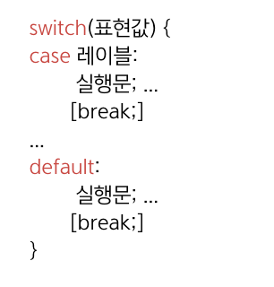
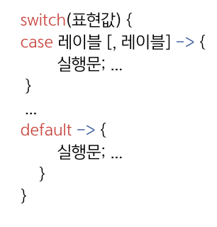
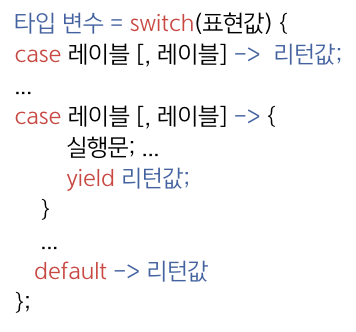

## 21.3 switch 문의 null 처리
- switch 문의 표현식을 사용하면 간결한 코드를 만들 수 있고, 단일값을 변수에 대입할 수 있음.

<table>
    <thead>
        <tr>
            <th>전통적 방식</th>
            <th>강화된 방식1 (자바 17부터)</th>
            <th>강화된 방식2 (자바 17부터)</th>
        </tr>
    </thead>
    <tbody>
        <tr>
            <td></td>
            <td></td>
            <td></td>
        </tr>
        <tr>
            <td>레이블에서는 리터럴(값) 또는 상수가 주로 사용됨</td>
            <td>case 블록이 한 개의 실행문을 가질 경우 {} 생략 가능</td>
            <td>리턴값에는 단일값 또는 단일값을 리턴하는 연산식 및 메소드 호출 코드가 올 수 있음</td>
        </tr>
        <tr>
            <td colspan="3">표현값에는 정수 타입(byte, char, short, int, long)과 
String 및 enum 타입의 값이 오거나 이 값들을 리턴하는 연산식 및 메소드 호출 코드가 올 수 있음. </td>
        </tr>
    </tbody>
</table>

- Java 17까지는 표현식이 null일 경우 switch 문에서 `NullPointerException`이 발생함.
- Java 21부터는 아래와 같이 레이블에 null을 지정해서 예외를 발생시키지 않고 **⭐️null을 처리할 수 있게 됨⭐️**.
```java
switch(object) {
    ...
    case null -> { ... }            // object가 null일 경우 선택
    case null, default -> { ... }   // object가 null이거나 위의 case가 선택되지 않은 경우 선택
}
```
### 🙋 면접 예상 질문
- 자바 17 이전과 자바 21 이후 switch 문의 null 처리에 대해 설명해주세요.