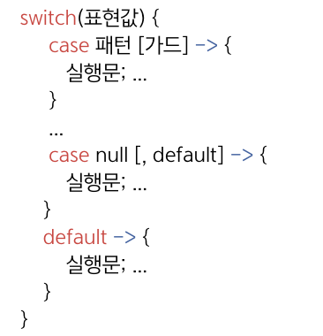
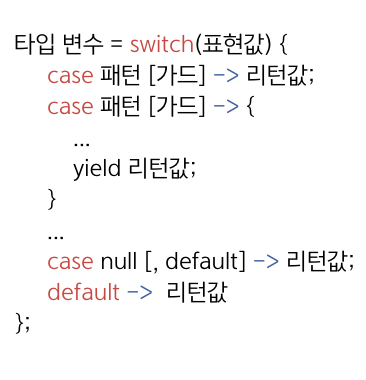

## 21.4 switch 문의 패턴 매칭
- 자바 21부터는 switch 레이블에 패턴과 가드를 작성해서 표현값과 매칭시킬 수도 있음.
- 이 방식은 표현값이 객체를 참조하는 변수일 경우에나 사용 가능.

<table>
  <thead>
    <tr>
      <th>강화된 방식1(자바21부터)</th>
      <th>강화된 방식2(자바21부터)</th>
    </tr>
  </thead>
  <tbody>
    <tr>
      <td></td>
      <td></td>
    </tr>
    <tr>
      <td colspan="2">- 패턴: 참조 변수 선언<br>- 가드: when + boolean을 리턴하는 조건식 또는 메소드 호출 코드</td>
    </tr>
  </tbody>
</table>

### 레이블에 패턴 사용
- 표현값이 참조 타입 변수일 경우 패턴을 사용해서 타입 검사를 수행하고, 자동 타입 변환해서 패턴 변수를 초기화시킴.
- 패턴 변수를 중괄호{} 블록에서 사용할 수 있음.
```java
switch(object) {
    case Integer i -> { i 변수 사용 }   // object가 Integer 타입인 경우 매칭(자동 타입 변환)
    case String s  -> { s 변수 사용 }   // object가 String 타입인 경우 매칭(자동 타입 변환)
}
```
- 💠 `표현값과 실행문의 완전성` : 표현값이 반드시 실행문에서 처리되어야 함.
  - 표현값은 패턴 중 하나와 반드시 매칭되도록 해야 함.
  - 만약 매칭할 패턴이 없을 경우에는 나머지 매칭을 위해 default를 포함해야 함. 
```java
switch(object) {
    case Integer i         -> { ... }  // object가 Integer 타입인 경우 매칭(자동 타입 변환)
    case String s          -> { ... }  // object가 String 타입인 경우 매칭(자동 타입 변환)
    default null, default  -> { ... }  // object가 null이거나 그 이외의 타입일 경우 매칭
}
```

### 가드 사용
- 패턴과 함께 좀 더 상세한 일치 조건을 만들기 위해 `when`으로 시작하는 `가드`를 사용할 수 있음.
- when 다음에는 패턴 변수를 사용해서 boolean을 리턴하는 조건식 또는 메소드 호출 코드가 올 수 있고,
true를 리턴하면 레이블이 선택되고 중괄호가 실행됨.
```java
switch(object) {
    case Integer i when i > 0 -> {  // object가 Integer 타입이면서 양수일 경우 선택
        ...
    }
    case String s when s.equals("a") -> {  // object가 String 타입이면서 "a"일 경우 선택
        ...
    }
}
```

### 레이블 통과
- 레이블에 패턴이 사용되면 기본적으로 다음 레이블로 통과가 금지됨.
    - 단, 다음이 default라면 통과할 수 있지만 화살표가 사용되면 무조건 통과가 금지됨.
```java
switch(object) {
    case String s:
        ...
        break;      // 생략하면 컴파일 에러 생김(다음 레이블로 무조건 통과 금지)
    case Integer i;
        ...
        break;      // 명시적 통과 금지
    default:
        ...
}
```
```java
switch(object) {
    case Integer i  -> { ... }  // 레이블에 패턴이 사용되면 기본적으로 다음 레이블로 통과 금지.
        
    case String s   -> { ... }
        
    default         -> { ... }
}
```

### 레이블 작성 순서
- 레이블이 패턴일 경우에는 좁은 범위의 패턴을 먼저 작성하고, 넓은 범위의 패턴을 나중에 작성해야 함.
- switch 문은 위에서부터 순차적으로 표현값과 패턴을 매칭하기 때문에 위쪽 패턴이 먼저 매칭되면 아래쪽 패턴은 검사하지 않음.
```java
Integer data = 3;
switch(data) {
    case 0 -> System.out.println("0");
    case Integer i when i > 0 -> System.out.println("0 or positive number");
    case Integer i -> System.out.println("negative number");
}
```
- 위의 레이블 순서를 바꾸면 `컴파일 에러⚠️`가 발생함.
- 부모와 자식 관계, 인터페이스의 구현 관계에도 범위가 있음.
  - 부모는 자식 클래스보다 항상 넓은 범위를 가지며, 인터페이스는 구현 클래스보다 항상 넓은 범위를 가짐.
```java
class A {}
class B extends A {}
---------------------------
Object obj = new A();
switch(obj) {
    case B b -> System.out.println("B type");       // 자식 패턴 작성
    case A a -> System.out.println("A type");       // 부모 패턴 작성
    default  -> System.out.println("unknown type");  // 그 이외의 패턴
}
```

### 인터페이스 타입의 표현값과 enum 레이블
- **자바17까지** ➡️ 표현값과 레이블에 enum 타입을 사용할 때 하나의 enum 타입만 사용해야 했음.
```java
public enum Shape {
    LINE,
    TRIANGLE,
    RECTANGLE
}
```
```java
// 레이블에는 표현값과 동일한 enum 타입의 상수가 와야 함.
String result = switch (shape) {
    case Line -> "선을 그립니다.";
    case TRIANGLE -> "삼각형을 그립니다.";
    case RECTANGLE -> "사각형을 그립니다.";
};
```
- **자바21에서는** ➡️ 패턴 매칭을 사용할 수 있기 때문에 표현값에 인터페이스 타입이 올 수 있음.
- 인터페이스는 여러 가지 enum을 그룹핑할 목적으로 사용할 수 있음.
```java
public sealed interface Drawable permits Shape, Image {
}
```
```java
public enum Shape implements Drawable {
    LINE,
    TRIANGLE,
    RECTANGLE
}
```
```java
public enum Image implements Drawable {
    JPEG,
    PNG
}
```
```java
// 그룹핑된 enum 타입을 레이블로 사용
String result = switch(drawable) {
    case Shape s when s == Shape.LINE -> "선을 그립니다.";
    case Shape s when s == Shape.TRIANGLE -> "삼각형을 그립니다.";
    case Shape s when s == Shape.RECTANGLE -> "사각형을 그립니다.";
    case Image i when i == Image.JPEG -> "JPEG 이미지를 그립니다.";
    case Image i when i == Image.PNG -> "PNG 이미지를 그립니다.";
};

// 그룹핑된 enum 타입과 상수를 혼용해서 레이블로 사용
String result = switch(drawable) {
    case Shape.LINE -> "선을 그립니다.";
    case Shape.TRIANGLE -> "삼각형을 그립니다.";
    case Shape.RECTANGLE -> "사각형을 그립니다.";
    case Image i -> "이미지를 그립니다.";
    // Shape 타입 패턴이 없기 때문에 필수로 작성
    default -> "도형을 그리지 않습니다.";
};
```

### 🙋 면접 예상 질문
- 가드에 대해 설명해주세요.
- switch 문에서 인터페이스 타입의 표현값이 어떻게 사용되는지 설명해주세요.