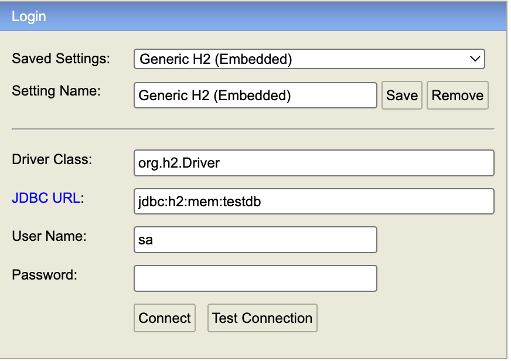

# 2. JPA 시작

> 중요하지 않은 내용은 제외하고 정리했습니다.

## 2.2 H2 데이터베이스 설치
### 주요 연결 URL
- **인메모리 URL**: `jdbc:h2:mem:testdb`
- **파일 URL**: `jdbc:h2:~/testdb`
- **웹 콘솔**: `http://localhost:8080/h2-console`
- 콘솔 화면



## 2.4 객체 매핑 시작

### 매핑 정보 예시
| 매핑 정보 | 회원 객체 | 회원 테이블 |
|-----------|-----------|-------------|
| 클래스와 테이블 | Member | MEMBER |
| 기본키 | id | ID |
| 필드와 컬럼 | username | NAME |
| 필드와 컬럼 | age | AGE |

### 엔티티 클래스 작성
```java
@Entity
@Table(name = "MEMBER")
public class Member {
    
    @Id
    @Column(name = "ID")
    private String id;
    
    @Column(name = "NAME")
    private String username;
    
    private Integer age;
    
    // getter, setter 생략
}
```

### 주요 어노테이션
- **@Entity**: 클래스를 테이블과 매핑한다고 JPA에게 알려줌
- **@Table**: 엔티티 클래스에 매핑할 테이블 정보를 지정 (생략 시 클래스명 사용)
- **@Id**: 엔티티 클래스의 필드를 테이블의 기본 키에 매핑
- **@Column**: 필드를 컬럼에 매핑 (생략 시 필드명 사용)

## 2.5 persistence.xml 설정
### 2.5.1 데이터베이스 방언

#### 방언이란?
- 각 데이터베이스마다 다른 SQL 문법과 함수를 JPA에서 방언이라고 함
- JPA는 표준 문법을 제공하고, 특정 데이터베이스에 의존적인 SQL은 방언이 처리
- 데이터베이스 변경 시 방언만 교체하면 됨

#### 주요 방언 클래스
- **MySQL**: `org.hibernate.dialect.MySQL5InnoDBDialect`
- **H2**: `org.hibernate.dialect.H2Dialect`

## 2.6 애플리케이션 개발

### 기본 코드 구조
```java
public class JpaMain {
    public static void main(String[] args) {
        
        // 엔티티 매니저 팩토리 생성
        EntityManagerFactory emf = Persistence.createEntityManagerFactory("jpabook");
        // 엔티티 매니저 생성
        EntityManager em = emf.createEntityManager();
        // 트랜잭션 획득
        EntityTransaction tx = em.getTransaction();
        
        try {
            tx.begin();
            logic(em);  // 비즈니스 로직 실행
            tx.commit();
        } catch (Exception e) {
            tx.rollback();
        } finally {
            em.close();
        }
        emf.close();
    }
    
    private static void logic(EntityManager em) {
        // 비즈니스 로직
    }
}
```

### 엔티티 매니저 설정

#### 엔티티 매니저 팩토리
- JPA 동작을 위한 기반 객체 생성 및 커넥션 풀 생성
- **생성 비용이 매우 크므로 애플리케이션 전체에서 한 번만 생성하고 공유**

#### 엔티티 매니저
- 엔티티의 등록/수정/삭제/조회 담당
- 데이터베이스 커넥션과 밀접한 관계
- **스레드 간 공유하거나 재사용하면 안됨**

#### 종료 처리
```java
em.close();      // 엔티티 매니저 종료
emf.close();     // 엔티티 매니저 팩토리 종료
```

### 트랜잭션 관리
- **JPA는 항상 트랜잭션 안에서 데이터를 변경해야 함**
- 트랜잭션 없이 데이터 변경 시 예외 발생
- 정상 동작 시 커밋, 예외 발생 시 롤백

## 2.5 CRUD 연산

### 등록 (Create)
```java
// 순수 JPA
em.persist(member);

// Spring Data JPA
memberRepository.save(member);
```
**생성되는 SQL**: `INSERT INTO MEMBER(ID, NAME, AGE) VALUES ('id1', '서희', 40)`

### 수정 (Update)
```java
// 순수 JPA - 더티 체킹 (Dirty Checking)
member.setAge(24);  // 값만 변경하면 자동으로 UPDATE SQL 생성
```
**생성되는 SQL**: `UPDATE MEMBER SET AGE = 24 WHERE ID='id1'`

### 삭제 (Delete)
```java
// 순수 JPA
em.remove(member);
// Spring Data JPA
memberRepository.delete(member);
// 또는
memberRepository.deleteById(id);
```
**생성되는 SQL**: `DELETE FROM MEMBER WHERE ID = 'id1'`

### 단건 조회 (Read)
```java
// 순수 JPA
Member findMember = em.find(Member.class, id);

// Spring Data JPA
Optional<Member> member = memberRepository.findById(id);
```
**생성되는 SQL**: `SELECT * FROM MEMBER WHERE ID='id1'`

## 2.6 JPQL (Java Persistence Query Language)

### 목록 조회
```java
// 순수 JPA
TypedQuery<Member> query = em.createQuery("select m from Member m", Member.class);
List<Member> members = query.getResultList();

// Spring Data JPA
List<Member> members = memberRepository.findAll();

// 커스텀 쿼리
@Query("select m from Member m where age = :age")
List<Member> findAllByAge(@Param("age") int age);
```

### JPQL 특징
- **SQL을 추상화한 객체지향 쿼리 언어**
- **엔티티 객체를 대상으로 쿼리** (테이블이 아닌)
- 데이터베이스 테이블을 직접 알지 못함
- JPA가 JPQL을 분석해서 적절한 SQL로 변환
- from Member는 회원 엔티티 객체를 말하는 것이지 MEMBER 테이블이 아님.

### JPQL vs SQL 비교
```sql
-- JPQL
select m from Member m

-- 변환된 SQL
SELECT M.ID, M.NAME, M.AGE FROM MEMBER M
```

## 추가) Spring Data JPA 사용법

### Repository 인터페이스
```java
@Repository
public interface MemberRepository extends JpaRepository<Member, String> {
    
    // 메서드 이름으로 쿼리 생성
    List<Member> findByAge(int age);
    List<Member> findByUsernameAndAge(String username, int age);
    
    // @Query 어노테이션 사용
    @Query("select m from Member m where m.age > :age")
    List<Member> findMembersOlderThan(@Param("age") int age);
    
    // 네이티브 쿼리
    @Query(value = "SELECT * FROM MEMBER WHERE AGE > ?1", nativeQuery = true)
    List<Member> findMembersOlderThanNative(int age);
}
```

### 서비스 계층
```java
@Service
@Transactional
public class MemberService {
    
    private final MemberRepository memberRepository;
    
    public MemberService(MemberRepository memberRepository) {
        this.memberRepository = memberRepository;
    }
    
    public Member saveMember(Member member) {
        return memberRepository.save(member);
    }
    
    public List<Member> findAllMembers() {
        return memberRepository.findAll();
    }
    
    public Optional<Member> findMemberById(String id) {
        return memberRepository.findById(id);
    }
    
    public void deleteMember(String id) {
        memberRepository.deleteById(id);
    }
}
```