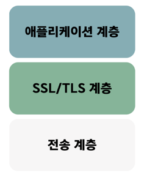
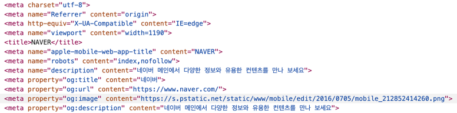

# HTTP
- HTTP는 애플리케이션 계층에서 웹 서비스 통신에 사용.
- HTTP/1.0부터 HTTP/3까지 발전.

## 2.5.1 HTTP/1.0
HTTP/1.0은 `한 연결당 하나의 요청`을 처리하도록 설계 -> `RTT 증가`라는 문제점⚠️이 발생.

### ⚠️ RTT 증가
서버로부터 **파일을 가져올 때마다 TCP의 3-way 핸드셰이크🤝를 계속해서 열어야 하기**에 RTT 증가 ⬆️⬆️
#### RTT(Round Trip Time)란
**패킷 왕복 시간** 🟰 패킷이 목적지에 도달하고 나서 다시 출발지로 돌아오기까지 걸리는 시간
### RTT의 증가를 해결하기 위한 방법
#### ✅ 이미지 스플리팅
많은 이미지가 합쳐 있는 하나의 이미지를 다운로드 받고, 이를 기반으로 backgroud-image의 포지션을 이용하여 이미지를 표기하는 방법
#### ✅ 코드 압축
코드의 개행 문자와 빈칸을 없애 **코드의 크기를 최소화** 하는 방법
#### ✅ 이미지 Base64 인코딩
이미지 파일을 64진법으로 이루어진 **문자열로 인코딩**하는 방법 (🌃 ➡ 🔤)
- 서버와의 연결을 열고 이미지에 대해 서버에 HTTP 요청을 할 필요가 없다는 장점👍이 있음.
- 하지만 37% 정도 크기가 더 커지는 단점👎이 있음.

## 2.5.2 HTTP/1.1
- HTTP/1.1은 **한번 TCP 초기화**를 한 후,` keep-alive 옵션`으로 여러 개의 파일을 송수신할 수 있음.
- 문서 안에 다수의 리소스를 처리하려면 요청할 리소스 개수에 비례해서 대기 시간이 길어진다는 문제점⚠️이 발생.

### ⚠️ HOL Blocking
- HOL blocking(Head Of Line Blocking)은 네트워크에서 같은 큐에 있는 패킷이 그 첫 번째 패킷에 의해 지연될 때 발생하는 성능저하 현상임.
- 앞의 파일이 느리게 받아지면 그 뒤에 있는 것들이 대기하게 되며 다운로드가 지연되기 때문.
- ```
  예를 들어 image.jpg와 style.css, data.xml을 다운로드 받을 때,
  image.jpg의 다운로드 속도가 느려지면 그 뒤에 대기하고 있는 style.css, data.xml의 다운로드 속도도 느려짐.
  ```

### ⚠️ 무거운 헤더 구조
- 헤더에 많은 메타데이터가 들어 있고 압축이 되지 않아 무거운 헤더구조를 가짐.

## 2.5.3 HTTP/2
- HTTP/1.x보다 지연 시간을 줄이고 응답 시간을 빠르게 할 수 있음.
- `멀티플렉싱, 헤더 압축, 서버푸시, 요청의 우선순위 처리`를 지원하는 프로토콜

### 멀티플렉싱
- 여러 개의 스트림을 사용하여 송수신한다는 것
- 병렬적인 스트림을 통해 데이터를 서빙.
- 스트림 내의 데이터들이 쪼개져 있음.
  - 애플리케이션에서 받아온 메시지를 독립된 프레임으로 조각내어 서로 송수신한 이후 다시 조립하며 데이터를 주고 받음.
- 이를 통해 HOL Blocking 문제를 해결✅.

### 헤더 압축
- HTTP/1.x에는 무거운 헤더라는 문제가 있었기에 헤더 압축을 써서 해결✅.
- `허프만 코딩 압축 알고리즘`을 사용하고 HPACK 압축 형식을 가짐.

#### 허프만 코딩
허프만 코딩은 문자열을 문자 단위로 쪼개 빈도수를 세어 비도가 높은 정보는 적은 비트 수를 사용하고 빈도가 낮은 정보는 비트 수를 많이 사용하여 전체 데이터의 표현에 필요한 비트을 줄이는 원리

### 서버 푸시
HTTP/2는 클라이언트 요청 없이 서버가 바로 리소스를 푸시할 수 있음
```
예를 들어, html을 읽으면서 그 안에 들어 있던 css나 js 파일을 서버에서 푸시하여 클라이언트에 먼저 줄 수 있음.
```

## 2.5.4 HTTPS
- HTTP/2는 HTTPS 위에서 동작함.
- 애플리케이션 계층과 전송 계층 사이에 신뢰 계층인 **SSL/TLS 계층을 넣은 신뢰할 수 있는 HTTP 요청**

  
- `통신을 암호화 🔐`함.
  - 애플리케이션 계층의 HTTP 프로토콜에서 사용자의 데이터를 받고 전송 계층으로 캡슐화되기 이전에 SSL 프로토콜에 의해 암호화됨.
  - 반대 과정도 마찬가지로 복호화하고 애플리케이션 계층으로 보냄.

### SSL/TLS
- SSL 1.0 부터 시작하여 TLS 1.3까지 발전했고, TLS로 명칭이 변경되었으나 보통 SSL/TLS로 칭함.
- 전송 계층에서 보안을 제공하는 프로토콜
- 클라이언트와 서버가 통신을 할 때 SSL/TLS를 통해 **제 3자가 메시지를 도청하거나 변조하지 못하도록 함.**
- SSL/TLS를 통해 `인터셉터😈`를 방지할 수 있음.
  - 인터셉터란 공격자가 서버인 척하며 사용자 정보를 가로채는 네트워크 상의 공격.
- 보안 세션을 기반으로 데이터를 암호화하며 `인증 메커니즘, 키 교환 알고리즘, 해싱 알고리즘`을 사용.
- TLS 1.3은 사용자가 이전에 방문한 사이트로 다시 방문한다면 SSL/TLS에서 보안 세션을 만들 떄 걸리는 통신을 하지 않아도 됨 🟰 `0-RTT`

#### 보안 세션
- 보안이 시작되고 끝나는 동안 유지되는 세션
  - `세션`은 운영체제가 어떠한 사용자로부터 자신의 자산 이용을 허락하는 일정한 기간을 말함.
- SSL/TLS는 **핸드셰이크를 통해 보안 세션을 생성**하고 이를 기반으로 상태 정보 등을 공유함.
- 클라이언트와 서버가 키를 공유하고 이를 기반으로 인증, 인증 확인 등의 작업이 일어나는 단 한 번의 1-RTT가 생긴 후 데이터를 송수신함.
- 클라이언트에서 `사이퍼 슈트`를 서버에 전달하면 서버는 받은 사이퍼 슈트의 암호화 알고리즘 리스트를 제공할 수 있는지 확인함.
- 제공할 수 있다면 서버에서 클라이언트로 인증서를 보내는 인증 메커니즘이 시작되고 이후 해싱 알고리즘 등으로 암호화된 데이터의 송수신이 시작됨.
  - **사이퍼 슈트(cyper suites)는 프로토콜, AEAD 사이퍼 모드, 해싱 알고리즘이 나열된 규약**을 말함.
    - ```
      TLS_AES_128_GCM_SHA256
      TLS_AES_256_GCM_SHA384
      TLS_CHACHA20_POLY1305_SHA256
      TLS_AES_128_CCM_SHA256
      TLS_AES_128_CCM_8_SHA256
      
      위처럼 5개의 종류가 있고, TLS_AES_128_GCM_SHA256에서
      TLS는 프로토콜, AES_128_GCM는 AEAD 사이퍼 모드, SHA256은 해싱 알고리즘을 뜻함.
      ```
    - `AEAD 사이퍼 모드`는 데이터 암호화 알고리즘이고, AES_128_GCM은 (128비트의 키를 사용하는 **표준 블록 암호화 기술** ➕ 병렬 계산에 용이한 **암호화 알고리즘 GCM**) 알고리즘을 뜻함.

#### 1️⃣ 인증 메커니즘
- **CA(Certificate Authorities)에서 발급한 인증서를 기반**으로 이루어짐.
- CA에서 발급한 인증서는 안전한 연결을 시작하는 데 있어 필요한 **공개키**를 클라이언트에 제공하고 사용자가 접속한 **서버가 신뢰할 수 있는 서버임을 보장**.
- 인증서는 `서비스 정보, 공개키, 지문, 디지털 서명` 등으로 이루어짐.
- CA는 신뢰성이 엄격하게 공인된 기업들만 참여할 수 있음.
- CA 발급 과정
  1. 자신의 서비스가 CA 인증서를 발급받으려면 자신의 사이트 정보와 공개키를 CA에 제츨.
  2. CA는 공개키를 해시한 값인 지문(finger print)을 사용하는 CA의 비밀키 등을 기반으로 CA 인증서를 발급함.

#### 2️⃣ 암호화 알고리즘
- 키 교환 암호화 알고리즘으로는 대수곡선 기반의 ECDHE 또는 모듈식 기반의 DHE를 사용함.
  - 둘 다 디피-헬만 방식을 근간으로 만들어졌음.
  - **디피-헬만 키 교환 암호화 알고리즘**
    - 암호키를 교환하는 하나의 방법
    - 키 교환 방식
      1. 처음에 공개 값을 공유
      2. 각자의 비밀 값과 공개 값을 혼합한 후 혼합 값을 공유
      3. 그 다음 각자의 비밀 값과 또 혼합 -> 공통의 암호키인 PSK(Pre-Shared Key)가 생성됨.
    - PSK가 생성된다면, 악의적은 공격자가 개인키 또는 공개키를 가지고 있어도 PSK가 없어서 아무것도 할 수 없음.

#### 3️⃣ 해싱 알고리즘
- 해싱 알고리즘은 데이터를 추정하기 힘든 더 작고, 섞여 있는 조각으로 만드는 알고리즘임.
  - SSL/TLS는 해싱 알고리즘으로 SHA-256 알고리즘과 SHA-384 알고리즘을 씀.
    - **SHA-256 알고리즘**
      - 해시 함수의 결괏값이 256비트인 알고리즘
      - 비트 코인을 비롯한 많은 블록체인 시스템에서 씀.
      - 해싱을 해야 할 메시지에 1을 추가하는 등 전처리를 하고 전처리된 메시지를 기반으로 해시를 반환함.

### SEO에도 도움이 되는 HTTPS
- 구글은 HTTPS 서비스를 하는 사이트가 그렇지 않은 사이트보다 SEO 순위가 높을 것이라고 밝힘.

#### SEO(Search Engine Optimization)
  - 검색 엔진 최적화를 뜻함.
  - 검색엔진으로 웹 사이트를 검색했을 때 그 결과를 페이지 상단에 노출시켜 많은 사람들이 볼 수 있도록 최적화하는 방법
  - SEO 관리 방법으로는 `캐노니컬 설정, 메타 설정, 페이지 속도 개선, 사이트맵 관리` 등이 있음.

#### ✅ 캐노니컬 설정
```
<link rel="canonical" href="https://example.com/page2.php" />
```
위의 예시처럼 사이트 link에 캐노니컬을 설정해야 함.
  - **캐노니컬 태그🔖**: 웹 페이지 상의 중복 콘텐츠 문제를 해결하기 위해 하나의 페이지로 연결되는 여러개의 주소가 존재할 경우 **어떠한 주소가 원본 url인지 알려주기 위한 태그**

#### ✅ 메타 설정

html 파일의 가장 윗부분인 메타를 잘 설정해야 함. 위 사진은 네이버 메타 태그.
  - **메타 태그🔖**: 페이지의 콘텐츠를 설명하는 텍스트 스니펫이며, 페이지가 무엇을 설명하는지 검색엔진에게 알려주는 아주 중요한 콘텐츠이다.

#### ✅ 페이지 속도 개선
사이트 속도는 빨라야 하고, 구글의 *PageSpeedInsights*로 가서 자신의 서브스에 대한 리포팅을 주기적으로 받으며 관리해야 함.

#### ✅ 사이트맵 관리
- 사이트맵(sitemap.xml)을 정기적으로 관리해야 함.
- 사이트맵은 웹사이트에서 구글이나 네이버와 같은 검색 엔진에 색인할 모든 페이지를 나열한 XML 파일임.
- 웹사이트에 방문하는 검색엔진 크롤러에게 지도와 같은 역할을 함.

### HTTPS 구축 방법
1. CA에서 구매한 인증키를 기반으로 HTTPS 서비스를 구축하는 방법
2. 서버 앞단의 HTTPS를 제공하는 `로드밸런서`를 둬서 구축하는 방법
3. 서버 앞단에 HTTPS를 제공하는 `CDN`을 둬서 구축하는 방법 
   - CDN(Content Delivery Network)은 지리적 제약 없이 전 세계 사용자에게 빠르고 안전하게 콘텐츠를 전송할 수 있는 콘텐츠 전송 기술.

## 2.5.5 HTTP/3
- HTTP/3은 `QUIC`이라는 계층 위에서 돌아가며, TCP 기반이 아닌 `UDP` 기반으로 돌아감.
  - HTTP/2는 TCP 위에서 돌아감.
- **멀티플렉싱을 가지고 있으며 초기 연결 설정 시 지연 시간 감소라는 장점👍**이 있음.

### 초기 연결 설정 시 지연 시간 감소
- TCP를 사용하지 않기 때문에 통신을 시작할 때 번거로운 3-웨이 핸드셰이크 과정을 거치지 않음.
- QUIC는 첫 연결 설정에 **1-RTT만 소요**됨.
  - 클라이언트가 서버에 신호를 한 번 주고, 서버도 거기에 응답하기만 하면 바로 본 통신을 시작할 수 있음.
- `순방향 오류 수정 메커니즘`이 적용됨.

#### 순방향 오류 수정 메커니즘(FEC, Forward Error Correction)
- 전송한 패킷이 손실되었따면 수식 측에서 에러를 검출하고 수정하는 방식
- 열악한 네트워크 환경에서도 낮은 패킷 손실률

### 예상 질문
- HTTP/2 프로토콜의 특징을 설명하시오.
- HTTP/1.0과 HTTP/1.1의 문제점에 대해 설명하시오.
- HTTPS에서 보안 세션이 어떻게 작동되는지 설명하시오.
- HTTPS 구축 방법에 대해 설명하시오.
- HTTP/3의 장점을 설명하시오.


### 참고자료
- https://seo.tbwakorea.com/blog/canonical-tag/
- https://fourward.co.kr/blog/meta-tags-for-seo
- https://seo.tbwakorea.com/blog/how-to-create-and-submit-a-sitemap/
- https://velog.io/@yun8565/HTTPS%EA%B3%BC-SSL