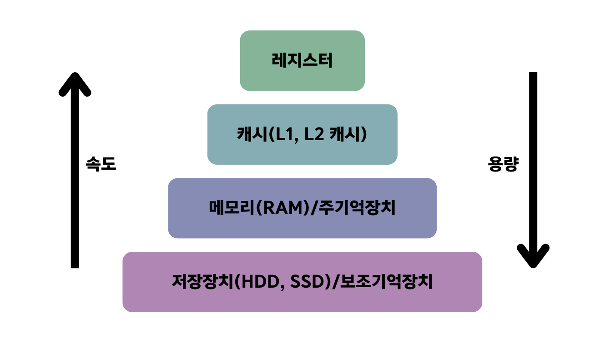

# 메모리
CPU는 메모리에 올라와 있는 프로그램의 명령어들을 실행함.

## 3.2.1 메모리 계층

메모리 계층은 **레지스터, 캐시, 메모리, 저장장치**로 구성됨. 이러한 계층이 있는 이유는 경제성과 캐시 때문.
램은 하드디스크로부터 일정량의 데이터를 복사하여 임시 저장하고 이를 필요 시마다 CPU에 빠르게 전달하는 역할을 함.
- 레지스터
  - CPU 안에 있는 작은 메모리
  - 휘발성
  - 속도 가장 빠름
  - 기억 용량 가장 적음
- 캐시
  - L1, L2 캐시를 지칭(L3 캐시도 있음.)
  - 휘발성
  - 속도 빠름
  - 기억 용량 적음
- 주기억장치
  - RAM
  - 휘발성
  - 속도 보통
  - 기억 용량 보통
- 보조기억장치
  - HDD, SDD
  - 비휘발성
  - 속도 낮음
  - 기억 용량 많음

### 캐시
- `캐시`는 데이터를 미리 복사해 놓은 임시 저장소로, 빠른 장치와 느린 장치에서 속도 차이에 따른 병목 현상을 줄이기 위한 메모리
- `캐시 계층`은 속도 차이를 해결하기 위해 계층과 계층 사이에 있는 계층

#### 지역성의 원리
- 캐시를 직접 설정할 할때는 자주 사용하는 데이터를 기반으로 설정해야 함.
- 자주 사용하는 데이터에 대한 근거가 되는 것이 바로 **지역성**임.
- 지역성은 `시간 지역성`과 `공간 지역성`으로 나뉨.
  - ⏳시간 지역성 : 최근 사용한 데이터에 다시 접근하려는 특성
  - ⛰️공간️ 지역성 : 최근 접근한 데이터를 이루고 있는 공간이나 그 가까운 공간에 접근하는 특성

### 캐시히트와 캐시미스
- `캐시히트`: 캐시에서 원하는 데이터를 찾음.
  - 제어장치를 거쳐 가져오는데 위치도 가깝고 CPU 내부 버스를 기반으로 작동해서 **빠름**.
- `캐시미스`: 데이터가 캐시에 없어 주메모리로 가서 데이터를 찾음.
  - 메모리에서 가져오는데 시스템 버스를 기반으로 작동해서 **느림**.

#### 캐시매핑
- 캐시가 히트되기 위해 매핑⛓️‍하는 방법
- CPU의 레지스터와 주 메모리(RAM) 간에 데이터를 주고받을 때를 기반으로 설명
  - 매핑을 어떻게 하느냐에 따라 레지스터가 캐시 계층으로써 역할을 잘 할 수 있음
      ```
      캐시매핑 분류
  
      🔧 직접 매핑
      - 메모리를 정해진 캐시로만 매핑
      - 처리가 빠름
      - 충돌 발생이 잦음
    
      🔨 연관 매핑
      - 순서를 일치시키지 않고 관련 있는 캐시와 메모리를 매핑
      - 충돌이 적음
      - 모든 블록을 탐색해야 해서 속도가 느림
    
      🛠️ 집합 연관 매핑
      - 직접 매핑과 연관 매핑을 합침
      - 순서는 일치시키지만 집합을 둬서 저장
      - 블록화되어 검색이 효율적
      - 메모리를 정해진 캐시 집합에 무작위로 저장
      ```
    
#### 웹 브라우저의 캐시
- 보통 사용자의 커스텀한 정보나 인중 모듈 관련 사항들을 웹 브라우저에 저장해서 추후 서버에 요청할 떄 자신을 나타내는 아이덴티티나
  중복 요청 방지를 위해 쓰임.

- `쿠키` : 만료기한이 있는 키-값 저장소
- `로컬 스토리지` : 만료기한이 없는 키-값 저장소 / 웹 브라우저를 닫아도 유지
- `세션 스토리지` : 만료기한이 없는 키-값 저장소 / 탭 단위로 생성, 탭을 닫으면 삭제됨

#### 데이터베이스의 캐싱 계층
- 메인 데이터베이스 위에 레디스 데이터베이스 계층을 캐싱 계층으로 둬서 성능을 향상시키기도 함.

## 3.2.2 메모리 관리
운영체제는 컴퓨터 내의 한정된 메모리를 극한으로 활용해야 함 -> `메모리 관리❗️`

### 가상 메모리
- 메모리 관리 기법 중 하나로, 컴퓨터가 실제로 이용 가능한 메모리 자원을 **추상화**하여 이를 사용하는 사용자들에게
  **매우 큰 메모리로 보이게** 만듦.
- 가상적으로 주어진 주소를 `가상 주소`라고 하며, 실제 메모리상에 있는 주소를 `실제 주소`라고 함.
  - 가상 주소는 `메모리관리장치(MMU)`에 의해 실제 주소로 **변환**됨.
- 가상 메모리는 `페이지 테이블`로 관리됨.
  - 페이지 테이블 : 가상 주소와 실제 주소가 매핑되어 있고 프로세스의 주소 정보가 들어 있음.
  - 속도 향상을 위해 `TLB`를 사용.
    - TLB: 메모리와 CPU 사이에 있는 주소 변환을 위한 캐시
  
#### 스와핑
- `페이지 폴트⚠️ `️가 발생함. ➡️ `스와핑` 필요
- 메모리에서 당장 사용하지 않는 영역을 하드디스크로 옮기고 하드디스크의 일부분을 마치 메모리처럼 불러와서 씀.

#### 페이지 폴트 ⚠️
- 프로세스의 주소 공간(가상메모리)에는 존재하지만 지금 이 컴퓨터의 RAM에는 없는 데이터에 접근했을 경우에 발생
- 페이지 폴트와 스와핑 과정
  1. 어떤 명령어가 가상 주소에 접근했으나 해당 `페이지`가 없다면 트랩이 발생되어 운영체제에 알리게 됨.
  2. 운영체제는 실제 디스크로부터 사용하지 않은 `프레임`을 찾음.
  3. 해당 프레임을 실제 메모리에 가져와서 페이지 교체 알고리즘을 기반으로 특정 페이지와 교체(스와핑)
  4. 페이지 테이블을 갱신시킨 후 해당 명령어를 다시 시작.


- 페이지 : **가상 메모리**를 사용하는 최소 크기의 단위
- 프레임 : **실제 메모리**를 사용하는 최소 크기의 단위

### 스레싱 ⚠️
- 메모리의 페이지 폴트율이 높아져 스와핑이 많이 일어나는 것, 이는 컴퓨터의 심각한 성능 저하를 초래함.
- 해결 방법으로는 메모리를 늘리거나 HDD를 SSD로 바꾸면 됨.
- 운영체제에서 해결할 수 있는 방법으로는 작업 세트와 PFF가 있음.

#### 작업 세트(working set)
- 프로세스의 과거 사용 이력인 지역성을 통해 결정된 페이지 집합을 만들어서 미리 메모리에 로드하는 것.
#### PFF(Page Fault Frequency)
- 페이지 폴트 빈도를 조절하는 방법으로 상한선과 하한선을 만듦.
- 상한선에 도달 -> 프레임을 늘림⬆️ / 하한선에 도달 -> 프레임을 줄임⬇️

### 메모리 할당
- 메모리에 프로그램을 할당할 때는 시작 메모리 위치, 메모리 할당 크기를 기반으로 할당
- `연속 할당`과 `불연속 할당`으로 나뉨.

#### 연속 할당
- 메모리에 연속적으로 공간을 할당하는 것.
- 순차적으로 공간에 할당함
- `고정 분할 방식`과 `가변 분할 방식`이 있음.


- 고정 분할 방식
  - 메모리를 미리 나누어 관리하는 방식.
  - 융통성 X, **내부 단편화⚠️️ 발생**
- 가변 분할 방식
  - 매 시점 프로그램의 크기에 맞게 동적으로 메모리를 나눠 사용
  - 내부 단편화 발생X, **외부 단편화⚠️ 발생**
  - 최초적합, 최적적합, 최악적합이 있음.
    ```
    최초적합 : 위쪽이나 아래쪽부터 시작해서 홀을 찾으면 바로 할당
    최적적합 : 프로세스의 크기 이상인 공간 중 가장 작은 홀부터 할당
    최악적합 : 프로세스의 크기와 가장 많이 차이가 나는 홀에 할당
    ```
  - `홀` : 할당할 수 있는 비어 있는 메모리 공간
- `내부 단편화` : 메모리를 나눈 크기보다 프로그램이 작아서 공간이 많이 발생하는 현상
- `외부 단편화` : 메모리보다 프로그램이 커서 들어가지 못하는 공간이 발생하는 현상

#### 불연속 할당
- 메모리를 연속적으로 할당하지 않음 -> 현대 운영체제가 쓰는 방법
- 페이징 기법, 세그멘테이션, 페이지드 세그멘테이션 기법이 있음.
- **페이징 기법**
  - 동일한 크기의 페이지 단위로 나누어 메모리의 서로 다른 위치에 프로세스를 할당
  - 홀의 크기가 균일해짐
  - 주소 변환이 복잡함
- **세그멘테이션**
  - 의미 단위인 세그먼트로 나누는 방식
  - 코드와 데이터로 나누거나 코드 내의 작은 함수를 세그먼트로 놓고 나눌 수 있음.
  - 공유와 보안 측면에서 장점을 가짐.
  - 홀 크기가 균일하지 않음.
- **페이지드 세그멘테이션**
  - 의미 단위인 세그먼트로 나누는 방식
  - 공유나 보안의 측면에서 장점을 가짐.
  - 임의의 길이가 아닌 동일한 크기의 페이지 단위로 나눔.
  
### 페이지 교체 알고리즘
- **스와핑이 많이 일어나지 않도록** 페이지 교체 알고리즘을 기반으로 스와핑이 일어남.
- 페이지 교체 알고리즘 종류
  - **오프라인 알고리즘**
    - 먼 미래에 참조되는 페이지와 현재 할당하는 페이지를 바꾸는 알고리즘
    - 가장 좋은 방법🧚이지만 가능한 방법이 아님. ➡️ 성능 비교에 대한 **상한기준을 제공**해줌.
  - **FIFO**
    - `FIFO(First In First Out)`는 가장 먼저 온 페이지를 교체하는 방법
  - **LRU**
    - `LRU(Least Recently Used)`는 참조가 가장 오래된 페이지를 교체
    - 오래된 것을 파악하기 위해 페이지마다 계수기, 스택을 두어야 하는 문제점.
    - 해시 테이블과 이중 연결 리스트(한정된 메모리를 나타냄.)로 구현
  - **NUR**
    - `NUR(Not Used Recently)`는 LRU에서 발전한 clock⏰ 알고리즘
    - 1은 최근에 참조, 0은 참조되지 않음
    - 시계 방향으로 돌면서 0을 찾고 0을 찾는 순간 해당 프로세스를 교체한 후 1로 바꿈
  - **LFU**
    - `LFU(Least Frequently Used)`는 가장 참조 횟수가 적은 페이지를 교체
  

### 예상 질문
- 페이지 교체 알고리즘에서 LRU에 대해 설명하세요.
- 메모리 계층은 어떻게 구성되어 있는지 설명하세요.
- 가상 메모리에 대해 설명하세요.