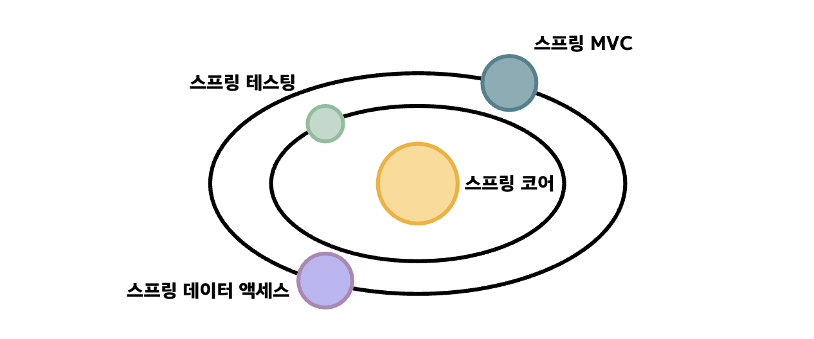
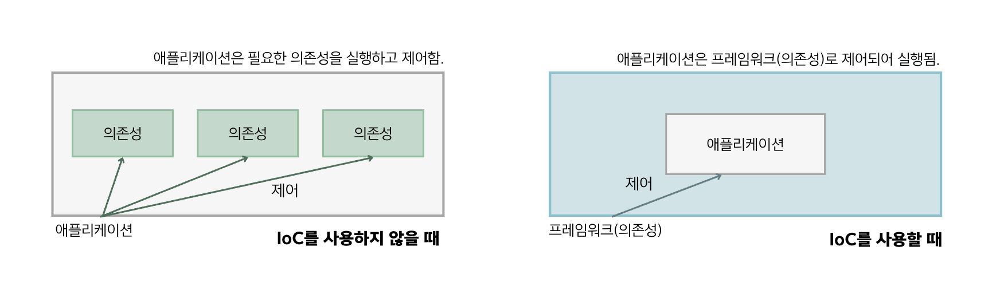

## 1.2 스프링 생태계
- 스프링은 여러 프레임워크의 생태계임.
- 일반적으로 개발자가 스프링 프레임워크를 언급할 때는 다음과 같이 소프트웨어 기능 일부분을 언급함.
- 1️⃣ **스프링 코어**
  - 기본 기능을 포함하는 스프링의 기반 부분 중 하나로 그 중에는 스프링 컨텍스트임.
  - 스프링 컨텍스트는 스프링이 앱의 인스턴스를 관리할 수 있게 하는 스프링 프레임워크의 기본 기능임.
  - 다른 스프링 코어로 스프링 애스펙트도 있음.
  - 애스펙트는 스프링이 앱에서 정의한 메소드를 가로채고 조작할 수 있음.
  - 또 다른 스프링 코어로는 스프링 표현 언어(SpEL)이 있음.

- 2️⃣ 스프링 모델-뷰-컨트롤러
  - HTTP 요청을 처리하는 웹 애플리케이션을 개발할 수 있게 하는 스프링 프레임워크 일부분임.
- 3️⃣ 스프링 데이터 액세스
  - 스프링 기본 부분 중 하나로, SQL 데이터베이스에 연결하여 앱 영속성 계층을 구현하는 데 사용할 수 있는 기본 도구를 제공함.
- 4️⃣ 스프링 테스팅
  - 스프링 애플리케이션 테스트를 작성하는 데 필요한 도구를 담고 있음.

- 스프링 프레임워크를 태양계로 비유하면, 스프링 코어는 모든 프레임 워크를 유지하는 중심의 항성으로 표현됨.

### 스프링 코어의 이해: 스프링 기초

- 스프링은 `제어의 역전(IoC)` 원칙을 기반으로 작동함.
- 제어의 역전 원칙을 사용하면 ➡️ 앱이 실행을 제어하는 대신 스프링 프레임워크에 제어 권한을 넘김.
- 제어의 역전에서 역전은 앱이 자체 코드로 실행을 제어하거나 의존성을 사용하지 못하는 대신 프레임워크(의존성)가 앱과 앱의 코드를 제어한다는 의미임.
- 제어의 역전에서 제어는 인스턴스 생성과 메서드 호출 같은 작업을 나타냄. 프레임워크는 앱에서 정의한 클래스의 객체를 생성할 수 있음.
- 스프링에서는 스프링 컨텍스트라는 IoC 컨테이너를 사용하여 특정 객체를 스프링에 전달해서 프레임워크가 구성한 방식으로 객체를 사용할 수 있게 함.

 

- 💠 메서드 애스펙팅 : 스프링이 IoC 컨테이터에 추가된 인스턴스를 제어하면서, 이 인스턴스의 동작인 **메서드를 가로채는 것**.
- 스프링 AOP(관점 지향 프로그래밍)는 프레임워크가 앱과 상호 작용하는 일반적인 방법 중 하나임.

### 스프링 데이터 액세스 기능을 사용한 앱 영속성 구현
- 스프링에서는 많은 경우에 데이터 영속성을 관리하는 데 데이터 액세스 모듈을 사용함.
- 스프링 데이터 액세스에는 JDBC 사용, 하이버네이트와 같은 객체 관계형 매핑 프레임워크와 통합, 트랜잭션 관리가 포함됨.

### 웹 앱 개발을 위한 스프링 MVC 기능
- 스프링 생태계 내에서 다양한 방식으로 웹 애플리케이션과 웹 서비스를 작성할 수 있게 하는 많은 도구 세트를 제공함.
- 스프링 MVC를 사용하여 표준 자바 서블릿 방식으로 앱을 개발할 수 있음.

### 스프링 테스트 기능
- 스프링 테스트 모듈은 단위 및 통합 테스트를 작성하는데 사용할 수 있는 다양한 도구 세트를 제공함.

### 스프링 생태계의 프로젝트
- 스프링 생태계에는 잘 통합되어 더 큰 세계를 형성하는 다른 프레임워크의 큰 집합이 포함됨.
- 여기에는 스프링 데이터, 스프링 시큐리티, 스프링 클라우드, 스프링 배치, 스프링 부트 등의 프로젝트가 있음.
- 스프링 부트, 스프링 시큐리티, 스프링 데이터를 모두 사용하여 앱을 만들 수 있음.
- 프로젝트는 독립적으로 개발된 스프링 생태계의 한 부분을 의미함.

#### 스프링 데이터로 영속성 기능 확장
- 스프링 데이터는 최소한의 코드 작성으로 쉽게 데이터베이스에 연결하고 영속성 계층을 사용할 수 있도록 해주는 스프링 생태계의 한 부분을 구현함.
- 스프링 데이터 액세스는 스프링 코어 모듈이고, 스프링 데이터는 스프링 생태계와는 독립적은 프로젝트임.

#### 스프링 부트
- 스프링 부트는 구성보다는 관례(convention-over-configuration) 개념을 도입한 스프링 생태계의 프로젝트 중 하나.
- 프레임워크의 모든 구성을 사용자가 직접 설정하는 대신 스프링 부트가 필요에 따라 정의할 수 있는 기본 구성을 제공하는 것. ➡️ 코드를 덜 작성하게 됨.
- 앱마다 모든 구성을 새로 작성하는 대신 기본 구성에서 시작하여 관례와 다른 부분을 변경하는 것이 더 효율적임.

### 🙋 면접 예상 질문
- 제어의 역전(IoC)에 대해 설명해주세요.