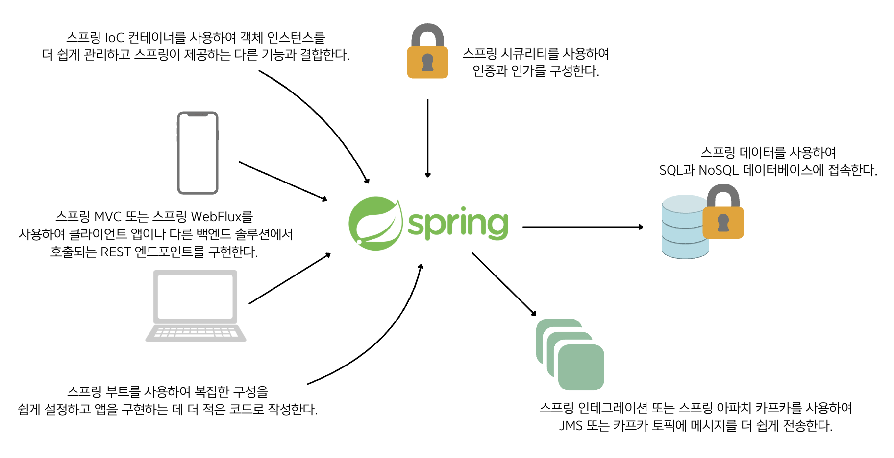

## 1.3 실제 시나리오에서 스프링
- 스프링 프레임워크는 백엔드 애플리케이션 개발에서 주로 사용되나, 자동화 테스트 프레임워크 개발, 테스트톱 앱 개발, 모바일 앱 개발에서도 사용할 수 있음

### 백엔드 앱 개발에서 스프링 사용
- 백엔드 애플리케이션은 서버 측에서 실행되고 데이터를 관리하며 클라이언트 애플리케이션 요청을 처리함.
- 스프링은 다른 앱과 통합은 물론 다양한 데이터베이스 영속성까지 백엔드 솔루션에서 일반적으로 구현하는 다양한 기능을 제공함.
- 아래 그림은 백엔드 앱에 스프링을 사용할 수 있는 가능성을 보여줌.

### 자동화 테스트 앱에서 스프링 사용
- 자동화 테스트는 개발 팀에서 애플리케이션이 예상대로 작동하는지 확인하는데 사용하는 소프트웨어 구현체를 의미함.
- 소규모 시스템에서는 수동으로 테스트를 수행할 수 있지만, 테스트받는 시스템의 모든 흐름을 검증하는 책임을 진 앱을 별도의 팀에서 구현하는 것이 가장 효율적임.
- 이런 애플리케이션은 백엔드 앱만큼 복잡해줄 수 있음.(시스템 구성 요소와 통신하고 데이터베이스에도 연결해야 하기 때문.)
- 스프링은 스프링 IoC 컨테이너를 사용하여 코드를 보다 쉽게 유지 관리할 수 있도록 객체 인스턴스를 관리하고, 스프링 데이터를 사용하면 데이터 유효성을
검사해야 하는 데이터베이스에 연결할 수 있음.
- 또 특정 시나리오를 시뮬레이션하거나 단순히 스프링을 사용하여 일부 REST 엔드포인트를 호출하고자 브로커 시스템의 큐나 토픽에 메시지를 보낼 수 있음.

### 데스크톱 앱 개발에서 스프링 사용
- 데스크톱 앱은 스프링 IoC 컨테이너를 효과적으로 사용하여 객체 인스턴스를 관리할 수 있음. 이렇게 하면 앱 구현이 더 깔끔해지고 유지 보수성도 향상됨.
- 앱은 스프링 도구로 다른 구성 요소와 통신하거나 캐싱을 구현하는 등 다양한 기능을 구현할 수 있음.

### 모바일 앱에서 스프링 사용
- 스프링 커뮤니티는 안드로이드를 위한 스프링 프로젝트로 모바일 애플리케이션 개발을 도움.(이 프로젝트는 현재 중단✋됨.)
- 이 스프링 프로젝트는 안드로이드용 REST 클라이언트와 보안 API 액세스를 위한 인증 지원을 제공함.

### 🙋 면접 예상 질문
- 스프링을 어디에서 사용할 수 있을지 설명해주세요.