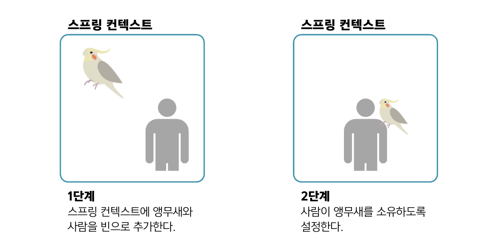
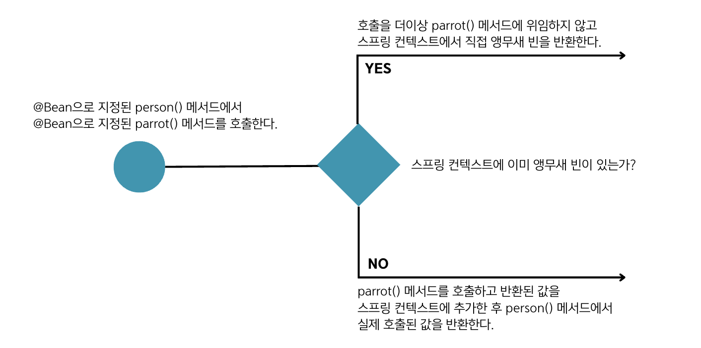

## 3.1 구성 파일에서 정의된 빈 간 관계 구현
- 이 장에서는 `@Bean` 애너테이션으로 메서드를 지정하는 구성 클래스에서 정의된 두 빈 관계를 구현하는 방법인 `1️⃣ 와이어링`과 `2️⃣ 오토와이어링`에 대해 설명함.
- 스프링 컨텍스트에 앵무새와 사람이라는 두 인스턴스가 있다고 가정할 때, 사람이 앵무새를 소유하게 만들고 싶다면.. 아래 두 단계를 따라야 함.
  ```java
  1. 스프링 컨텍스트에 사람과 앵무새 빈을 추가.
  2. 사람과 앵무새 사이의 관계를 설정.
  ```
  
- 사람과 앵무새 빈을 정의하는 방법은 아래 토글을 참고. ➡️ 아직 인스턴스 사이에 관계가 설정되지 않았음.
  <details><summary>&nbsp;코드</summary>
  <div markdown="1">
  
   ```java
   public class Parrot {
  
      private String name;
       
      @Override
      public String toString() {
           return "Parrot : " + name;
      }
  }
  ```
  ```java
   public class Person {
  
       private String name;
       private Parrot parrot;
   }
  ```
  ```java
  @Configuration
  public class ProjectConfig {
      @Bean
      public Parrot parrot() {
          Parrot p = new Parrot();
          p.setName("koko");
          return p;
      }
      
      @Bean
      public Person person() {
          Person p = new Person();
          p.setName("Ella");
          return p;
      }
  }
  ```
  </div>
  </details>

### 3.1.1 두 @Bean 메서드 간 직접 메서드를 호출하는 빈 작성
- 인스턴스 간 관계를 설정하는 첫 번째 방법은 `와이어링`이며, **구성 클래스에서 한 메서드가 다른 메서드를 호출하는 것**을 말함.
```java
@Configuration
public class ProjectConfig {
   @Bean
    public Parrot parrot() {
        Parrot p = new Parrot();
        p.setName("koko");
        return p;
    }
      
    @Bean
    public Person person() {
        Person p = new Person();
        p.setName("Ella");
        p.setParrot(parrot());    // 사람의 앵무새 속성에 앵무새 빈의 참조를 설정함.
        return p;
    }
}
```
- 위의 코드는 설정하려는 빈을 반환하는 메서드를 직접 호출하여 사람 빈과 앵무새 빈 간 관계를 정의함.
- `parrot()` 메서드를 호출하면 스프링은 스프링 컨텍스트의 앵무새 빈을 참조하고 싶어한다는 것을 알아챔.
- 위의 코드로 Parrot 인스턴스는 **❗️하나❗️**만 생김.
  - **앵무새 빈이 컨텍스트에 이미 있을 때** 스프링은 `parrot()` 메서드를 호출하는 대신 **⭐️해당 컨텍스트에서 직접 인스턴스를 가져옴.⭐️**
  - 앵무새 빈이 아직 컨텍스트에 없을 때 스프링은 `parrot()` 메서드를 호출하고 빈을 반환함.



### 3.1.2 @Bean 메서드의 매개변수로 빈 와이어링하기
- `오토와이어링`은 **객체 타입의 메서드에 매개변수를 추가하고 스프링이 해당 매개변수를 이용하여 값을 제공하는 것에 의존하는 방식**임.
- 이 방식은 메서드를 직접 호출하는 것보다 유연함. 
➡️ 참조하려는 빈이 `@Bean` 애너테이션된 메서드로 정의되든 `@Component` 같은 스테레오 타입 애너테이션으로 정의되든 상관 없음.
```java
@Configuration
public class ProjectConfig {
   @Bean
    public Parrot parrot() {
        Parrot p = new Parrot();
        p.setName("koko");
        return p;
    }
      
    @Bean
    public Person person(Parrot parrot) { // 스프링은 이 매개변수에 앵무새 빈을 주입함.
        Person p = new Person();
        p.setName("Ella");
        p.setParrot(parrot);    // 스프링이 전달한 참조로 사람의 속성 값을 설정함.
        return p;
    }
}
```
- 위의 코드는 Parrot 타입의 매개변수를 받고 해당 매개변수의 참조를 반환된 사람의 속성으로 설정함.
- 메서드를 호출할 때 스프링은 컨텍스트에서 앵무새 빈을 찾아 그 값을 `person()` 메서드의 매개변수에 **주입**해야 한다는 것을 알고 있음.


- 💠 `의존성 주입(DI)` : 프레임워크가 특정 필드 또는 매개변수에 값을 설정하는 기법
- DI는 IoC 원리를 응용한 것으로, IoC는 프레임워크가 실행될 때 애플리케이션을 제어하는 것을 의미함.
- DI는 생성된 객체 인스턴스를 관리하고 앱을 개발할 때 작성하는 코드를 최소화하는데 도움이 되는 매우 편리한 방법임.

### 🙋 면접 예상 질문
- @Bean 메서드에서 다른 @Bean 메서드를 직접 호출할 때 스프링이 어떻게 싱글톤 인스턴스를 보장하는지 설명해주세요.
- 스프링에서 빈 간의 관계를 구현하는 두 가지 방법인 와이어링과 오토와이어링의 차이점에 대해 설명해주세요.