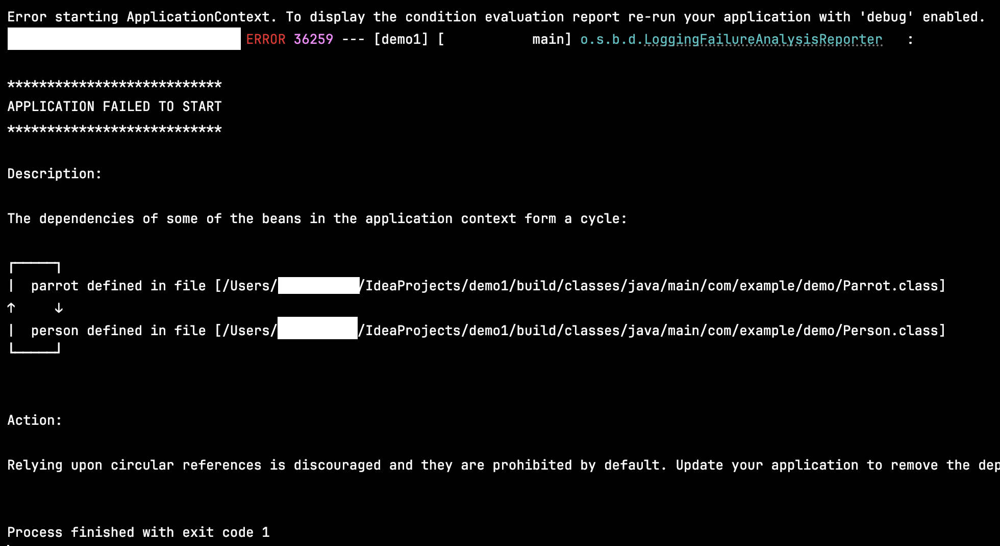

## 3.3 순환 의존성 다루기
- 스프링이 애플리케이션의 객체들에 대한 의존성을 빌드하고 설정하게 위임하는 것은 편하지만, **⚠️스프링은 때때로 혼동하기도 함⚠️**.
➡️ 자주 발생하는 시나리오는 `순환 의존성`을 생성하는 것임.


- `💠순환 의존성` : 빈 A를 생성하기 위해 스프링이 아직 없는 다른 빈 B를 주입해야 하는 상황인데 빈 B도 빈 A에 대한 의존성이 필요해
빈 B를 생성하려면 빈 A가 있어야 할 때를 말함. 스프링은 교착 상태에 빠지게 됨.
- 순환 의존성을 피하기 위해서는 생성을 위해 다른 객체에 의존해야 하는 객체를 정의하지 않았는지 확인해야 함. 
- 아래 코드는 순환 의존성의 예시임.
  ```java
  @Component
  public class Person {
  
      private final Parrot parrot;
    
      @Autowired
      public Person(Parrot parrot) {  // 스프링은 Person 인스턴스를 생성하는데 Parrot 빈이 필요함.
          this.parrot = parrot;
      } 
  }
  ```
  ```java
  @Component
  public class Parrot {
  
      private String name = "koko";
      private final Person person;
    
      @Autowired
      public Parrot(Person person) {  // 스프링은 Parrot 인스턴스를 생성하는데 Person 빈이 필요함.
          this.person = person;
      } 
  }
  ```
- 순환 의존성이 발생하면 다음과 같이 친절하게 예외를 보여줌.


### 🙋 면접 예상 질문
- 스프링에서 순환 의존성이란 무엇이며, 어떤 상황에서 발생하는지 설명해주세요.
- 스프링에서 순환 의존성 문제를 해결할 수 있는 방법에는 어떤 것들이 있는지 설명해주세요.