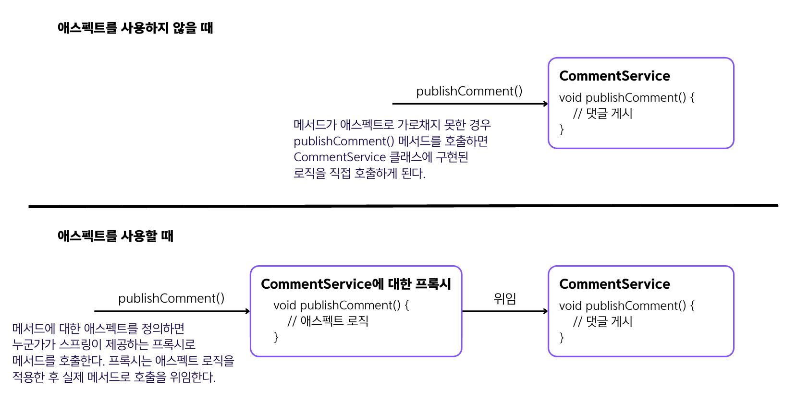

## 6.1 스프링에서 애스펙트 작동 방식
### 애스펙트 필수 용어
- 💠 **애스펙트** : 특정 메서드를 호출할 때 스프링이 실행하길 원하는 코드는 무엇인지(What)
- 💠 **어드바이스** : 언제(메서드 호출 전 또는 후)이 애스펙트 로직을 실행해야 하는지(When)
- 💠 **포인트컷** : 프레임워크가 어떤 메서드를 가로채기해서 해당 애스펙트를 실행해야 하는지(Which)
- 💠 **조인트 포인트** : 애스펙트 실행을 트리거하는 이벤트를 정의 ➡️ 항상 메소드 호출임.
- 💠 **대상 객체** : 애스펙트가 가로챈 메서드를 선언하는 빈
    - 스프링이 메서드를 가로채려면 가로채기되는 메서드를 정의하는 객체가 스프링 컨텍스트의 빈이어야 함.
- `CommentService 빈의 publishComment() 메서드를 실행하기 전에 일부 로직이 실행되길 원한다` 라는 표현에서
`CommentService 빈`은 **대상 객체**, `publishComment()`는 **포인트 컷**, `실행`은 **조인트 포인트**, `전`은 **어드바이스**, `일부 로직`은
**애스펙트**를 뜻함.

### 애스펙트 로직
- 애스펙트 대상인 빈을 컨텍스트에서 요청할 때 **스프링은 빈에 대한 인스턴스 참조를 직접 제공하지 않음**.
➡️ 스프링은 실제 메서드 대신 애스펙트 로직을 호출하는 객체인 `⭐️프록시⭐️` 객체를 제공함.
- 컨텍스트의 getBean()을 사용하든 DI를 사용하든 컨텍스트에서 빈을 얻을 때는 언제나 빈 대신 프록시 객체를 받게 됨. 이렇게 감싸는 방식을 `위빙`이라고 함.

```java
public static void main(String[] args) {
    
    var c = new AnnotationConfigApplicationContext(ProjectConfig.class);
        
    var service = c.getBean(CommentService.class);
        
    System.out.println(service.getClass());
}
```
- 위의 코드를 실행할 때 CommentService 빈이 애스펙트 대상이면 `class services.CommentService$$SpringCGLIB$$0`가 출력됨.
- 반대로, CommentService 빈이 애스펙트 대상이 아니면 `class services.CommentService`가 출력됨.
- 이를 통해서 빈이 애스펙트 대상이면 프록시 객체에 대한 참조를 제공한다는 것을 알 수 있음. 프록시 객체는 가로챈 메서드에 대한 호출을 모두 관리하고
애스펙트 로직을 적용할 수 있음.


- 프록시는 애스펙트 로직을 적용하고 실제 메서드에 호출을 위임함.

### 🙋 면접 예상 질문
- 스프링 AOP에서 프록시 방식의 장단점은 무엇인지 설명해주세요.
- 애스펙트 로직에 대해 설명해주세요.