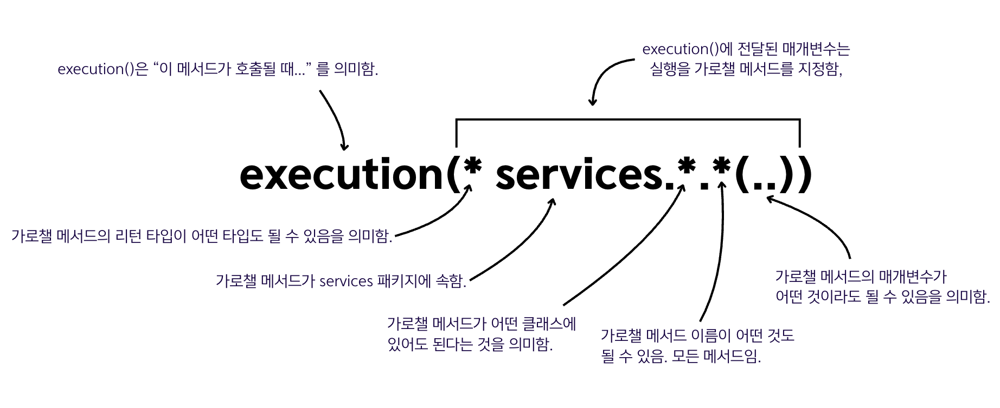
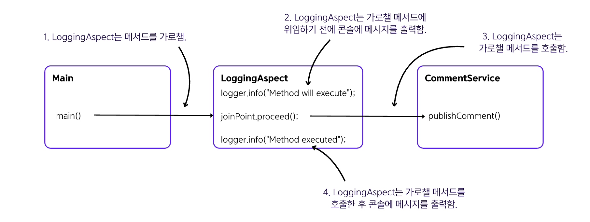
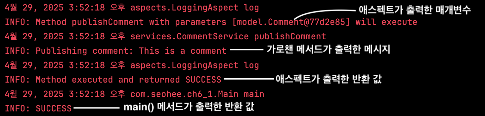
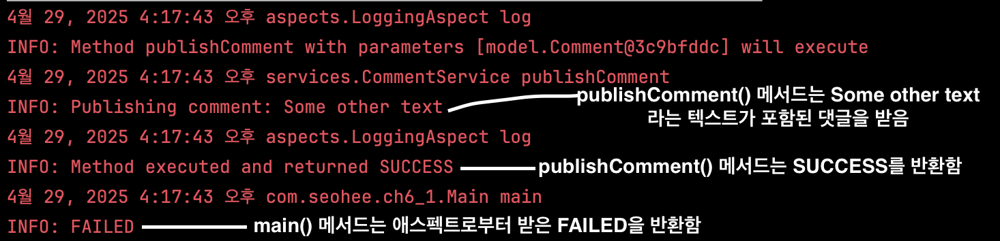
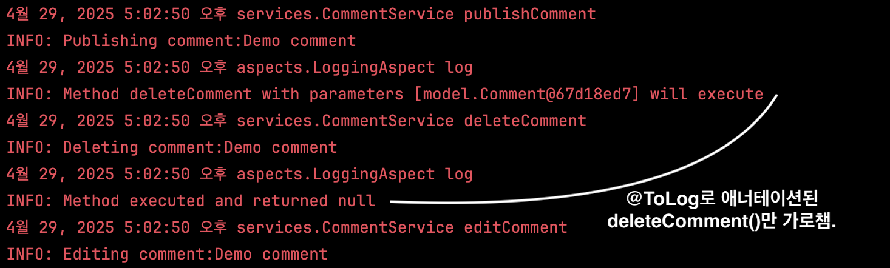

## 6.2 스프링 AOP를 사용한 애스펙트 구현

### 6.2.1 간단한 애스펙트 구현
#### 1️⃣ 단계: 애스펙트 의존성을 추가하고, 스프링 앱에 애스펙트 메커니즘 활성화하기
- pom.xml에 애스펙트 의존성을 추가하기
    ```xml
    <!-- pom.xml -->
    <dependency>
        <groupId>org.springframework</groupId>
        <artifactId>spring-aspects</artifactId>
        <version>6.2.6</version>
    </dependency>
    ```
- 구성 클래스에 `@EnableAspectJAutoProxy` 애너테이션을 추가해서 애스펙트 기능을 활성화하기
    ```java
    @Configuration
    @ComponentScan(basePackages = "services")
    @EnableAspectJAutoProxy
    public class ProjectConfig {
    }
    ```
#### 2️⃣ 단계: 애스펙트를 정의하는 클래스를 생성하고 이 클래스의 인스턴스를 스프링 컨텍스트에 추가하기
- 애스펙트 클래스 정의하기
    ```java
    @Aspect
    public class LoggingAspect {
        
        public void log() {
            // 추가 구현
        }
    }
    ```
- 클래스의 인스턴스를 스프링 컨텍스트에 추가하기
    ```java
    @Configuration
    @ComponentScan(basePackages = "services")
    @EnableAspectJAutoProxy
    public class ProjectConfig {
    
        @Bean
        public LoggingAspect aspect() {
            return new LoggingAspect();
        }
    
    }
    ```
  - 스프링은 관리해야 하는 모든 객체를 알아야 하기 때문에 이 객체를 스프링 컨텍스트에 빈으로 만들어야 함.
  - `@Aspect` 애너테이션은 스테레오 애너테이션이 아니기 때문에 `@Aspect` 애너테이션을 달았다고 해서 `⚠️ 컨텍스트에 빈으로 추가되지 않음. ⚠️`

#### 3️⃣ 단계: 어드바이스 애너테이션으로 스프링에 언제 어떤 메서드를 가로챌지 지시하기
- 어드바이스 애너테이션을 추가하기 (여기서는 `@Around` 애너테이션을 사용)
    ```java
    @Aspect
    public class LoggingAspect {
    
        private Logger logger = Logger.getLogger(LoggingAspect.class.getName());
    
        @Around("execution(* services.*.*(..))")    // 어떤 메서드를 가로챌지 정의
        public void log(ProceedingJoinPoint joinPoint) {
            joinPoint.proceed();    // 실제 가로채는 메서드에 위임
        }
    }
    ```
    - `@Around` 애너테이션의 매개변수로 사용된 특이한 표현식은 **스프링이 어떤 메서드 호출을 가로채야 하는지 지정**함. ➡️
  이 표현식 언어를 `AspectJ 포인트컷 언어`라고 함.(따로 배우거나 외울 필요❌)
    - 위의 표현식은 메서드의 리턴 타입, 메서드가 속한 클래스, 메서드 이름 또는 메서드가 수신하는 매개변수에 관계없이 스프링이 서비스 패키지에 있는
  클래스에 정의된 모든 메소드를 가로채는 것을 의미함.
    
    - `ProceedingJoinPoint`는 가로챌 메서드를 나타냄.

#### 4️⃣ 단계: 애스펙트 로직 구현하기
- 애스펙트 로직을 구현하기 (아래 로직을 수행)
  
  ```text
  - 메서드를 가로챔.
  - 가로챌 메서드가 호출되기 전에 콘솔에 메시지를 출력함.
  - 가로챌 메서드가 호출됨.
  - 가로챌 메서드가 호출된 콘솔에 메시지를 출력함.
  ```
  ```java
  @Aspect
  public class LoggingAspect {
  
      private Logger logger = Logger.getLogger(LoggingAspect.class.getName());
  
      @Around("execution(* services.*.*(..))")
      public void log(ProceedingJoinPoint joinPoint) throws Throwable {
          logger.info("Method will execute"); // 가로챌 메서드를 실행하기 전에 메시지를 출력함.
          joinPoint.proceed();                // 가로챌 메서드를 호출함.
          logger.info("Method executed");     // 가로챈 메서드를 실행한 후 메시지를 출력함.
      }
  }
  ```
  - `proceed()` 메서드는 가로챌 메서드인 CommentService 빈의 `publishComment()`를 호출함.
  - `proceed()`를 호출하지 않는다면 애스펙트는 가로챌 메서드에 위임되지 않음. 이때 메서드 호출자(ex. 위의 그림에서 `main()`)는 **실제 메서드가 실행되지 않는다는 것을 알지 못함**.
  - 예를 들어, 권한 부여 규칙이 충족되지 않는다면 애스펙트는 가로챌 메서드에 위임하지 않을 수 있음.


### 6.2.2 가로챈 메서드의 매개변수 및 반환 값 변경
- **애스펙트는 가로챈 메서드 이름 및 매개변수를 쉽게 찾을 수 있음.**
  ```java
  // 여기서 joinPoint는 ProceedingJoinPoint의 매개변수임.
  String methodName = joinPoint.getSignature().getName();
  Object[] arguments = joinPoint.getArgs();
  ```
  <details>
    <summary>&nbsp;애스펙트가 메소드 호출을 가로채 매개변수와 반환값에 접근하는 코드</summary>
  
  - 이를 확인해보기 위해 서비스 메서드가 값을 반환하도록 변경함.
    ```java
    @Service
    public class CommentService {
    
        private Logger logger = Logger.getLogger(CommentService.class.getName());
    
        public String publishComment(Comment comment) {
            logger.info("Publishing comment: " + comment.getText());
            return "SUCCESS";     // 시연을 위해 값을 반환하게 함.
        }
    }
    ```
    ```java
    @Aspect
    public class LoggingAspect {
    
      private Logger logger = Logger.getLogger(LoggingAspect.class.getName());
    
      @Around("execution(* services.*.*(..))")
      public Object log(ProceedingJoinPoint joinPoint) throws Throwable {
    
        String methodName = joinPoint.getSignature().getName();
        Object[] arguments = joinPoint.getArgs();
    
        logger.info("Method " + methodName +
                " with parameters " + Arrays.asList(arguments) + " will execute");
    
        Object returnedByMethod = joinPoint.proceed();
    
        logger.info("Method executed and returned " + returnedByMethod);
    
        return returnedByMethod;
      }
    }
    ```
    ```java
    public class Main {
    
        private static Logger logger = Logger.getLogger(Main.class.getName());
    
        public static void main(String[] args) {
    
            var c = new AnnotationConfigApplicationContext(ProjectConfig.class);
            var service = c.getBean(CommentService.class);
            Comment comment = new Comment();
            comment.setText("This is a comment");
            comment.setAuthor("Michael");
    
            String value = service.publishComment(comment);
    
            logger.info(value);
        }
    }
    ```
    
  </details>


- **애스펙트는 메서드로 전송된 ❗️매개변수 값을 변경❗️하거나 호출자가 받는 ❗️반환값을 변경❗️할 수 있음.**
- 또한, 애스펙트는 호출자에게 예외를 던지거나 가로챈 메서드에서 캐치 및 처리를 할 수 있음.
  <details>
    <summary>&nbsp;애스펙트가 메소드 호출을 가로채 매개변수와 반환값을 변경하는 코드</summary>
  
    ```java
    @Aspect
    public class LoggingAspect {
    
        private Logger logger = Logger.getLogger(LoggingAspect.class.getName());
    
        @Around("execution(* services.*.*(..))")
        public Object log(ProceedingJoinPoint joinPoint) throws Throwable {
    
            String methodName = joinPoint.getSignature().getName();
            Object [] arguments = joinPoint.getArgs();
    
            logger.info("Method " + methodName +
                    " with parameters " + Arrays.asList(arguments) + " will execute");
    
            Comment comment = new Comment();
            comment.setText("Some other text");
            Object [] newArguments = {comment};
    
            Object returnedByMethod = joinPoint.proceed(newArguments);  // 다른 댓글 인스턴스를 매개변수의 값으로 전달함.
    
            logger.info("Method executed and returned " + returnedByMethod);
    
            return "FAILED";
        }
    }
    ```
    
  </details>


- 애스펙트는 코드 흐름을 이해하기 어렵게 만들 수 있으므로, 로깅, 트랜잭션 관리 등 공통 관심사를 분리할 때만 신중하게 사용해야 함
- **스프링의 트랜잭션은 애스펙트에 의존함**.

### 6.2.3 애너테이션된 메서드 가로채기
- 사용자 정의 애너테이션을 정의하고 커스텀 애너테이션을 사용하여 표시된 메서드 실행만 로깅하려고 함.
```text
- 커스텀 애너테이션을 정의하고 런타임에 액세스할 수 있도록 함. 애너테이션을 @ToLog 라고 할 것임.
- 커스텀 애너테이션된 메서드를 가로채도록 애스펙트에 지시하고자 애스펙트 메서드에 대한 다른 AspectJ 포인트컷 표현식을 사용함.
```
#### 1️⃣ 단계: 커스텀 애너테이션 정의하기
- 커스텀 애너테이션을 정의함.
  ```java
  @Retention(RetentionPolicy.RUNTIME)     // 이 애너테이션을 활성화하여 실행 중에 가로채도록 함.
  @Target(ElementType.METHOD)             // 이 애너테이션을 메서드에만 사용하도록 제한함.
  public @interface ToLog {
  }
  ```
  - 기본적으로 자바에서는 실행 중에 애너테이션을 가로챌 수 없는데 `Retention 정책을 RUNTIME으로 설정`하여 실행중에 가로챌 수 있도록 함.
  - `@Target` 애너테이션은 이 애너테이션을 사용할 수 있는 언어 요소를 지정함. 애너테이션을 만드는 대상으로만 제한하는 편이 좋음.
- `deleteComment()` 메서드에만 애너테이션을 달아 이 메서드만 가로채게 함.
  ```java
  @Service
  public class CommentService {
  
      private Logger logger = Logger.getLogger(CommentService.class.getName());
  
      public void publishComment(Comment comment) {
          logger.info("Publishing comment: " + comment.getText());
      }
      
      @ToLog
      public void deleteComment(Comment comment) {
          logger.info("Deleting comment: " + comment.getText());
      }
      
      public void editComment(Comment comment) {
          logger.info("Editing comment: " + comment.getText());
      }
  }
  ```
#### 2️⃣ 단계: AspectJ 포인트컷 표현식을 사용하여 애스펙트가 새로 생성된 애너테이션이 달린 메서드를 가로채도록 지시함.
- 커스텀 애너테이션이 달린 메서드에 애스펙트를 적용함. ➡️ `@annotation(ToLog)`라는 AspectJ 포인트컷 표현식을 사용함.
  ```java
  @Aspect
  public class LoggingAspect {
  
      private Logger logger = Logger.getLogger(LoggingAspect.class.getName());
  
      @Around("@annotation(ToLog)")
      public Object log(ProceedingJoinPoint joinPoint) throws Throwable {
  
          // 코드 생략
      }
  }
  ```
  ```java
  public class Main {
  
      public static void main(String[] args) {
          var c = new AnnotationConfigApplicationContext(ProjectConfig.class);
  
          var service = c.getBean(CommentService.class);
  
          Comment comment = new Comment();
          comment.setText("Demo comment");
          comment.setAuthor("Natasha");
  
          service.publishComment(comment);
          service.deleteComment(comment);
          service.editComment(comment);
      }
  }
  ```
- 앱을 실행하면 애너테이션된 메서드(`deleteComment()`)만 가로채어 이 메소드 실행을 콘솔에 출력하는 걸 볼 수 있음.
  

### 6.2.4 사용 가능한 다른 어드바이스 애너테이션
- 지금까지는 `@Around` 애너테이션을 사용했는데 이외에도 다양한 어드바이스 애너테이션이 있음.
  - `@Before` : 가로채인 메서드가 실행되기 전에 애스펙트 로직을 정의하는 메서드를 호출함.
  - `@AfterReturning` : 메서드가 성공적으로 반환된 후 애스펙트 로직을 정의하는 메서드를 호출하고 반환된 값을 애스펙트 메서드에 매개변수로 제공함.
  가로채인 메서드가 예외를 던지면 애스펙트 메서드는 호출되지 않음.
  - `@AfterThrowing` : 가로채인 메서드가 예외를 던지면 애스펙트 로직을 정의하는 메서드를 호출하고 예외 인스턴스를 애스펙트 메서드의 매개변수로 전달함.
  - `@After` : 메서드가 성공적으로 반환했는지 또는 예외를 던졌는지와 관계없이 가로채인 메서드 실행 후에만 애스펙트 로직을 정의하는 메서드를 호출함.
- 위 어드바이스 애너테이션으로 특정 메서드 실행을 위한 애스펙트 로직을 작성할 때는 `@Around`와 동일하게 AspectJ 포인트컷 표현식을 제공하면 됨.
- 위 어드바이스 애너테이션의 애스펙트 메서드는 ProceedingJoinPoint 매개변수를 받지 않으며, `@Around`와 달리 다른 어드바이스 애너테이션들은 가로챈 메소드에 언제 위임할지 결정할 수 없고, 애너테이션의 목적에 따라 발생함.

<details>
  <summary>&nbsp;<code>@AfterReturning</code>를 사용하는 예제</summary>

  ```java
  @Aspect
  public class LoggingAspect {
  
    private Logger logger = Logger.getLogger(LoggingAspect.class.getName());
  
    @AfterReturning(value = "@annotation(ToLog)", returning = "returnedValue") // AspectJ 포인트컷 표현식 사용.
    public void log(Object returnedValue) {     // 매개변수 이름은 애너테이션의 'returning' 속성 값과 동일해야 함.
      logger.info("Method executed and returned " + returnedValue);
    }
  
    public void setLogger(Logger logger) {
      this.logger = logger;
    }
  }
  ```
</details>

### 🙋 면접 예상 질문
- 스프링 AOP란 무엇인지 설명해주세요.
- `@Aspect` 애너테이션의 역할은 무엇인지, 스프링 컨텍스트에 자동으로 빈으로 등록되는지 설명해주세요.
- 스프링 AOP에서 Aspect, Join Point, Pointcut, Advice의 개념을 설명해주세요.
- `@Around`, `@Before`, `@After`, `@AfterReturning`, `@AfterThrowing` 어드바이스의 차이점은 무엇인지 설명해주세요.
- 커스텀 애너테이션을 만들어 AOP를 적용하는 과정을 설명해주세요.
- 스프링 AOP를 사용할 때 주의해야 하는 이유에 대해 설명해주세요.

### 💬 스터디원의 한마디
- 내용이 많습니다. 그래도 중요한 부분이니 책으로도 꼼꼼하게 봐요!