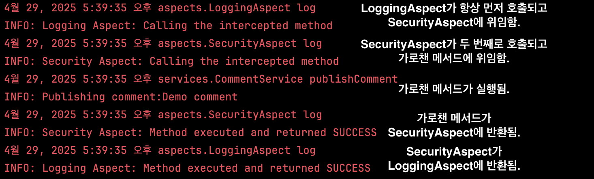
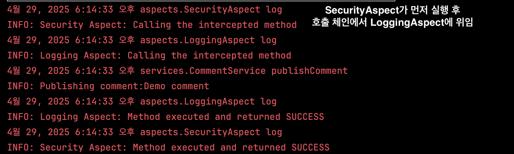
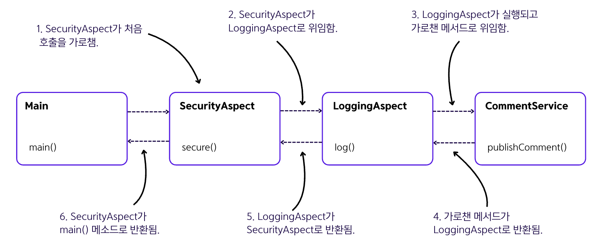

## 6.3 애스펙트 실행 체인
- 실제 앱에서는 메서드가 애스펙트 두 개 이상으로 가로채기될 때도 많음.
- 기본적으로 스프링은 동일한 실행 체인에 있는 두 애스펙트가 호출되는 순서를 보장하지 않음.
- **애스펙트 실행 순서를 정의해야 한다면** ➡️ `@Order` 애너테이션을 사용할 수 있음.
    - 이 애너테이션은 특정 애스펙트 실행 체인에서 순서 번호를 받음.
    - 해당 애스펙트 숫자가 작을수록 더 일찍 실행되고, 두 값이 같으면 실행 순서가 지정되지 않음.
- 아래 예시에는 `SecurityAspect`와 `LoggingAspect` 라는 두 가지의 애스펙트가 있음.
  <details>
    <summary>애스펙트 실행 순서를 정의하지 않은 코드</summary>

    ```java
    @Aspect
    public class LoggingAspect {
    
        private Logger logger = Logger.getLogger(LoggingAspect.class.getName());
    
        @Around(value = "@annotation(ToLog)")
        public Object log(ProceedingJoinPoint joinPoint) throws Throwable {
            logger.info("Logging Aspect: Calling the intercepted method");
            Object returnedValue = joinPoint.proceed();
            logger.info("Logging Aspect: Method executed and returned " + returnedValue);
            return returnedValue;
        }
    }
    ```

    ```java
    @Aspect
    public class SecurityAspect {
    
        private Logger logger = Logger.getLogger(SecurityAspect.class.getName());
    
        @Around(value = "@annotation(ToLog)")
        public Object log(ProceedingJoinPoint joinPoint) throws Throwable {
            logger.info("Security Aspect: Calling the intercepted method");
            Object returnedValue = joinPoint.proceed();
            logger.info("Security Aspect: Method executed and returned " + returnedValue);
            return returnedValue;
        }
    }
    ```

    ```java
    @Configuration
    @ComponentScan(basePackages = "services")
    @EnableAspectJAutoProxy
    public class ProjectConfig {
    
        @Bean
        public LoggingAspect loggingAspect() {
            return new LoggingAspect();
        }
    
        @Bean
        public SecurityAspect securityAspect() {
            return new SecurityAspect();
        }
    }
    ```

    ```java
    public class Main {
    
        public static void main(String[] args) {
            var c = new AnnotationConfigApplicationContext(ProjectConfig.class);
    
            var service = c.getBean(CommentService.class);
    
            Comment comment = new Comment();
            comment.setText("Demo comment");
            comment.setAuthor("Natasha");
    
            service.publishComment(comment);
        }
    }
    ```
  
  </details>
  <details>
    <summary>애스펙트 실행 순서를 정의한 코드</summary>

    ```java
    @Aspect
    @Order(1)
    public class SecurityAspect {
    
        // 코드 생략
    }
    ```
    ```java
    @Aspect
    @Order(2)
    public class LoggingAspect {

        // 코드 생략
    }
    ```
  
    - `Order()` 순서대로 실행됐음을 확인할 수 있음.
  </details>
  

- 위의 그림은 두 개의 애스펙트 실행 체인을 시각화한 그림임.


### 🙋 면접 예상 질문
- 여러 애스펙트가 동일한 조인트 포인트에 적용될 때 실행 순서를 어떻게 제어할 수 있는지 설명해주세요.