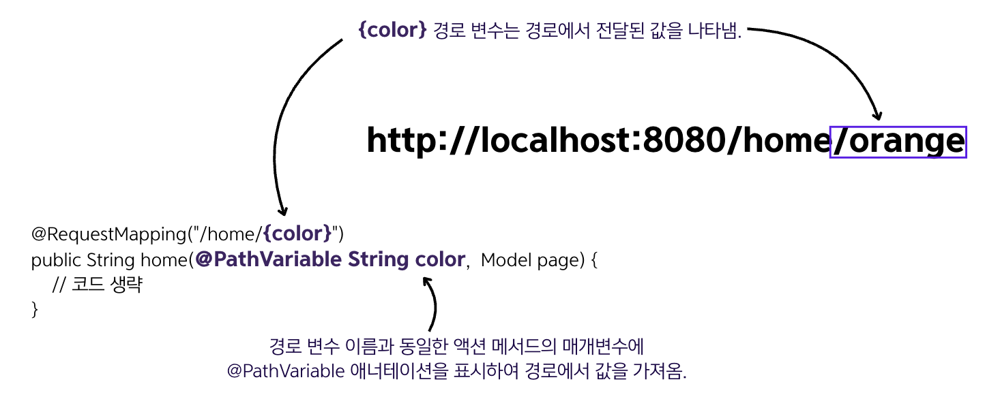

## 8.1 동적 뷰를 사용한 웹 앱 구현
- 동적 뷰를 구현할 때 템플릿 엔진을 사용함.
  - 동적 뷰의 예시 ➡️ 사용자마다 장바구니 페이지에 표시되는 정보가 다름.(동적 콘텐츠를 포함하기 때문.)
- 템플릿 엔진은 가변 데이터를 쉽게 가져와서 표시할 수 있게 해줌.


- 위의 그림과 같이 클라이언트는 HTTP 요청으로 데이터를 전송하고, 백엔드는 데이터를 처리하고 응답을 생성하여 클라이언트에 재전송함.
- 백엔드의 데이터 처리 방식에 따라 다양한 요청에 대한 다른 데이터가 사용자에게 표시될 수 있음.

### 동적 뷰를 구현하는 스프링 MVC 흐름도

```text
1️⃣ 클라이언트가 웹 서버에 HTTP 요청을 보냄.
2️⃣ 디스패처 서블릿은 핸들러 매핑을 사용하여 호출할 컨트롤러 액션을 찾음.
3️⃣ 디스패처 서블릿은 컨트롤러의 액션을 호출함.
4️⃣ HTTP 요청과 연관된 액션을 실행한 후 컨트롤러는 디스패처 서블릿이 HTTP 응답으로 렌더링하는데 필요한 뷰 이름을 반환함.
   동적 뷰에서는 컨트롤러가 뷰에 데이터를 전송하고, 뷰는 이 데이터를 통합하여 HTTP 응답을 정의함.
5️⃣ 응답은 클라이언트로 재전송됨.
```

### Thymeleaf 🍀 템플릿 엔진을 사용하는 간단한 예제 코드
  
```java
@Controller // @Controller 애너테이션은 이 클래스가 스프링 MVC 컨트롤러 클래스라고 표시하고 스프링 컨텍스트에 이 타입의 빈을 추가함.
public class MainController {
    
    @RequestMapping("/home")  // HTTP 요청 경로에 대한 컨트롤러의 액션을 할당함.
    public String home(Model page) {  // 액션 메서드의 Model 타입의 매개변수를 정의함. 이 Model 타입 안에 컨트롤러에서 뷰로 전송할 데이터를 저장함.
        page.addAttribute("username", "seohee-P");  // 컨트롤러가 뷰로 전송할 데이터를 추가함.
        page.addAttribute("color", "red");
        return "home.html";  // 컨트롤러의 액션은 렌더링할 뷰를 HTTP 응답으로 반환함.
    }
}
```
- 특정 요청 경로에 대한 액션을 매핑하기 위해 메서드에 `@RequestMapping` 애너테이션을 사용함.
- `Model` 타입의 매개변수에 컨트롤러가 뷰에 전송할 데이터를 저장함.
- 뷰에 새로운 값을 추가하려면 `addAttribute()` 메서드를 호출하고, `addAttribute()`의 첫 매개변수는 `키 🔑`이며, 두 번째 매개변수는 `뷰에 전달할 값 💎`임.
```html
<!DOCTYPE html>
<html lang="en" xmlns:th="http://www.thymeleaf.org">
<head>
    <meta charset="UTF-8">
    <title>Home Page</title>
</head>
<body>
    <h1>Welcome
    <span th:style="'color:' + ${color}"
          th:text="${username}"></span>!</h1>
</body>
</html>
```
- 동적 뷰는 `⭐️resources/templates⭐️` 폴더에 저장함. 반대로, 정적 뷰는 `resources/static` 폴더에 저장함.(따라서 위의 home.html 파일은 templates 폴더에 저장함.)
- `<html lang="en" xmlns:th="http://www.thymeleaf.org">` 이 구문은 자바에서 `import`와 동일하고, `th` 접두사를 정의함.
이를 통해 뷰에서 타임리프가 제공하는 특정 기능을 참조할 수 있음.
- `${attribute_key}` 구문을 사용하면 Model 인스턴스로 컨트롤러에서 보내는 모든 속성을 참조할 수 있음. 위의 예시에서는 `${username}`, `${color}`를 사용해 각 속성의 값을 가져옴.

<details>
<summary>&nbsp;결과 사진</summary>

</details>


### 8.1.1 HTTP 요청에서 데이터 얻기
**클라이언트가 HTTP 요청으로 서버에 데이터를 전송하는 방법**


- 1️⃣ **HTTP 요청 매개변수(request parameter)** : 키-값 쌍으로 된 형식으로 클라이언트에서 서버로 값을 전송하는 간단한 방식. 쿼리 매개변수라고도 함. HTTP
요청 매개변수를 보내려면 요청 쿼리 표현식의 URI에 매개변수를 추가함. 이 방식은 소량의 데이터를 전송할 때만 사용해야 함.
- 2️⃣ **HTTP 요청 헤더(request header)** : 요청 헤더가 HTTP 헤더로 전송된다는 점에서 요청 매개변수와 유사함. 가장 큰 차이점은 URI에 표시되지 않는다는 것임.
하지만 HTTP 헤더를 사용하여 대량의 데이터는 전송할 수 없는 것은 동일함.
- 3️⃣ **경로 변수(path variable)** : 요청 경로 자체를 이용하여 데이터를 전송함. 요청 매개변수 접근 방식과 동일하게 경로 변수를 사용하여 소량의 데이터를 전송함.
하지만 전송하는 값이 필수라면 경로 변수를 사용해야 함.
- 4️⃣ **HTTP 요청 본문(request body)** : 주로 대량의 데이터를 전송하는데 사용됨.

### 8.1.2 클라이언트에서 서버로 데이터를 전송하려고 `요청 매개변수(request parameter)` 사용
- 요청 매개변수는 `⭐️선택 항목⭐️`임.
- **요청 매개변수를 사용하면 좋은 상황**
  - **1️⃣ 전송하는 데이터양이 많지 않을 때** : 쿼리 변수를 사용하여 요청 매개변수를 설정함. 2000자로 제한됨.
  - **2️⃣ 필수가 아닌 데이터를 보내야 할 때** : 요청 매개변수는 **클라이언트가 보내지 않아도 되는 값을 처리**하는 깔끔한 방식임. 서버는 특정 요청 매개변수에 대한 값을 
  전달받지 못할 수도 있음.
    - ex. 사용자가 상품을 검색할 때 가격으로 검색할 수도, 이름과 브랜드를 기준으로 검색할 수도 있음. 선택적으로 요청 파라미터로 전송할 수 있으므로 클라이언트는
    사용자가 검색하기로 결정한 값만 전송하면 됨.

```java
@Controller
public class MainController {

    @RequestMapping("/home")
    public String home(@RequestParam String color,  // 컨트롤러의 액션 메서드에 대한 새로운 매개변수를 정의하고 @RequestParam 애너테이션을 추가함.
                       Model page) {  // 컨트롤러에서 뷰로 데이터를 전송하는 데 사용하는 Model 매개변수도 추가함.
        page.addAttribute("username", "seohee-P");
        page.addAttribute("color", color);  // 컨트롤러는 클라이언트가 전송한 색상을 뷰로 전달함.
        return "home.html";
    }
}
```
- 위의 코드는 요청 매개변수를 사용하여 클라이언트에서 색상을 가져옴.
- 요청 매개변수에서 값을 가져오려면 컨트롤러의 액션 메서드에 매개변수를 하나 더 추가하고 해당 매개변수에 `@RequestParam` 애너테이션을 추가해야 함.
- `@RequestParam` 애너테이션은 메서드의 매개변수 이름과 동일한 이름의 HTTP 요청 매개변수 값을 가져와야 한다고 스프링에 알려줌.
- 다음과 같이 접속해야 함. ➡️ `http://localhost:8080/home?color=blue`

  <details>
  <summary>&nbsp;결과 사진</summary>
  
  </details>


- 요청 매개변수로 데이터를 전송할 때 매개변수 각각은 `키-값 쌍`으로 되어 있음. 키는 요청 매개변수 이름이고, 값은 `=` 기호 오른편에 작성함.
- 요청 매개변수 쿼리는 `?`로 시작하며 요청 매개변수가 두 개 이상일 경우에는 키-값 쌍을 `&` 기호로 분리함.

### 8.1.3 `경로 변수(path variable)`로 클라이언트에서 서버로 데이터 전송
#### 요청 매개변수와 경로 변수 방식 비교
| 요청 매개변수                                                                                       | 경로 변수                                                                                     |
|-----------------------------------------------------------------------------------------------|-------------------------------------------------------------------------------------------|
| 비필수(optional) 값과 함께 사용할 수 있음.                                                                 | 비필수 값을 사용하면 안 됨.                                                                          |
| 많은 수의 매개변수는 피하는 것이 좋음. 세 개 이상을 사용해야 한다면 요청 본문을 사용하는 편이 좋음. 가독성을 위해 쿼리 매개변수를 세 개 이상 전송하는 것은 피함. | 언제든 경로 변수를 세 개 이상 전송하면 안됨. 최대 두 개까지만 보내는 것이 나음. (일반적으로 복수 값은 사용하지 않는 것이 좋음.)              |
| 일부 개발자는 경로 표현식보다 쿼리 표현식을 더 읽기 어렵다고 생각함.                                                       | 쿼리 표현식보다 읽기 쉬움. 공개적으로 노출되는 웹 사이트의 경우 검색 엔진이 페이지를 색인하기가 더 쉬움. 검색 엔진으로 웹 사이트를 더 쉽게 찾을 수 있음. |
| `http://localhost:8080/home?color=blue `  | `http://localhost:8080/home/blue`                                                         |
- 작성하는 페이지가 **최종 결과의 핵심이 되는 값 한두 개만 의존하는 경우**에는 요청을 더 쉽게 읽어 올 수 있도록 경로에 직접 작성하는 것이 좋음.

```java
@Controller
public class MainController {

    @RequestMapping("/home/{color}")  // 경로 변수를 정의하려면 이름을 정의하고 '{}'에 넣어 경로에 추가함.
    public String home(@PathVariable String color,  // @PathVariable 애너테이션을 사용하여 경로 변수 값을 가져오려는 곳에 표시함.
                       Model page) {                // 매개 변수 이름이 경로에 사용되는 변수 이름과 동일해야 함.(color)
        page.addAttribute("username", "seohee-P");
        page.addAttribute("color", color);
        return "home.html";
    }
}
```
- 컨트롤러의 액션에서 경로 변수를 참조하려면 변수 이름을 지정해서 중괄호 `{}` 사이의 경로에 이름을 추가하면 됨.
- 그 다음 `@PathVariable` 애너테이션으로 컨트롤러의 액션 매개변수를 표시하여 경로 변수 값을 가져옴.
- 다음과 같이 접속해야 함. ➡️ `http://localhost:8080/home/orange`

  <details>
  <summary>&nbsp;결과 사진</summary>
  
  </details>



### 🙋 면접 예상 질문
- 동적 뷰와 정적 뷰의 차이점은 무엇이며, 스프링 부트에서 각각 어디에 저장되어야 하는지 설명해주세요.
- HTTP 요청 매개변수와 경로 변수의 차이점을 설명하고, 각각 어떤 상황에서 사용하는 것이 적합한지 설명해주세요.
- 타임리프의 주요 특징과 JSP와 비교했을 때의 장점은 무엇인지 설명해주세요.
- Model 객체의 역할에 대해 설명해주세요.