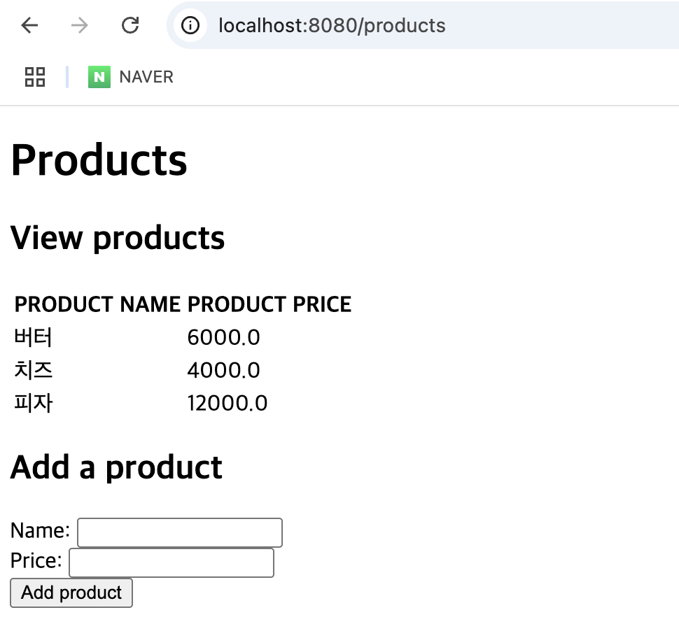

## 8.2 HTTP GET과 POST 메소드 사용
### HTTP 메소드
- 동사로 정의되며 클라이언트 의도를 나타냄.

|  HTTP 메소드  |             설명             |
|:----------:|:--------------------------:|
|    GET     |         데이터 조회만 함.         |
|    POST    |   서버에 추가할 새로운 데이터를 전송함.    |
|    PUT     |    서버에 있는 데이터 레코드를 변경함.    |
|   PATCH    | 서버에 있는 데이터 레코드를 부분적으로 변경함. |
|   DELETE   |      서버에 있는 데이터를 삭제함.      |
- 💡프로덕션 앱에서 레코드를 완전히 교체하는 PUT과 일부만 변경하는 PATCH를 구분하는 것은 좋은 관행이지만 항상 명확히 구분되는 것은 아님.

### HTTP GET과 POST 메서드를 사용하는 예제
- 🎬 시나리오 : 제품 목록을 저장하는 앱을 만들고, 각 제품에는 이름과 가격이 있음. 웹 앱은 모든 제품 목록을 표시하고 사용자가 HTML 양식을 사용하여 제품을 하나 더 추가할 수 있음.
    - 목록에 있는 모든 제품 보기 ➡️ `GET` 사용
    - 목록에 제품 추가 ➡️ `POST` 사용

  <details>
  <summary>&nbsp;Product 클래스</summary>
  
  - 이름과 가격 속성을 가진 제품을 표현하는 Product 클래스
  ```java
  public class Product {
  
      private String name;
      private double price;
      
      // getters와 setters 생략
  }
  ```
  </details>

  <details>
  <summary>&nbsp;ProductService 클래스</summary>
  
  - 표시할 제품 목록 가져오기 및 새 제품 추가하기를 구현하는 ProductService 클래스
  - 이 방식은 프로덕션용 앱에서는 사용해서는 안 됨⚠️. ➡️ 제품 목록을 변경하면, 많은 클라이언트가 동시에 제품을 추가하는 실제 앱에서 경쟁 상태가 발생할 수 있기 때문.
  즉, **싱글톤 빈은 스레드 세이프 하지 않음**.
  ```java
  @Service
  public class ProductService {
  
      private List<Product> products = new ArrayList<>();
  
      public void addProduct(Product p) {
        products.add(p);
      }
  
      public List<Product> findAll() {
        return products;
      }
  }
  ```
  </details>

  <details>
  <summary>&nbsp;ProductsController 클래스 - 제품 목록 보기 기능 구현</summary>
  
  - 컨트롤러는 클라이언트에서 새 제품에 대한 데이터를 가져오고, 서비스를 호출하여 목록에 추가하며, 제품 목록을 가져와 뷰로 보냄.
  - 서비스를 호출하는 ProductsController
  ```java
  @Controller
  public class ProductsController {
  
      private final ProductService productService;
  
      public ProductsController(ProductService productService) {  // 스프링 컨텍스트에서 서비스 빈을 얻기 위해 컨트롤러의
          this.productService = productService;                   // 생성자 매개변수를 이용한 DI를 사용함.
      }
        
      // 웹 페이지에 제품 목록을 표시하는 방법(Model 매개변수를 사용하여 컨트롤러에서 뷰로 데이터를 전송함.)
      @RequestMapping("/products")
      public String viewProducts(Model model) {     // 뷰에 데이터를 전송하는 데 사용하는 Model 매개변수를 정의함.
          var products = productService.findAll();  // 서비스에서 제품 목록을 얻음.
          model.addAttribute("products", products); // 제품 목록을 뷰로 전송함.
  
          return "products.html";                   // 뷰 이름이 반환되며 디스패처 서블릿이 받아 뷰를 렌더링함.
      }
  }
  ```
  </details>

  <details>
  <summary>products.html - 제품 목록 보기 기능 구현</summary>
  
  - resources/templates 폴더에 정의함.
  - 컨트롤러에서 전송한 제품 목록을 받아 HTML 표에 표시함.
  ```html
  <!DOCTYPE html>
  <html lang="en" xmlns:th="http://www.thymeleaf.org"> <!-- th 접두사를 정의해서 타임리프 기능을 사용함. -->
      <head>
          <meta charset="UTF-8">
          <title>Home Page</title>
      </head>
      <body>
          <h1>Products</h1>
          <h2>View products</h2>
  
          <table>
            <tr>
              <th>PRODUCT NAME</th>
              <th>PRODUCT PRICE</th>
            </tr>
            <tr th:each="p: ${products}">     <!-- th:each 기능을 사용하여 컬렉션에서 순차 반복함.-->
              <td th:text="${p.name}"></td>   <!-- 한 열마다 각 제품의 이름과 가격을 표시함. -->
              <td th:text="${p.price}"></td>
            </tr>
          </table>
      
      </body>
  </html>
  ```
  </details>


- HTTP GET /products 경로의 호출 흐름도
  
  ```text
  1️⃣ 클라이언트가 /products 경로에 대한 HTTP 요청을 전송함.
  2️⃣ 디스패처 서블릿은 핸들러 매핑을 사용하여 /products 경로를 호출하는 컨트롤러 액션을 찾음.
  3️⃣ 디스패처 서블릿이 컨트롤러의 액션을 호출함.
  4️⃣ 컨트롤러가 서비스에 제품 목록을 요청하고 렌더링하도록 제품 목록을 뷰에 전달함.
  5️⃣ 뷰가 렌더링되어 HTTP 응답에 포함됨.
  6️⃣ HTTP 응답이 클라이언트로 재전송됨.
  ```

  <details>
  <summary>&nbsp;ProductsController 클래스 - 제품을 추가하는 기능 구현</summary>
  
  ```java
  @Controller
  public class ProductsController {
  
      private final ProductService productService;
  
      public ProductsController(ProductService productService) {
          this.productService = productService;
      }
      // 코드 생략
  
      @RequestMapping(path="/products", method=RequestMethod.POST)    // @RequestMapping 애너테이션의 method 속성을 사용하여
      public String addProduct(                                       // HTTP 메서드를 POST로 변경함.
          @RequestParam String name,      // 요청 매개변수를 사용하여 추가할 제품의 이름과 가격을 가져옴.
          @RequestParam double price,
          Model model) {
          
          Product p = new Product();      // 새로운 Product 인스턴스를 생성하고 서비스의
          p.setName(name);                // 메서드를 호출하여 제품 목록에 추가함.
          p.setPrice(price);
          productService.addProduct(p);
  
          var products = productService.findAll();    // 제품 목록을 가져와 뷰에 전송함.
          model.addAttribute("products", products);
  
          return "products.html";         // 렌더링할 뷰 이름을 반환함.
      }
  }
  ```
  - 위의 코드에서는 HTTP 메서드를 지정하기 위해 `@RequestMapping` 애너테이션의 속성 메서드를 사용함. 메서드를 설정하지 않으면 `@RequestMapping`은 기본적으로 HTTP `GET`을 사용함.
  - HTTP 호출에 경로와 메서드는 필수이기 때문에 **⭐️각 HTTP 메서드에 해당되는 전용 애너테이션⭐️**을 사용함.
  - 위의 코드에서 `@GetMapping`을 사용하여 GET 요청을 액션에 매핑하고, `@PostMapping`을 사용하여 POST 요청에 매핑할 수 있음.
  - 💡 위의 코드에서 `@RequestParam` 애너테이션을 사용했음. ➡️ 스프링에서는 이 코드를 **생략**할 수 있음.(참고로 `@ModelAttribute`도 생략가능함.)
  ```java
  @Controller
  public class ProductsController {
  
      private final ProductService productService;
  
      public ProductsController(ProductService productService) {
          this.productService = productService;
      }
  
      @GetMapping("/products") // @GetMapping은 특정 경로에 대한 HTTP GET 요청을 컨트롤러 액션과 매핑함.
      public String viewProducts(Model model) {
          var products = productService.findAll();
          model.addAttribute("products", products);
  
          return "products.html";
      }
  
      @PostMapping("/products") // @PostMapping은 특정 경로에 대한 HTTP POST 요청을 컨트롤러 액션과 매핑함.
      public String addProduct(
          @RequestParam String name,
          @RequestParam double price,
          Model model
      ) {
          Product p = new Product();
          p.setName(name);
          p.setPrice(price);
          productService.addProduct(p);
  
          var products = productService.findAll();
          model.addAttribute("products", products);
  
          return "products.html";
      }
  }
  ```
  </details>

  <details>
  <summary>&nbsp;products.html - 제품을 추가하는 기능 구현</summary>
  
  - HTTP 요청을 위해 `HTML 폼(form)`을 사용함.
  ```html
  <!DOCTYPE html>
  <html lang="en" xmlns:th="http://www.thymeleaf.org">
    <head>
        <meta charset="UTF-8">
        <title>Home Page</title>
    </head>
    <body>
        <!-- 코드 생략 -->

        <h2>Add a product</h2>
        <form action="/products" method="post">
            Name: <input type="text" name="name"><br />
            Price: <input type="number" step="any" name="price"><br />
            <button type="submit">Add product</button>
        </form>
    </body>
  </html>
  ```
  - `<form action="/products" method="post">`
    - 등록 폼이 제출(submit)되었을 때, HTML 폼은 /products 경로에 대해 POST 요청을 함.
  - `Name: <input type="text" name="name"><br />`
    - input 컴포넌트로 사용자는 제품 이름을 설정할 수 있음. 컴포넌트 값은 'name' 키와 함께 요청 매개변수로 전송됨.
  - `<button type="submit">Add product</button>`
    - 사용자는 제출(type=submit) 버튼을 눌러 폼을 제출함.
  </details>

  <details>
  <summary>&nbsp;결과 화면</summary>
  
  </details>
  

  <details>
  <summary>&nbsp;ProductsController 매개변수로 Product를 사용</summary>
  
  - **요청 매개변수 이름이 Product 클래스의 속성 이름과 동일**하기 때문에 **스프링은 이를 인식하고 자동으로 이 객체를 생성**함.
    - 즉, 컨트롤러 동작의 매개변수로 Product를 직접 사용할 수 있음.
  ```java
  @Controller
  public class ProductsController {
  
      private final ProductService productService;
  
      public ProductsController(ProductService productService) {
          this.productService = productService;
      }
    
      @PostMapping("/products")
      public String addProduct(
          Product p,   // 모델 클래스를 컨트롤러 액션의 매개변수로 직접 사용할 수 있음. 스프링은 요청 속성을 기반으로 인스턴스를 생성함.
          Model model       // 모델 클래스에는 스프링이 액션 메서드를 호출하기 전에 인스턴스를 생성할 수 있도록 기본 생성자가 있어야 함.
      ) {
          productService.addProduct(p);
  
          var products = productService.findAll();
          model.addAttribute("products", products);
  
          return "products.html";
      }
  }
  ```
  </details>

### 🙋 면접 예상 질문
- HTTP 메서드의 종류와 각각에 대해 설명해주세요.
- 스프링 MVC에서 디스패처 서블릿의 역할에 대해 설명해주세요.
- @RequestParam, @ModelAttribute, @RequestBody 애너테이션의 역할과 생략 가능 여부에 대해 설명해주세요.
- HTML 폼(form)은 어떤 HTTP 메서드에서 사용할 수 있는지 설명해주세요.