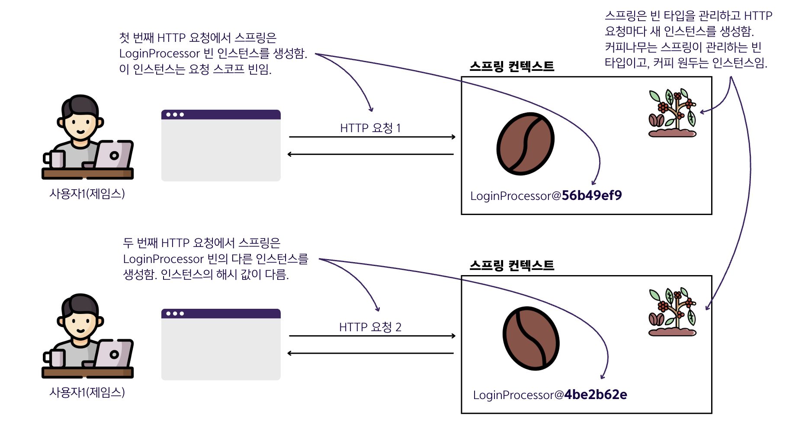
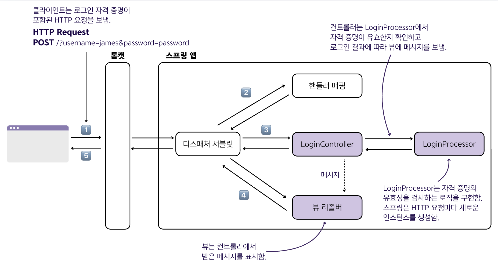
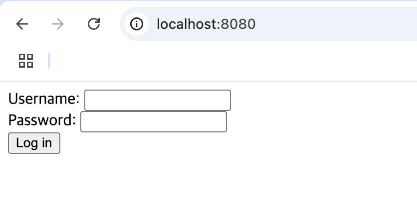
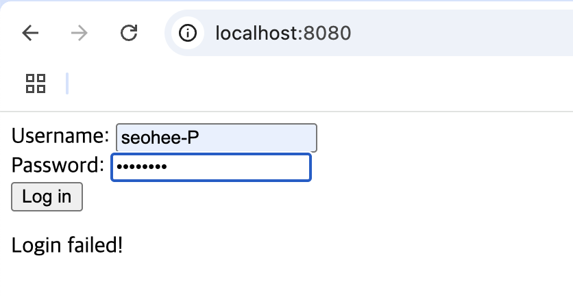
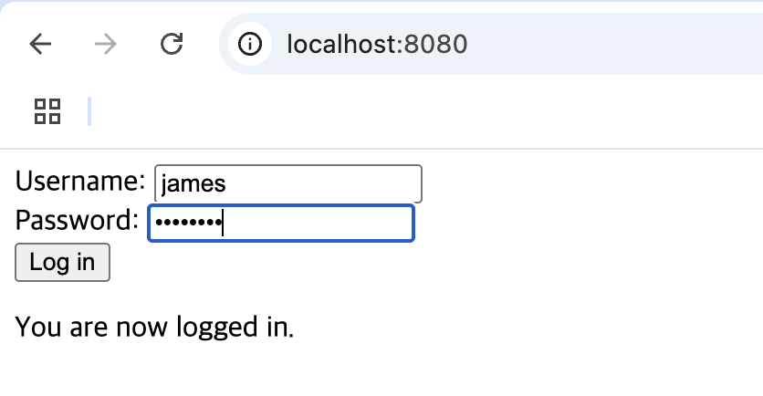

## 9.1 스프링 웹 앱에서 요청 스코프 사용

### 스프링 웹 앱에서 사용할 수 있는 세 가지 `웹 스코프`

#### 1️⃣ 요청 스코프 (Request Scope)
- 각 HTTP 요청별로 별도의 빈 인스턴스 생성
- 인스턴스는 해당 HTTP 요청 내에서만 존재
- **사용법**: `@RequestScope` 애너테이션으로 지정

#### 2️⃣ 세션 스코프 (Session Scope)
- 클라이언트의 HTTP 세션별로 빈 인스턴스 생성
- 전체 HTTP 세션 동안 서버 메모리에 인스턴스 유지
- 동일 클라이언트의 여러 요청에서 동일한 인스턴스 공유
- **사용법**: `@SessionScope` 애너테이션으로 지정

#### 3️⃣ 애플리케이션 스코프 (Application Scope)
- 애플리케이션 전체(컨텍스트)에서 하나의 인스턴스만 존재
- 애플리케이션 실행 동안 모든 클라이언트 요청이 접근 가능
- **사용법**: `@ApplicationScope` 애너테이션으로 지정

#### 활용 예시
- `요청 스코프` - 로그인 요청 처리
- `세션 스코프` - 사용자 로그인 상태 유지 및 관련 정보 저장
- `애플리케이션 스코프` - 전체 로그인 횟수 등 애플리케이션 전반 통계 관리


### 요청 스코프

- 요청 스코프 빈은 스프링에서 관리하는 객체로, 프레임워크는 **HTTP 요청마다 새로운 인스턴스를 생성**함.
- 앱은 인스턴스를 생성한 요청에서만 해당 인스턴스를 사용할 수 있음.
- 각각의 새로운 HTTP 요청은 동일한 클래스의 다른 인스턴스를 생성하고 사용함.

#### 요청 스코프 빈의 핵심 관점

<table>
    <tr>
        <td rowspan="2">사실</td>
        <td>스프링은 모든 클라이언트의 HTTP 요청마다 새 인스턴스를 생성함.</td>
    </tr>
    <tr>
        <td>하나의 요청만 요청 스코프 빈 인스턴스를 사용할 수 있음.</td>
    </tr>
    <tr>
        <td rowspan="2">결과</td>
        <td>스프링은 실행 중 앱 메모리에 해당 빈의 인스턴스를 많이 생성함.</td>
    </tr>
    <tr>
        <td>요청 스코프 빈 인스턴스는 하나의 스레드(요청당 하나)만 액세스할 수 있으므로 멀티스레드 관련 문제가 발생하지 않음.</td>
    </tr>
    <tr>
        <td rowspan="2">고려<br>사항</td>
        <td>이런 인스턴스는 수명이 짧아서 인스턴스 수가 일반적으로 큰 문제가 되지 않음.<br> 앱은 HTTP 요청을 완료하는데 필요한 시간보다 더 오랜 시간 인스턴스가 필요하지는 않음.<br>HTTP 요청이 완료되면 앱은 인스턴스를 해제하고 인스턴스는 가비지 컬렉션이 됨.</td>
    </tr>
    <tr>
        <td>인스턴스의 속성을 사용하여 요청에 사용된 데이터를 저장할 수 있음.</td>
    </tr>
    <tr>
        <td rowspan="2">기피 사항</td>
        <td>인스턴스를 생성하는데 스프링이 실행해야 하는 시간 소모적인 로직(데이터베이스에서 데이터 가져오기 또는 네트워크 호출 구현)을 구현하지 않도록 해야 함. 생성자 또는 요청 스코프 빈에 대한 <code>@PostConstruct</code> 메서드에 로직을 작성하지 말아야 함.</td>
    </tr>
    <tr>
        <td>이런 빈의 속성에 동기화 기술을 사용하면 안 됨. 이런 기술은 불필요할 수 있고, 앱 성능에 영향을 줄 뿐임.</td>
    </tr>
</table>

### 요청 스코프 사용 예제

- 로그인 자격 증명은 민감한 세부 정보이므로 로그인 요청보다 오랜 시간 앱 메모리에 저장해서는 안되고, 다른 자격 증명을 가진 많은 사용자가
  동시에 로그인을 시도할 수 있음. ➡️ 로그인 로직을 구현할 때 `요청 스코프 빈`을 사용해야 함.
- 아래 코드에서는 요청에 대한 자격 증명(이름, 비밀번호)을 가져와서 유효성을 검사하는 요청 스코프 빈인 `LoginProcessor`를 추가함.

    <details>
    <summary>LoginProcessor 클래스</summary>

    ```java
    @Component      // 스프링에 이 클래스가 빈이라고 지정하려고 스테레오타입 애너테이션을 사용함.
    @RequestScope   // @RequestScope 애너테이션을 사용하여 빈을 요청 스코프로 지정함. 즉 스프링은 HTTP 요청마다 새로운 인스턴스를 생성함.
    public class LoginProcessor {
    
        private String username;    // 빈은 자격 증명을 속성으로 저장함.
        private String password;
    
        public boolean login() {    // 빈은 로그인 로직을 구현하는 메서드를 정의함.
            String username = this.getUsername();
            String password = this.getPassword();
    
            if ("james".equals(username) && "password".equals(password)) {
                return true;
            } else {
                return false;
            }
        }
    
        // getters와 setters 생략
    }
    ```
    </details>

    <details>
    <summary>LoginController 클래스</summary>

    ```java
    @Controller // @Controller 스테레오타입 애너테이션을 사용하여 스프링 MVC 컨트롤러를 정의함.
    public class LoginController {
      
        private final LoginProcessor loginProcessor;
    
        public LoginController(LoginProcessor loginProcessor) {
            this.loginProcessor = loginProcessor;
        }
    
        @GetMapping("/")    // 컨트롤러 액션을 애플리케이션의 루트 경로("/")에 매핑함.
        public String loginGet() {
            return "login.html";    // 앱이 렌더링하는 뷰 이름을 반환함.
        }
    
        @PostMapping("/")   // 컨트롤러 액션을 로그인 페이지의 HTTP POST 요청과 매핑함.
        public String loginPost(
                @RequestParam String username,  // HTTP 요청 매개변수에서 자격 증명을 가져옴.
                @RequestParam String password,
                Model model                     // Model 매개변수를 선언하여 뷰에 메시지 값을 전달함.
        ) {
            loginProcessor.setUsername(username);
            loginProcessor.setPassword(password);
            boolean loggedIn = loginProcessor.login();
      
            if (loggedIn) {                     // 로그인 결과에 따라 뷰에 적절한 메시지를 전달함.
                model.addAttribute("message", "You are now logged in.");
            } else {
                model.addAttribute("message", "Login failed!");
            }
      
            return "login.html";                // 여전히 login.html을 반환하므로 동일한 페이지로 이동함.
        }
    }
    ```
    </details>

    <details>
    <summary>login.html</summary>

    ```html
    <!DOCTYPE html>
    <html lang="en" xmlns:th="http://www.thymeleaf.org">
    <head>
        <meta charset="UTF-8">
        <title>Login</title>
    </head>
    <body>
        <form action="/" method="post">
            Username: <input type="text" name="username" /><br />
            Password: <input type="password" name="password" /><br />
            <button type="submit">Log in</button>
        </form>
  
        <p th:text="${message}"></p>
    </body>
    </html>
    ```
    - `<p th:text="${message}"></p>` : 로그인 요청 결과 메시지를 표시함.
    </details>

    <details>
    <summary>결과 화면</summary>
    <p>로그인 폼</p>
    
    <p>로그인 실패 했을 때 - 실패 메시지를 표시함.</p>
    
    <p>로그인 성공 했을 때 - 성공 메시지를 표시함.</p>
    
    </details>


### 🙋 면접 예상 질문
- 스프링의 웹 스코프 종류와 각각의 특징을 설명해주세요.
- 요청 스코프 빈을 어떤 상황에서 사용하는 것이 적합한지 설명해주세요.
- 요청 스코프 빈을 사용할 때 주의해야 할 점은 무엇인지 설명해주세요.
- 요청 스코프 빈이 멀티스레드 환경에서 안전한 이유에 대해 설명해주세요.