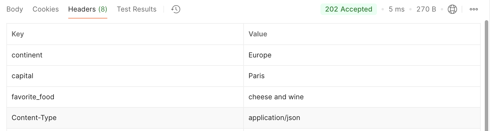
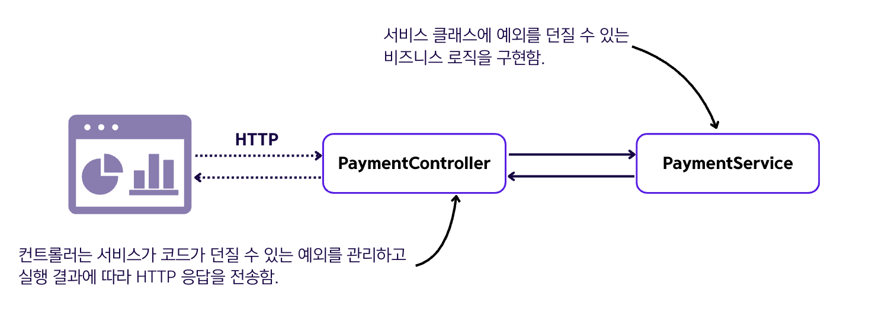
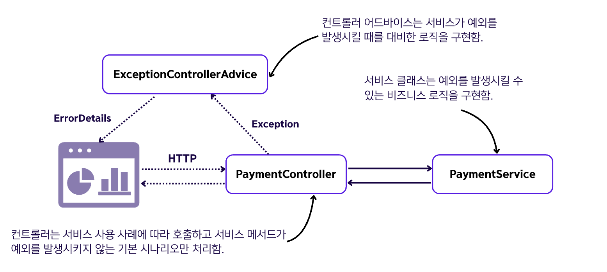

## 10.3 HTTP 응답 관리

### HTTP 응답에 포함되는 데이터
- **응답 헤더** : 응답에 포함된 작은 데이터 조각
- **응답 본문** : 백엔드에서 응답으로 보내야 하는 많은 양의 데이터
- **응답 상태** : 요청 결과를 간략하게 표현한 내용

### 10.3.1 객체를 응답 본문에 전송
- 응답으로 클라이언트에 객체를 보내려면 컨트롤러의 액션이 해당 객체를 반환하게 만들면 됨.
- 💠 **데이터 전송 객체(Data Transfer Object, DTO)** : 두 앱 간에 전송되는 데이터를 모델링하려고 사용하는 객체
- 아래 예시 코드는 Country 클래스 타입의 인스턴스를 반환하는 컨트롤러 액션을 구현함.
➡️ 아래 예시에서 Country는 DTO라고 할 수 있음.
- 💠 **JSON** : 문자열을 속성과 값의 쌍으로 포맷하는 방법
  - JSON은 REST 엔드포인트로 작업할 때 객체를 표현하는 가장 일반적인 방법임.
- 아래 예시의 엔드포인트를 호출하면 스프링은 객체의 문자열 표현을 생성하고 JSON 포맷으로 만듦.
  - `/france` 호출
    ```json
    {
      "name" : "France",
      "population" : 67
    }
    ```
  - `/all` 호출
    - JSON에서 리스트는 대괄호([ ])로 정의하고, 각 객체는 중괄호({ })로 감싸 쉼표(,)로 분리한다. 
    ```json
    [
      {
        "name" : "France",
        "population" : 67
      },
      {
        "name" : "Spain",
        "population" : 47
      }
    ]
    ```
- 스프링은 원한다면 객체에 대한 맞춤형 변환기를 연결하여 응답 본문의 형식을 지정하는 다른 방법(XML, YAML)도 제공함.
```java
public class Country {

    private String name;
    private int population;

    public static Country of(String name, int population) {
        Country country = new Country();
        country.setName(name);
        country.setPopulation(population);
        return country;
    }
  // getters, setters 생략
}
```
```java
@RestController
public class CountryController {

    @GetMapping("/france")
    public Country france() {
        Country c = Country.of("France", 67);
        return c;
    }

    @GetMapping("/all")
    public List<Country> countries() {
        Country c1 = Country.of("France", 67);
        Country c2 = Country.of("Spain", 47);

        return List.of(c1,c2);
    }
}
```

### 10.3.2 응답 상태 및 헤더 설정
- 응답 상태는 요청 결과를 알리는데 사용하는 HTTP 응답의 필수 플래그임.
- 스프링에서 자주 쓰이는 응답 상태 종류
  - `200 OK` : 요청을 처리하는 동안 서버 측에서 예외가 발생하지 않은 경우에 사용.
  - `404 Not Found` : 요청된 리소스가 존재하지 않는 경우에 사용.
  - `400 Bad Request` : 요청 일부가 서버가 예상한 방식과 일치하지 않는 경우에 사용.
  - `500 Error on server` : 요청을 처리하는 동안 어떤 이유로 서버 측에서 예외가 발생한 경우에 사용.(백엔드에서 문제를 해결해야 함.)


- HTTP 응답을 사용자 정의할 때 가장 쉽고 일반적인 방법은 `ResponseEntity` 클래스를 사용하는 것.
  - `ResponseEntity를` 사용하면 HTTP 응답 본문, 상태 및 헤더를 지정할 수 있음.
- 아래 예시는 ResponseEntity를 반환하는 예시.
  - 응답 상태를 `202 Accepted`로 변경하고, 헤더 세 개를 설정함.
  ```java
  @RestController
  public class CountryController {
  
      @GetMapping("/france")
      public ResponseEntity<Country> france() {
          Country c = Country.of("France", 67);
  
          return ResponseEntity
                  .status(HttpStatus.ACCEPTED)
                  .header("continent", "Europe")
                  .header("capital", "Paris")
                  .header("favorite_food", "cheese and wine")
                  .body(c);
      }
  }
  ```
  결과사진
  

### 10.3.3 엔드포인트 수준에서 예외 관리
- 예외를 관리하는 방법에는 아래의 방법이 있음.
  - ResponseEntity를 사용하여 예외가 발생할 때 응답을 다르게 구성하여 전송하는 방법
  - REST 컨트롤러 어드바이스 클래스를 사용하는 방법 
  ➡️ 엔드포인트 호출이 예외를 던질 때 이를 가로채는 애스펙트로 특정 예외에 대한 사용자 로직을 정의함.

#### 1️⃣ ResponseEntity로 예외를 관리하는 방법
```java
public class ErrorDetails {

    private String message;

    public String getMessage() {
        return message;
    }

    public void setMessage(String message) {
        this.message = message;
    }
}
```
```java
@RestController
public class PaymentController {

    private final PaymentService paymentService;

    public PaymentController(PaymentService paymentService) {
        this.paymentService = paymentService;
    }

    @PostMapping("/payment")
    public ResponseEntity<?> makePayment() {
        try {
            PaymentDetails paymentDetails = paymentService.processPayment();
            return ResponseEntity
                  .status(HttpStatus.ACCEPTED)
                  .body(paymentDetails);
        } catch (NotEnoughMoneyException e) {
            ErrorDetails errorDetails = new ErrorDetails();
            errorDetails.setMessage("Not enough money to make the payment.");
            return ResponseEntity
                  .badRequest()
                  .body(errorDetails);
        }
    }
}
```

- 이 방법은 `NotEnoughMoneyException`라는 사용자 정의 예외를 만들고, 컨트롤러가 예외를 관리해 예외가 발생하면 ResponseEntity로 ErrorDetails를 반환하고,
응답 상태를 `400 Bad Request`로 설정함.
- 이 방법은 많이 사용되지만, 더 복잡한 애플리케이션에서는 예외 관리의 책임을 분리하는 것이 더 편할 수 있음.
  - 여러 엔드포인트에 대해 동일한 예외를 관리해야 할 때가 있는데, 코드의 중복을 피할 수 있기 때문.
  - 특정한 사용 사례가 어떻게 작동하는지 이해해야 할 때 예외 로직을 한곳에서 모두 찾을 수 있다면 더 편리할 수 있기 때문.
- 이러한 이유 때문에 컨트롤러 동작으로 발생하는 예외를 가로채고 가로챈 예외에 따라 사용자 정의 로직을 적용하는 **⭐️REST 컨트롤러 어드바이스⭐️**를 사용하는 방식도 많이 사용됨.

#### 2️⃣ REST 컨트롤러 어드바이스 클래스를 사용하는 방법
```java
@RestController
public class PaymentController {

    private final PaymentService paymentService;

    public PaymentController(PaymentService paymentService) {
        this.paymentService = paymentService;
    }

    @PostMapping("/payment")
    public ResponseEntity<PaymentDetails> makePayment() {
        PaymentDetails paymentDetails = paymentService.processPayment();
        return ResponseEntity
                .status(HttpStatus.ACCEPTED)
                .body(paymentDetails);
    }
}
```
```java
@RestControllerAdvice
public class ExceptionControllerAdvice {

    @ExceptionHandler(NotEnoughMoneyException.class)    // @ExceptionHandler 메서드를 사용하여 메서드가
                                                        // 구현할 로직을 예외와 연결함.
    public ResponseEntity<ErrorDetails> exceptionNotEnoughMoneyHandler() {
        ErrorDetails errorDetails = new ErrorDetails();
        errorDetails.setMessage("Not enough money to make the payment.");
        return ResponseEntity
            .badRequest()
            .body(errorDetails);
    }
}
```

- 이 방법은 컨트롤러에서 예외 관리를 하지 않고 기본 성공 시나리오만 관리하고, `ExceptionControllerAdvice` 컨트롤러 어드바이스를
추가하여 컨트롤러 액션이 예외를 발생시킬 때 구현할 로직을 처리하는 방법임.
- `ExceptionControllerAdvice`는 **REST 컨트롤러 어드바이스**이며, 이를 표시하기 위해 `@RestControllerAdvice` 애너테이션을 사용함.
이 클래스가 정의하는 메소드를 `예외 핸들러`라고도 함.
- 위의 코드는 `NotEnoughMoneyException` 예외와 관련된 로직을 구현하는 예외 핸들러 메서드를 보여줌.


### 🙋 면접 예상 질문
- DTO(Data Transfer Object)란 무엇이고 왜 사용하는지 설명해주세요.
- ResponseEntity를 사용하는 이유와 장점에 대해 설명해주세요.
- HTTP 응답 상태 코드 200, 400, 404, 500의 의미에 대해 설명해주세요.
- 컨트롤러에서 직접 예외 처리하는 방법과 @RestControllerAdvice를 사용하는 방법의 차이점은 무엇인지 설명해주세요.
- ResponseEntity<?> 에서 와일드카드(?)를 사용하는 이유는 무엇인지 설명해주세요.