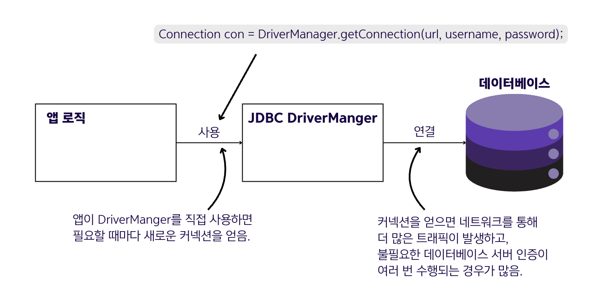

## 12.1 데이터 소스

- 💠 `데이터 소스` : 데이터베이스를 처리하는 서버(DBMS)에 대한 커넥션을 관리하는 구성 요소
- JDBC 드라이버를 사용하여 커넥션을 가져오고 관리함
- 커넥션 재사용을 통해 앱 성능을 개선하는 것이 목표
- 필요할 때만 새 커넥션을 요청하고, 사용 후 커넥션을 해제
- 데이터 소스 없이는 매번 새 커넥션을 생성해야 해서 성능 저하 발생


- 💠 `JDBC(Java Database Connectivity)` : 자바 앱에서 관계형 데이터베이스에 연결할 수 있는 언어 기능
- JDBC는 DBMS에 연결하여 데이터베이스로 작업할 수 있는 방법을 제공하지만, JDK는 특정 DBMS 구현체가 아닌 추상화만 제공
- 실제 DB 연결을 위해서는 각 DBMS 공급업체에서 제공하는 JDBC 드라이버를 런타임 의존성으로 추가해야 함


### DBMS에 대한 커넥션을 얻는 방법 1️⃣ - JDBC 드라이버를 직접 사용

- 앱이 영속성 데이터 작업을 실행할 때마다 새로운 연결이 필요한 방식
- 일반적으로 DriverManager 클래스를 사용하여 커넥션을 얻음

  ```java
  Connection con = DriverManager.getConnection(url, username, password);
  ``` 
  - `getConnection()` 메서드는 URL로 데이터베이스를 식별하고, 사용자 이름과 비밀번호로 인증함
  - 매 작업마다 새 연결을 요청하고 인증하는 것은 클라이언트와 DB 서버 모두에 자원과 시간 낭비를 가져옴 ➡️ ⭐️데이터베이스 커넥션을 재사용하기 위해 앱의 커넥션 관리를 담당하는 객체인 데이터 소스가 필요⭐️

### DBMS에 대한 커넥션을 얻는 방법 2️⃣ - 데이터 소스를 사용

- 데이터 소스로 커넥션을 검색하고 관리하는 방식
- 필요할 때만 새로운 커넥션이 생성되도록 함
- 일반적으로 가장 많이 사용되는 것은 HikariCP(Hikari Connection Pool) 데이터 소스임

### 🙋 면접 예상 질문
- 데이터 소스(DataSource)란 무엇이고, 왜 사용하는지 설명해주세요.
- JDBC 드라이버를 직접 사용하는 것과 데이터 소스를 사용하는 것의 차이점에 대해 설명해주세요.
- JDBC에서 JDK가 제공하는 것과 JDBC 드라이버와의 역할 차이에 대해 설명해주세요.