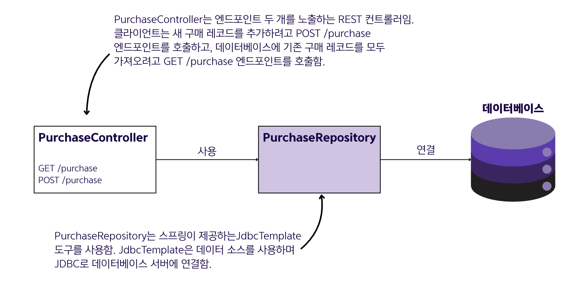
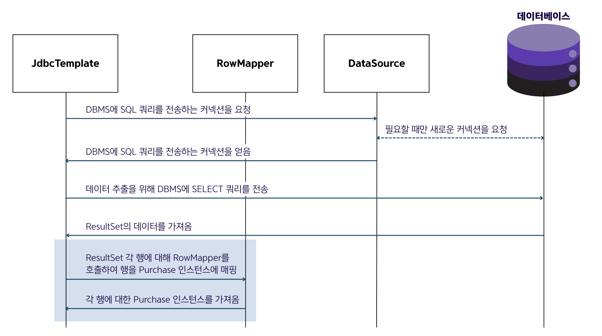
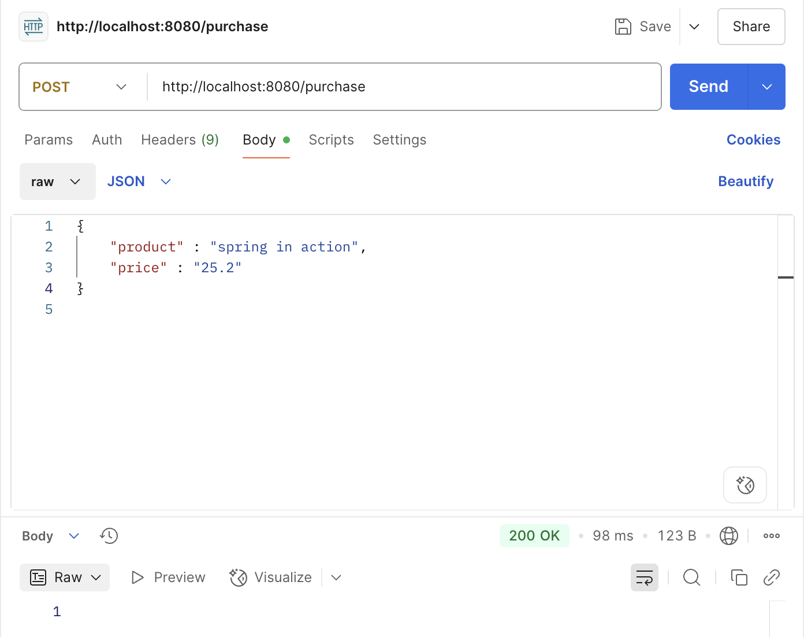
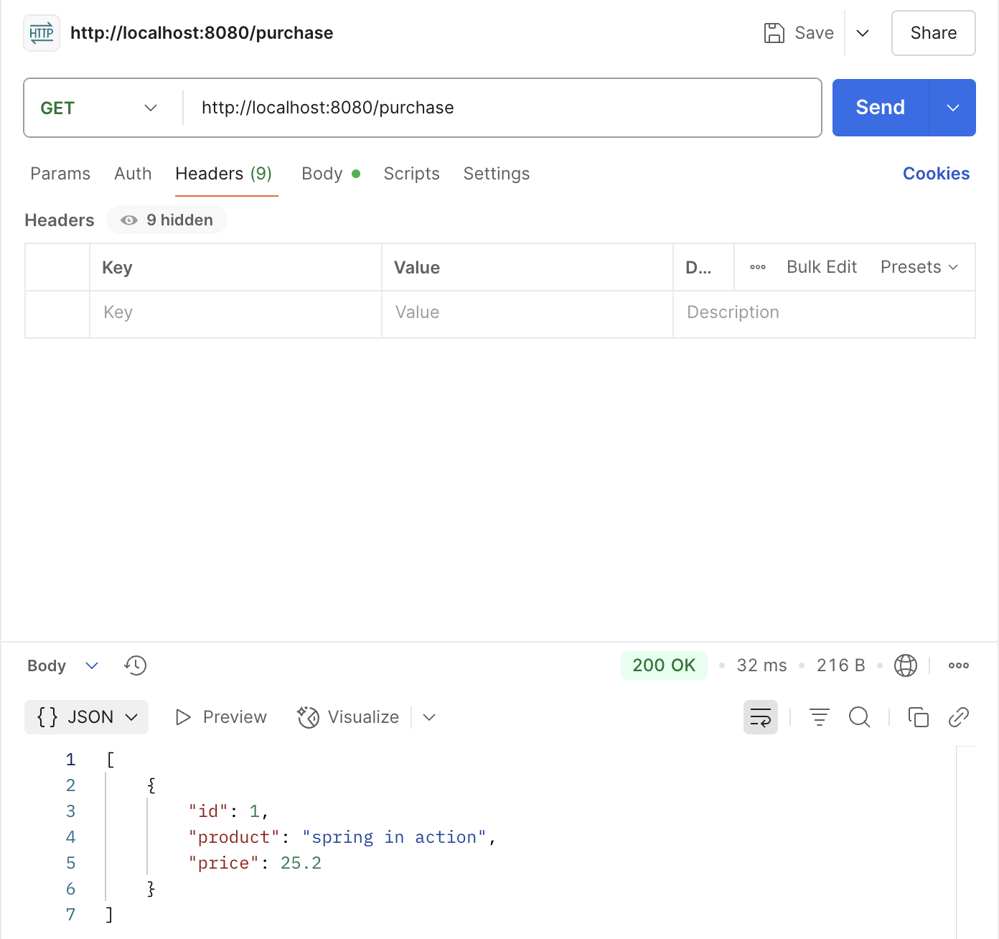

## 12.2 JdbcTemplate으로 영속성 데이터 작업
- 가장 간단한 방식으로 JDBC로 데이터베이스에 작업하는 방법은 `JdbcTemplate` 도구를 사용하는 것
- 아래 예제 코드를 따라 실습

#### 예제 코드 구현 단계
  1. DBMS에 대한 커넥션을 생성
  2. 리포지터리 로직을 작성
  3. REST 엔드포인트의 동작을 구현하는 메서드에서 리포지터리 메서드를 호출
#### 구매 테이블 정보
  ```
  - id : 테이블의 기본 키 역할을 하며 자동으로 증가하는 고윳값
  - product : 구매한 제품 이름
  - price : 구매 가격
  ```
#### 구현할 앱의 요구 사항
  - 구매 테이블에 새 레코드 추가하는 엔드포인트 `POST /purchase`
  - 구매 테이블에서 모든 레코드를 조회하는 엔드포인트 `GET /purchase`



#### 예시 코드
##### build.gradle에 의존성 추가
```groovy
implementation 'org.springframework.boot:spring-boot-starter-jdbc'
implementation 'org.springframework.boot:spring-boot-starter-web'
runtimeOnly 'com.h2database:h2'
```
##### src/main/resources/schema.sql 작성
```sql
CREATE TABLE IF NOT EXISTS purchase (
    id INT AUTO_INCREMENT PRIMARY KEY,
    product varchar(50) NOT NULL,
    price double NOT NULL
);
```
##### 구매 모델 클래스 작성
```java
public class Purchase {

    private int id;
    private String product;
    private BigDecimal price;
    
    // getters와 setters 생략
```
- 가격을 double이 아닌 BigDecimal로 설정한 이유는 double과 float가 간단한 산술 연산에서도 정밀도가 떨어지기 때문에 가격과 같은
민감한 정보는 BigDecimal를 사용함. 변환은 스프링이 알아서 해줌.

##### PurchaseRepository 빈 정의하기
```java
@Repository // @Repository 스테레오타입 애너테이션을 사용하여 이 클래스 타입의 빈을 스프링 컨텍스트에 추가
public class PurchaseRepository {
    
}
```
- PurchaseRepository 빈이 추가되어서 데이터베이스 작업에 사용할 JdbcTemplate 인스턴스를 주입할 수 있음.
- 스프링 부트는 사용자가 H2 의존성을 추가한 것을 보고 데이터 소스와 JdbcTemplate 인스턴스를 자동으로 구성해서 JdbcTemplate 인스턴스를 주입 가능

##### 영속성 데이터 작업을 위한 JdbcTemplate 빈 주입하고 테이블에 새로운 레코드 추가하기
```java
@Repository
public class PurchaseRepository {

  private final JdbcTemplate jdbc;

  public PurchaseRepository(JdbcTemplate jdbc) {
    this.jdbc = jdbc;
  }

  public void storePurchase(Purchase purchase) {
    // 쿼리는 문자열로 작성되며, 쿼리의 매개변수 값은 물음표로 대체됨. ID의 경우 이 열 값을 생성하도록 DBMS를 구성해서 NULL을 사용  
    String sql = "INSERT INTO purchase VALUES (NULL, ?, ?)";
    // update() 메서드는 쿼리를 데이터베이스 서버로 보냄. 첫 번째 매개변수는 쿼리고 그 다음은 매개변수에 대한 값임. 쿼리의 각 물음표를 순서대로 대체함
    jdbc.update(sql, purchase.getProduct(), purchase.getPrice());
  }

}
```
- JdbcTemplate은 데이터 변형을 위한 쿼리(INSERT, UPDATE, DELETE)를 실행하는 데 사용되는 update() 메서드를 갖고 있음
- SQL과 필요한 매개변수만 전달하면 나머지 작업(커넥션 획득, 쿼리문 생성, SQLException 처리 등)은 JdbcTemplate이 알아서 처리

##### JdbcTemplate으로 데이터베이스에서 레코드 선택하기
```java
@Repository
public class PurchaseRepository {

  // 코드 생략

  public List<Purchase> findAllPurchases() { // 조회한 레코드를 Purchase 객체 리스트로 반환
    String sql = "SELECT * FROM purchase";   // SELECT 쿼리를 정의하여 구매 테이블의 모든 레코드를 가져옴

    // ResultSet 행을 Purchase 객체로 매핑하는 RowMapper 구현
    // 매개변수 r은 데이터베이스에서 가져온 데이터인 ResultSet을, 매개변수 i는 행 번호를 나타냄
    RowMapper<Purchase> purchaseRowMapper = (r, i) -> {     
      Purchase rowObject = new Purchase();
      rowObject.setId(r.getInt("id"));
      rowObject.setProduct(r.getString("product"));
      rowObject.setPrice(r.getBigDecimal("price"));
      return rowObject;
    };

    return jdbc.query(sql, purchaseRowMapper);
  }
}
```
- 데이터를 Purchase 객체로 변환하는 방법을 JdbcTemplate에 알려주고자 RowMapper(ResultSet 행을 특정 객체로 변환하는 역할을 하는 객체) 구현



##### 컨트롤러 구현하기
```java
@RestController
@RequestMapping("/purchase")
public class PurchaseController {

  private final PurchaseRepository purchaseRepository;

  public PurchaseController(PurchaseRepository purchaseRepository) {
    this.purchaseRepository = purchaseRepository;
  }

  @PostMapping
  public void storePurchase(@RequestBody Purchase purchase) {
    purchaseRepository.storePurchase(purchase);
  }

  @GetMapping
  public List<Purchase> findPurchases() {
    return purchaseRepository.findAllPurchases();
  }
}
```
##### 엔드포인트 테스트하기
|`POST /purchase`| `GET /purchase`              |
|---|------------------------------|
||  |

### 🙋 면접 예상 질문
- JdbcTemplate이란 무엇이고, 언제 사용하는지 설명해주세요.
- JdbcTemplate의 update() 메서드와 query() 메서드의 차이점은 무엇인지 설명해주세요.
- RowMapper가 무엇이고 왜 사용하는지 설명해주세요.
- 가격 데이터를 double 대신 BigDecimal로 사용하는 이유에 대해 설명해주세요.