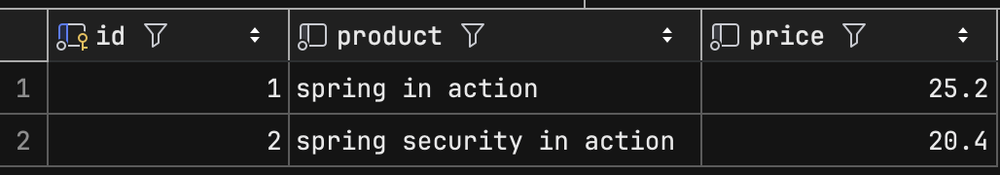
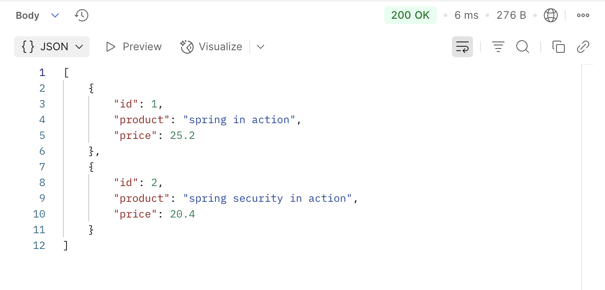

## 12.3 데이터 소스 구성을 사용자 정의
- H2 데이터베이스 대신 MySQL 서버를 사용하도록 변경

### 12.3.1 애플리케이션 프로퍼티 파일에서 데이터 소스 정의
- 애플리케이션을 MySQL DBMS에 연결
##### build.gradle에 MySQL JDBC 드라이버 의존성 추가
```groovy
implementation 'org.springframework.boot:spring-boot-starter-jdbc'
implementation 'org.springframework.boot:spring-boot-starter-web'
runtimeOnly 'com.mysql:mysql-connector-j'
```
##### application.properties 파일에 데이터베이스에 대한 커넥션 프로퍼티를 추가
```yml
spring.datasource.url=jdbc:mysql://localhost/spring_textbook
spring.datasource.username=root
spring.datasource.password=1234
spring.sql.init.mode=always
```
- `spring.datasource.url` 프로퍼티를 추가하여 데이터베이스 위치를 정의
- `spring.datasource.username/password` 프로퍼티를 추가하여 앱을 인증하고 DBMS에서 커넥션을 얻는데 필요한 자격 증명을 정의
- `spring.sql.init.mode=always` 로 설정하여 스프링 부트가 schema.sql 파일로 구매 테이블을 생성하도록 지시
  - H2 데이터베이스는 스프링부트가 기본 설정으로 schema.sql의 쿼리를 실행하기 때문에 해당 설정이 불필요

##### 12.2에서 구현한 엔드포인트 테스트

- MySQL에 잘 저장된 것을 확인


- Get /purchase로 MySQL에 저장된 정보 조회

### 12.3.2 사용자 정의 DataSource 빈 사용
- 스프링 부트는 application.properties 기반으로 DataSource 빈을 자동 생성
- 하지만 다음과 같은 경우 직접 DataSource 빈을 정의해야 함
  - 런타임 조건에 따라 특정 DataSource 구현 사용
  - 여러 데이터베이스 연결 시 데이터 소스 구분 필요
  - 런타임에만 알 수 있는 조건으로 DataSource 매개변수 구성
  - 스프링 부트 없이 스프링 프레임워크만 사용

##### application.properties 파일에 데이터베이스에 대한 커넥션 프로퍼티를 추가
```yml
custom.datasource.url=jdbc:mysql://localhost/spring_textbook
custom.datasource.username=root
custom.datasource.password=1234
```
- 프로퍼티 이름에 `custom`이라는 단어를 사용하여 스프링 부트의 고유 프로퍼티가 아님을 강조
##### 구성 클래스와 @Bean 메서드 정의
```java

@Configuration
public class ProjectConfig {

  @Value("${custom.datasource.url}")
  private String datasourceUrl;

  @Value("${custom.datasource.username}")
  private String datasourceUsername;

  @Value("${custom.datasource.password}")
  private String datasourcePassword;

  @Bean
  public DataSource dataSource() {
    HikariDataSource dataSource = new HikariDataSource(); // 데이터 소스 구현체로 HikariCP를 사용
    dataSource.setJdbcUrl(datasourceUrl);
    dataSource.setUsername(datasourceUsername);
    dataSource.setPassword(datasourcePassword);
    dataSource.setConnectionTimeout(1000);
    return dataSource;
  }
}
```
### 🙋 면접 예상 질문
- H2 데이터베이스와 MySQL을 연결할 때 설정의 차이점에 대해 설명해주세요.