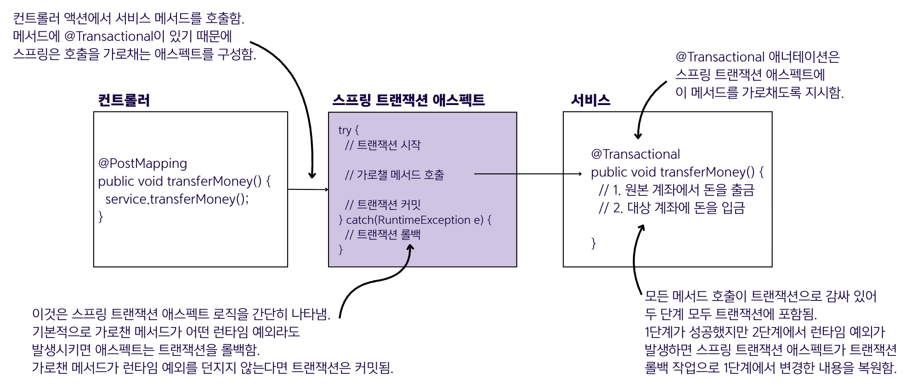
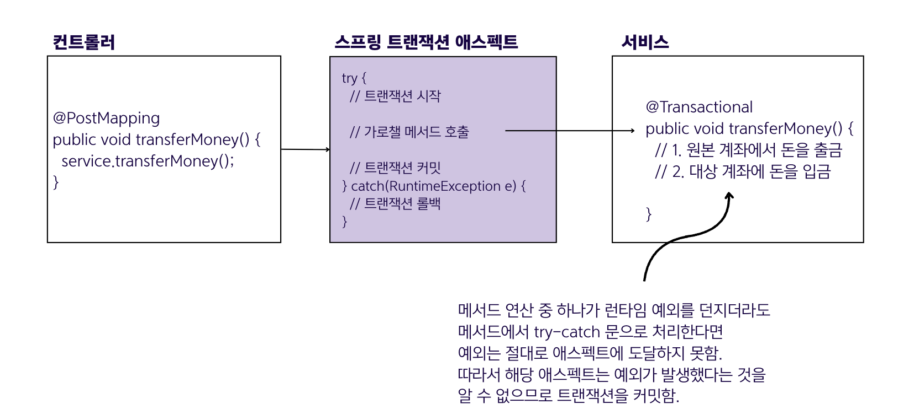

## 13.2 스프링에서 트랜잭션의 작동 방식



### 기본 동작 원리
- 트랜잭션은 **AOP 애스펙트**를 사용하여 구현됨
- `@Transactional` 애노테이션을 사용하면 스프링이 자동으로 애스펙트를 구성하고 해당 메서드에 트랜잭션 로직을 적용
- 스프링은 메서드가 **런타임 예외**를 발생시키면 자동으로 트랜잭션을 롤백

### 트랜잭션 사용 시 주의사항

#### 1. 체크 예외는 기본적으로 롤백하지 않음
- 💠 **체크 예외**: 컴파일 타임에 처리되어야 하는 예외로, `Exception`을 상속하지만 `RuntimeException`은 상속하지 않는 예외
- 예시: `SQLException`, `IOException`
- 체크 예외도 롤백하려면 `@Transactional(rollbackFor = {Exception.class})` 사용

#### 2. 예외를 직접 처리하면 롤백되지 않음

- 런타임 예외를 메서드 내부에서 `try-catch`로 처리할 경우 롤백되지 않음
- **이유**: 메서드 내부에서 예외를 처리하면 호출자에게 예외가 전달되지 않아 애스펙트가 예외를 감지할 수 없어 트랜잭션을 커밋함

**잘못된 예시:**
```java
@Transactional
public void transferMoney() {
   try {
       // 1. 원본 계좌에서 돈을 출금
       // 2. 대상 계좌에 돈을 입금
   } catch (RuntimeException e) {
       // 예외를 여기서 처리하면 롤백되지 않음
   }
}