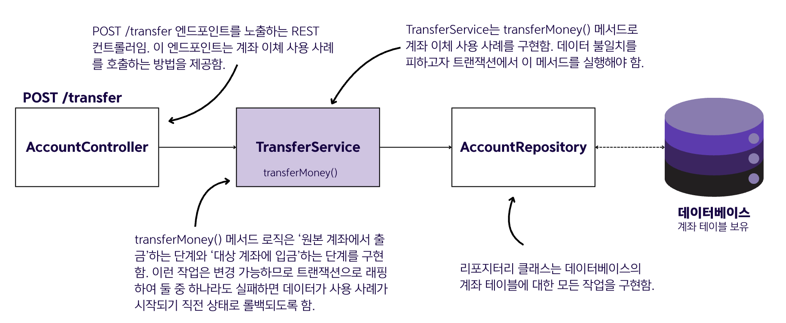
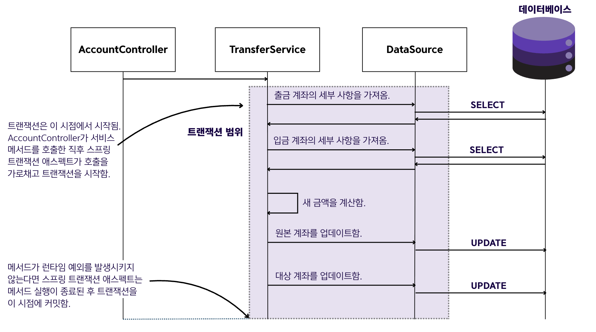
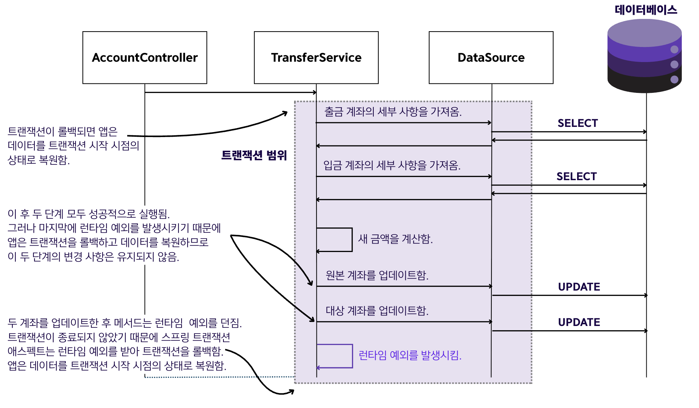

## 13.3 스프링 앱에서 트랜잭션 사용

### 기본 사용법
- 스프링 앱에서 트랜잭션을 선언하기 위해서는 `@Transactional` 애노테이션을 사용
- `@Transactional`로 스프링에서 트랜잭션으로 래핑할 메서드를 표시
- 클래스에 적용하면 클래스의 모든 메서드에 애노테이션이 적용됨
- 스프링은 사용자가 `@Transactional`로 애노테이션한 메서드를 가로채는 애스펙트를 구성함

### 구현 예시
- 트랜잭션을 사용하기 위해 이체 기능을 구현함




---
### 예시 1️⃣ - 트랜잭션 커밋 (성공 케이스)
- 예외가 발생해도 데이터가 일관성을 유지하도록 트랜잭션을 사용
- 모든 작업이 성공하면 변경사항이 커밋됨

```java
@Service
public class TransferService {

    private final AccountRepository accountRepository;

    public TransferService(AccountRepository accountRepository) {
        this.accountRepository = accountRepository;
    }

    @Transactional // 메서드 호출이 트랜잭션에 포함되도록 지시
    public void transferMoney(long idSender, long idReceiver, BigDecimal amount) {
        
        // 출금 계좌에서 출금 후 입금 계좌에 입금
        Account sender = accountRepository.findAccountById(idSender);
        Account receiver = accountRepository.findAccountById(idReceiver);

        BigDecimal senderNewAmount = sender.getAmount().subtract(amount);
        BigDecimal receiverNewAmount = receiver.getAmount().add(amount);

        accountRepository.changeAmount(idSender, senderNewAmount);
        accountRepository.changeAmount(idReceiver, receiverNewAmount);
    }
}
```


---

### 예시 2️⃣ - 트랜잭션 롤백 (실패 케이스)
- 메서드에서 런타임 예외가 발생하면 트랜잭션이 롤백됨
- 데이터를 트랜잭션 시작 시점의 상태로 복원함

```java
@Service
public class TransferService {

    private final AccountRepository accountRepository;

    public TransferService(AccountRepository accountRepository) {
        this.accountRepository = accountRepository;
    }

    @Transactional
    public void transferMoney(long idSender, long idReceiver, BigDecimal amount) {
        Account sender = accountRepository.findAccountById(idSender);
        Account receiver = accountRepository.findAccountById(idReceiver);

        BigDecimal senderNewAmount = sender.getAmount().subtract(amount);
        BigDecimal receiverNewAmount = receiver.getAmount().add(amount);

        accountRepository.changeAmount(idSender, senderNewAmount);
        accountRepository.changeAmount(idReceiver, receiverNewAmount);
        
        // 서비스 메서드 끝부분에서 런타임 예외를 던져 트랜잭션에서 문제가 발생한 상황을 시뮬레이션함.
        throw new RuntimeException("Oh no! Something went wrong!");
    }
    
}
```

