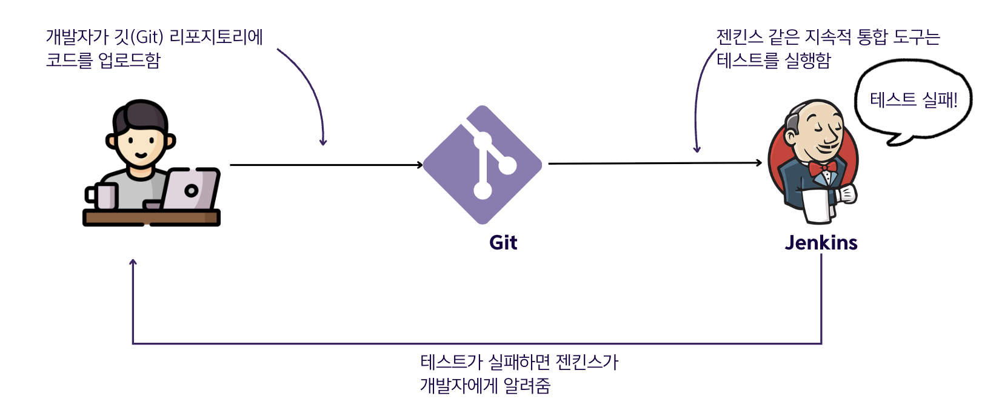
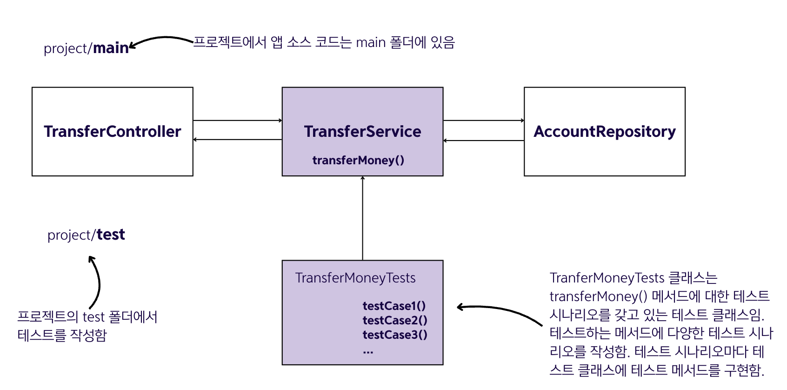

# 15.1 올바른 테스트 작성

## 테스트 유형
- 💠 **단위 테스트**: 격리된 로직 부분에만 집중함
- 💠 **통합 테스트**: 여러 구성 요소가 서로 올바르게 상호 작용하는지 검증하는데 집중함

## 테스트를 작성해야 하는 이유

### 주요 이점
- 테스트를 반복해서 실행하여 최소한의 노력으로 예상대로 작동하는지 검증할 수 있음 (앱이 지속적으로 올바르게 작동하는지 검증가능함)
- 테스트 단계를 읽으면서 사용 사례 목적을 쉽게 이해할 수 있음 (문서화 역할을 함)
- 테스트는 개발 과정에서 새로운 애플리케이션 문제에 대해 이른 피드백을 제공함

### 테스트 방식
- 💠 **회귀 테스트**: 기존 기능을 지속적으로 테스트하여 여전히 올바르게 작동하는지 확인하는 방식임
- 구현하는 기능에 대해 모든 관련 시나리오를 테스트하는 방식이 좋음
- 오늘날에는 앱 빌드 프로세스 한 부분으로 테스트를 실행함

### CI(지속적 통합)
일반적으로 개발팀은 개발자가 변경할 때마다 빌드 프로세스를 실행하도록 젠킨스 또는 팀시티 같은 도구를 구성하는 CI(지속적 통합) 방식을 사용함. 이 CI 도구는 테스트를 실행하고 문제가 발생하면 개발자에게 알려줌.

## 올바른 테스트 작성

### 기본 원칙
- 테스트 가능성과 유지 보수성은 상호 보완적인 소프트웨어 품질 요소임
- 앱을 테스트할 수 있도록 설계하면 유지 관리가 용이해짐
- 프로젝트에서는 프로젝트의 테스트 폴더에 테스트 클래스를 작성함
- 테스트 클래스는 로직을 테스트하는 특정 메서드에만 집중해야 함

### 테스트 시나리오 구현
테스트 시나리오 구현은 앱의 작동 방식과 밀접한 관련이 있지만 기술적으로는 테스트 시나리오를 식별하고 각 시나리오에 대한 테스트 방법을 작성한다는 점에서 모든 앱에 동일하게 해당됨

### 메서드 크기의 중요성
- 작은 메서드에서도 관련된 많은 테스트 시나리오를 도출할 수 있기 때문에 애플리케이션의 메서드를 작게 유지해야 함
- 큰 메서드를 작성하면 관련 테스트 시나리오를 식별하기 매우 어려워짐
- 다양한 책임을 작고 읽기 쉬운 메서드로 분리하지 못할 때 앱의 테스트 가능성은 떨어지게 됨

