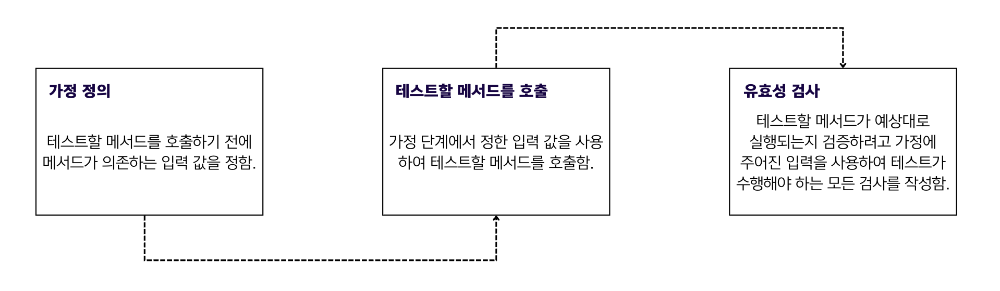
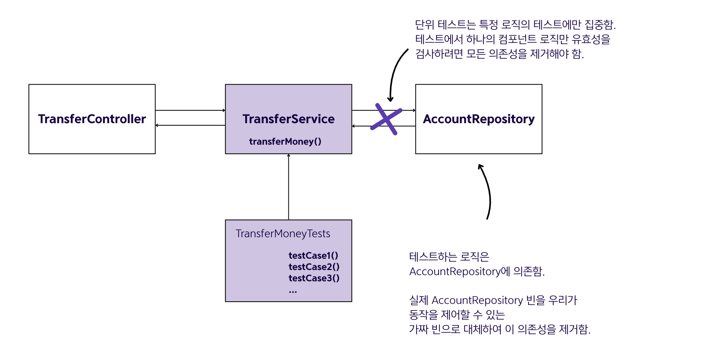
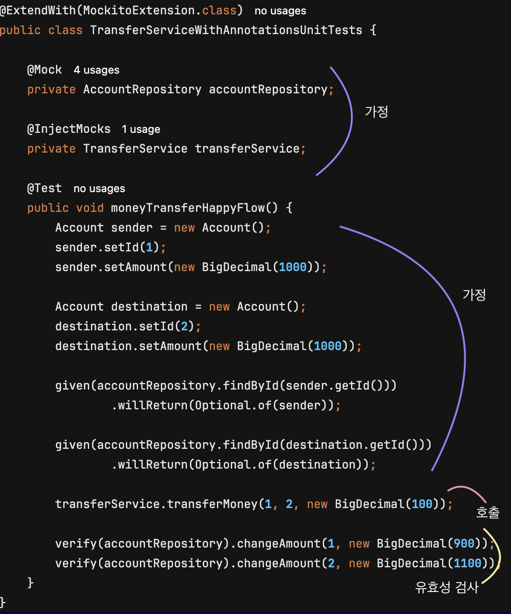
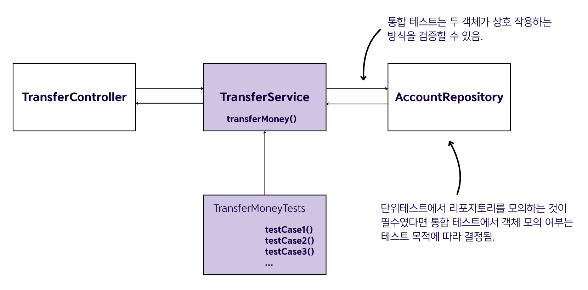

## 15.2 스프링 앱에서 테스트 구현

### 스프링 앱의 주요 테스트 기법

- 스프링 애플리케이션에서 자주 사용되는 두 가지 핵심 테스트 방법론이 있음.

#### ✅ 단위 테스트 (Unit Test)
- 메서드의 로직을 검증하는 테스트임
- 한 가지 흐름에만 집중함
- 모든 의존성을 제거하여 작은 로직의 유효성을 검사하는 데 집중함

#### ✅ 스프링 통합 테스트 (Spring Integration Test)
- 메서드의 로직과 프레임워크가 제공하는 특정 기능의 통합을 검증함
- 의존성을 업그레이드할 때 앱 기능이 여전히 작동하는지 확인할 수 있음

---

### 15.2.1 단위 테스트 구현

#### 단위 테스트의 정의와 목적

**단위 테스트**는 동작을 검증하려고 특정 조건에서 특정 사용 사례를 호출하는 메서드임. 테스트하는 기능의 모든 의존성을 제거하여 격리된 특정 로직만 테스트함.

**단위 테스트의 장점:**
- 특정 코드에 문제가 있다는 것을 명확히 식별할 수 있음
- 수정해야 할 부분을 정확히 파악할 수 있음
- 로직 동작을 하나씩 검증하여 특정 컴포넌트 문제를 효과적으로 식별함

#### 정상 플로에 대한 테스트 작성
- 일반적으로 가장 확실한 시나리오이자 가장 먼저 테스트를 작성하는 것은 예외나 오류가 발생하지 않는 실행 시나리오인 **정상 플로**임.
##### 계좌 이체 사용 사례 예제

```java
@Transactional
public void transferMoney(long idSender, long idReceiver, BigDecimal amount) {
    Account sender = accountRepository.findById(idSender)
            .orElseThrow(() -> new AccountNotFoundException());

    Account receiver = accountRepository.findById(idReceiver)
            .orElseThrow(() -> new AccountNotFoundException());

    BigDecimal senderNewAmount = sender.getAmount().subtract(amount);
    BigDecimal receiverNewAmount = receiver.getAmount().add(amount);

    accountRepository.changeAmount(idSender, senderNewAmount);
    accountRepository.changeAmount(idReceiver, receiverNewAmount);
}

public Iterable<Account> getAllAccounts() {
    return accountRepository.findAll();
}

public List<Account> findAccountsByName(String name) {
    return accountRepository.findAccountsByName(name);
}
```

##### 코드 실행 로직
1. 발신인의 계좌 정보를 찾음
2. 수취인의 계좌 상세 정보를 찾음
3. 각 계좌에 대한 새 금액을 계산함
4. 발신인의 계좌 금액을 업데이트함
5. 수취인의 계좌 금액을 업데이트함

#### 테스트 구조의 3단계

- 모든 테스트는 **세 가지 주요 부분**으로 구성됨.



##### 1. 가정 (Given)
- 원하는 시나리오 플로를 달성하려면 입력을 정의하고 제어해야 할 로직의 의존성을 찾아야 함.
  - 어떤 입력을 제공해야 하는가?
  - 테스트 대상 로직이 기대하는 특정한 방식으로 동작하려면 의존성이 어떻게 동작해야 하는가?

##### 2. 호출/실행 (When)
- 테스트 대상 로직을 호출하여 동작을 검증해야 함.

##### 3. 유효성 검사 (Then)
- 해당 로직에 대해 수행해야 하는 모든 유효성 검사를 정의해야 함. 해당 로직이 주어진 조건에서 호출되면 어떤 일이 발생하는지에 대한 질문에 답할 수 있어야 함.

#### 의존성 식별과 모의 객체 사용

##### 의존성의 정의
- 💠 의존성 : 메서드가 사용하지만 자체적으로 생성하지 않는 모든 것을 의미함
  - 메서드의 매개변수
  - 메서드가 사용하지만 메서드로 생성되지 않는 객체 인스턴스

- 계좌 이체 사용 사례에서는 `long idSender`, `long idReceiver`, `BigDecimal amount` 매개변수와 `accountRepository` 객체가 의존성임.

##### 모의 객체 사용 이유
- AccountRepository의 `findById()` 메서드를 호출하지만 단위 테스트는 한 부분의 로직에만 초점을 맞추므로 실제 `findById()` 메서드를 호출해서는 안 됨
- `findById()`가 주어진 방식으로 작동한다고 가정하고 테스트 대상 메서드가 주어진 상황에서 예상되는 작업을 수행한다고 단언(assert)함
- 실제 AccountRepository 객체 대신 가짜 객체인 모의(mock) 객체를 사용함


#### 정상 플로 테스트 시나리오 구현

```java
public class TransferServiceUnitTests {

    @Test
    @DisplayName("Test the amount is transferred from one account to another if no exception occurs.")
    public void moneyTransferHappyFlow() {
        // mock() 메서드로 AccountRepository 객체에 대한 모의 인스턴스를 생성함
        AccountRepository accountRepository = mock(AccountRepository.class);
        TransferService transferService = new TransferService(accountRepository);

        Account sender = new Account();
        sender.setId(1);
        sender.setAmount(new BigDecimal(1000));

        Account destination = new Account();
        destination.setId(2);
        destination.setAmount(new BigDecimal(1000));
        
        // 모의 객체의 동작을 given()으로 제어함
        given(accountRepository.findById(sender.getId()))
                .willReturn(Optional.of(sender));

        given(accountRepository.findById(destination.getId()))
                .willReturn(Optional.of(destination));

        transferService.transferMoney(1, 2, new BigDecimal(100));
        
        // 호출 검증
        verify(accountRepository).changeAmount(1, new BigDecimal(900));
        verify(accountRepository).changeAmount(2, new BigDecimal(1100));
    }
}
```

##### 구현 설명
- `transferMoney()` 메서드를 호출하려고 TransferService 인스턴스를 생성함
- 실제 AccountRepository 인스턴스 대신 제어할 수 있는 모의 객체를 생성함
- `mock()` 메서드는 JUnit과 함께 자주 사용되는 Mockito 의존성에서 제공됨
- `given()` 메서드로 모의 객체의 동작을 제어함
- AccountRepository의 `findById()` 메서드가 주어진 매개변수 값에 따라 특정 Account 인스턴스를 반환하게 함
- `verify()` 메서드를 사용하여 `changeAmount()`가 올바른 값으로 호출되었는지 검증함

#### 애너테이션을 사용한 모의 객체 생성

```java
@ExtendWith(MockitoExtension.class) // @Mock과 @InjectMocks 애너테이션을 활성화함
public class TransferServiceWithAnnotationsUnitTests {

    @Mock // 모의 객체를 생성하고 테스트 클래스의 애너테이션된 필드에 주입함
    private AccountRepository accountRepository;

    @InjectMocks // 테스트할 객체를 생성하고 클래스의 애너테이션된 필드에 주입함
    private TransferService transferService;

    @Test
    public void moneyTransferHappyFlow() {
        Account sender = new Account();
        sender.setId(1);
        sender.setAmount(new BigDecimal(1000));

        Account destination = new Account();
        destination.setId(2);
        destination.setAmount(new BigDecimal(1000));

        given(accountRepository.findById(sender.getId()))
                .willReturn(Optional.of(sender));

        given(accountRepository.findById(destination.getId()))
                .willReturn(Optional.of(destination));

        transferService.transferMoney(1, 2, new BigDecimal(100));

        verify(accountRepository).changeAmount(1, new BigDecimal(900));
        verify(accountRepository).changeAmount(2, new BigDecimal(1100));
    }
}
```

##### 애너테이션 설명
- `@Mock`: 프레임워크가 애너테이션된 속성에 모의 객체를 생성하고 주입함
- `@InjectMocks`: 테스트할 객체를 생성하고 프레임워크가 해당 생성자에 모든 모의 객체를 주입하도록 지시함
- `@ExtendWith(MockitoExtension.class)`: @Mock과 @InjectMocks이 작동하려면 필수로 추가해야 함


- 위의 그림으로 가정, 호출, 유효성 검사 단계와 코드를 확인할 수 있음.

#### 예외 플로에 대한 테스트 작성

- 메서드가 예외를 만났을 때 기대한 방식으로 실행되는지도 확인해야 하며, 이런 플로를 **예외 플로**라고 함.
- 계좌 이체 사용 사례에서는 발신인 또는 수취인 계좌 상세 정보를 지정된 ID로 찾을 수 없을 때 예외 플로가 발생할 수 있음.

```java
@ExtendWith(MockitoExtension.class)
public class TransferServiceWithAnnotationsUnitTests {

    @Mock
    private AccountRepository accountRepository;

    @InjectMocks
    private TransferService transferService;

    @Test
    public void moneyTransferDestinationAccountNotFoundFlow() {
        Account sender = new Account();
        sender.setId(1);
        sender.setAmount(new BigDecimal(1000));

        given(accountRepository.findById(1L))
                .willReturn(Optional.of(sender));

        given(accountRepository.findById(2L))
                .willReturn(Optional.empty());  // 비어 있는 Optional을 반환하도록 제어함

        assertThrows(
                AccountNotFoundException.class, // 해당 예외 발생을 단언(assert)함
                () -> transferService.transferMoney(1, 2, new BigDecimal(100))
        );

        verify(accountRepository, never())      // changeAmount()가 호출되지 않았음을 단언함
                .changeAmount(anyLong(), any());
    }
}
```

- `assertThrows()`: 메서드가 예상된 예외를 던지는지 검증함
- `never()` 조건: `changeAmount()`가 호출되지 않았음을 확인함

#### 메서드 반환값 테스트

- 메서드의 반환값을 확인해야 하는 경우의 예제임.

##### 로그인 컨트롤러 예제

```java
@PostMapping()
public String loginPost(
        @RequestParam String username,
        @RequestParam String password,
        Model model) {
    loginProcessor.setUsername(username);
    loginProcessor.setPassword(password);
    boolean loggedIn = loginProcessor.login();
    
    if (loggedIn) {
        model.addAttribute("message", "You are now logged in.");
    } else {
        model.addAttribute("message", "Login Failed!");
    }
    return "login.html";
}
```

##### 테스트 구현 단계
1. 의존성을 식별하고 제어함
2. 테스트할 메서드를 호출함
3. 테스트할 메서드 실행이 예상대로 작동하는지 확인함

##### 로그인 성공 테스트

```java
@ExtendWith(MockitoExtension.class)
class LoginControllerUnitTests {
    @Mock
    private Model model;
    
    @Mock
    private LoginProcessor loginProcessor;
    
    @InjectMocks
    private LoginController loginController;
    
    @Test
    public void loginPostLoginSucceedsTest() {
        given(loginProcessor.login()).willReturn(true);
        
        String result = loginController.loginPost("username", "password", model);
        
        assertEquals("login.html", result);
        
        verify(model).addAttribute("message", "You are now logged in.");
    }
}
```

##### 로그인 실패 테스트

```java
@ExtendWith(MockitoExtension.class)
class LoginControllerUnitTests {
    @Mock
    private Model model;
    
    @Mock
    private LoginProcessor loginProcessor;
    
    @InjectMocks
    private LoginController loginController;
    
    @Test
    public void loginPostLoginFailsTest() {
        given(loginProcessor.login()).willReturn(false);
        
        String result = loginController.loginPost("username", "password", model);
        
        assertEquals("login.html", result);
        
        verify(model).addAttribute("message", "Login Failed!");
    }
}
```

- `assertEquals()`: 예상 값과 메서드가 반환하는 값을 비교함
- `verify()`: Model 인스턴스의 `addAttribute()` 메서드가 올바른 값으로 호출되었는지 확인함

---

### 15.2.2 통합 테스트 구현

#### 통합 테스트의 특징

- 통합테스트는 단위 테스트와 매우 유사하지만 중요한 차이점이 있음
  - 격리된 로직을 테스트하지 않기 때문에 모든 의존성을 모의하여 테스트할 필요가 없음
  - 리포지터리를 모의하는 것이 필수가 아님
  - 특정 컴포넌트의 작동 방식보다는 컴포넌트 두 개 이상이 상호 작용하는 방식에 중점을 둠

#### 통합 테스트의 효과

통합테스트를 작성하면 구성 요소가 독립적으로 올바르게 작동하지만 올바르게 통신하지 않을 때 발생할 수 있는 문제를 완화하는데 도움이 됨.

#### 통합 테스트 사용 사례
1. 앱 내의 객체 간 통합 : 객체가 올바르게 상호 작용하는지 테스트함.

2. 프레임워크 기능과 앱 객체의 통합 : 프레임워크가 제공하는 기능과 상호 작용하는 방식을 테스트함.

3. 앱과 영속성 계층의 통합 : 리포지터리가 데이터베이스와 어떻게 작동하는지 테스트함.

#### 스프링 통합 테스트

- 스프링 앱에서는 일반적으로 통합 테스트를 사용하여 앱의 동작이 스프링이 제공하는 기능과 올바르게 상호 작용하는지 확인함.
- 이런 테스트를 **스프링 통합 테스트**라고 함.

##### 스프링 통합 테스트의 특징
- 스프링이 앱을 실행할 때처럼 빈을 생성하고 컨텍스트를 구성할 수 있게 해줌
- `@MockBean` 애너테이션을 사용하여 모의 객체를 생성할 수 있음
- `@MockBean`은 `@Mock`과 매우 유사하지만, 모의 객체가 애플리케이션 컨텍스트에 추가됨

#### 스프링 통합 테스트 구현 예제


```java
@SpringBootTest
class TransferServiceSpringIntegrationTests {

    @MockBean // 스프링 컨텍스트 일부이기도 한 모의 객체를 생성함
    private AccountRepository accountRepository;

    @Autowired  // 동작을 테스트할 스프링 컨텍스트에서 실제 객체를 주입함
    private TransferService transferService;

    @Test
    void transferServiceTransferAmountTest() {
        Account sender = new Account();
        sender.setId(1);
        sender.setAmount(new BigDecimal(1000));

        Account receiver = new Account();
        receiver.setId(2);
        receiver.setAmount(new BigDecimal(1000));

        when(accountRepository.findById(1L)).thenReturn(Optional.of(sender));
        when(accountRepository.findById(2L)).thenReturn(Optional.of(receiver));

        transferService.transferMoney(1, 2, new BigDecimal(100));

        verify(accountRepository).changeAmount(1, new BigDecimal(900));
        verify(accountRepository).changeAmount(2, new BigDecimal(1100));
    }
}
```

#### 통합 테스트 실행 특징

- 통합테스트는 다른 테스트와 같은 방식으로 실행됨
- 스프링은 테스트할 객체를 인식하고 실행 중인 앱처럼 객체를 관리해줌
- 스프링 컨텍스트를 구성해야 하기 때문에 실행하는데 더 오랜 시간이 걸림

#### 테스트 전략 권장사항

- 효율적인 테스트를 위한 권장사항
  - **단위 테스트**: 앱 구성 요소 로직을 검증하는데 사용함
  - **통합 테스트**: 프레임워크와 어떻게 통합되는지 확인하는 데만 사용함
  - 이러한 전략을 따르면 테스트 실행 시간을 절약할 수 있음.

### 🙋 면접 예상 질문
- 단위테스트와 통합 테스트의 차이점에 대해 설명해주세요.
- Mock 객체를 사용하는 이유는 무엇인지 설명해주세요.
- @Mock과 @MockBean의 차이점에 대해 설명해주세요.
- Given-When-Then 패턴에 대해 설명해주세요.
- verify() 메서드의 용도와 사용법에 대해 설명해주세요.
- assertThrows()는 언제 사용하는지 설명해주세요.
- 스프링 시큐리티가 적용된 컨트롤러는 어떻게 테스트하는지 설명해주세요.
- 테스트 실행 시간을 단축하는 방법은 무엇인지 설명해주세요.
- 테스트 코드도 리팩토리이이 필요한지 설명해주세요.